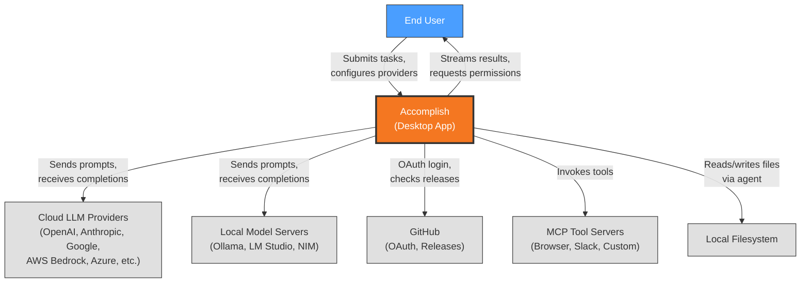
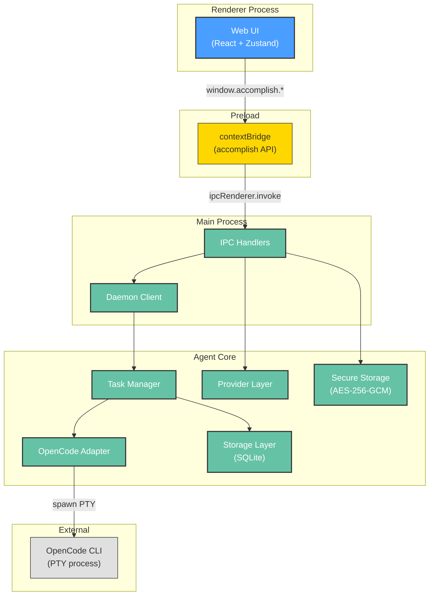
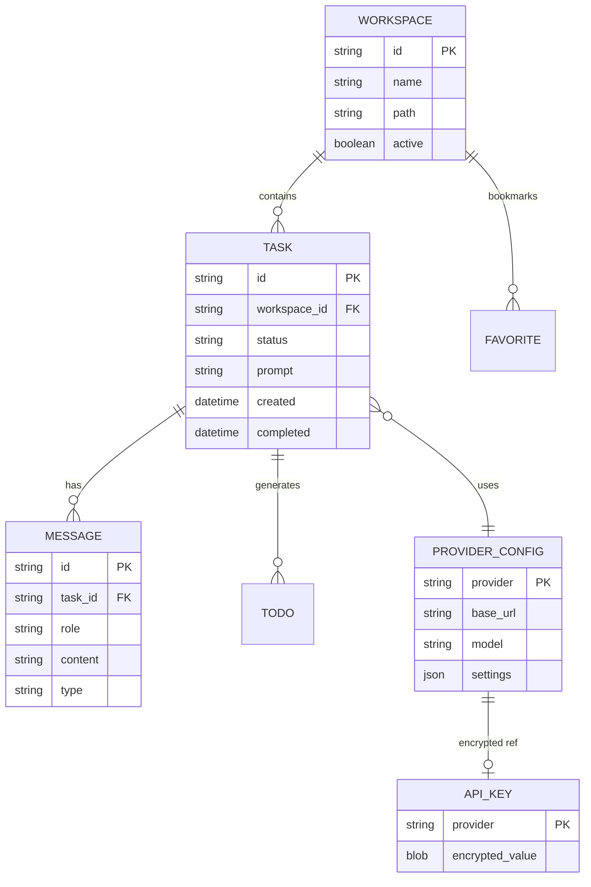
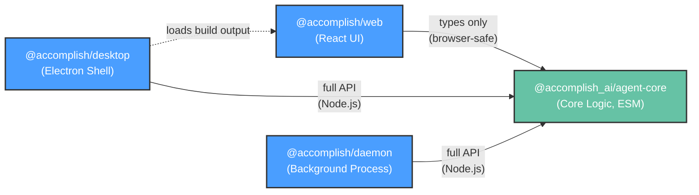
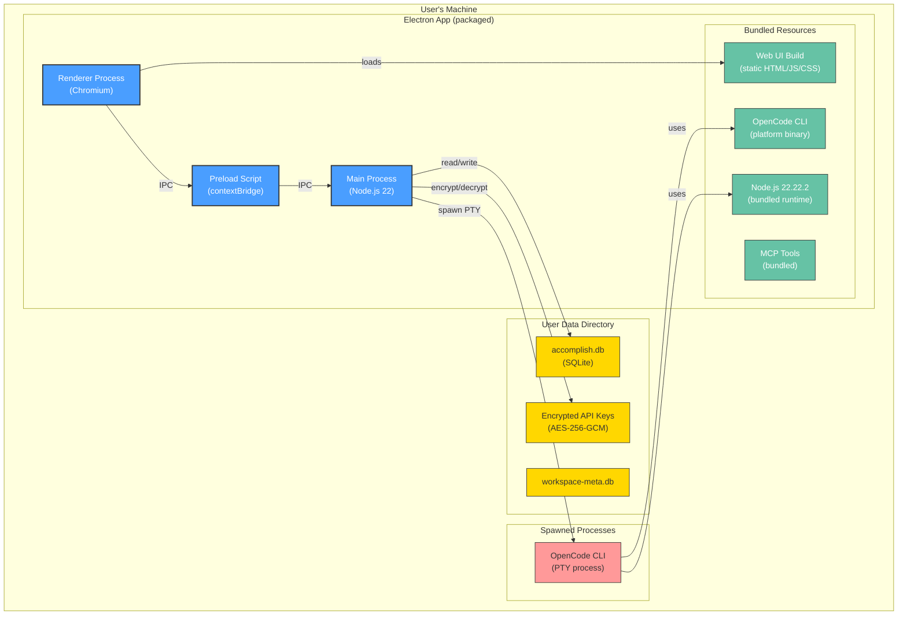

# Architecture Description: Accomplish

**Version**: 1.0 | **Created**: 2026-03-26 | **Last Updated**: 2026-03-26
**Architect**: AI (reverse-engineered from codebase) | **Status**: Draft
**ADR Reference**: [.specify/drafts/adr.md](.specify/drafts/adr.md)

---

## 1. Introduction

### 1.1 Purpose

Accomplish is an open-source AI automation assistant that lives on the user's
desktop. It enables users to delegate complex software engineering tasks to an
AI agent that can browse the web, write code, run commands, and manage files —
all orchestrated through a local-first desktop application with bring-your-own
API key support.

### 1.2 Scope

**In Scope:**

- Desktop application (macOS, Windows, Linux) for AI task execution
- Multi-provider LLM integration (12+ providers including local models)
- Task lifecycle management (create, execute, monitor, cancel)
- Encrypted credential storage for API keys
- MCP (Model Context Protocol) tool integration
- Multi-workspace support with isolated task histories
- Skills system for reusable task templates

**Out of Scope:**

- Server-side deployment or SaaS hosting
- Mobile applications
- User-to-user collaboration features
- Custom model training or fine-tuning

### 1.3 Definitions & Acronyms

| Term     | Definition                                                         |
| -------- | ------------------------------------------------------------------ |
| AD       | Architecture Description — this document                           |
| ADR      | Architecture Decision Record — documented architectural decisions  |
| IPC      | Inter-Process Communication — Electron main ↔ renderer bridge      |
| MCP      | Model Context Protocol — standardized tool interface for AI agents |
| PTY      | Pseudo-Terminal — terminal emulation for spawning CLI processes    |
| OpenCode | External CLI agent engine spawned by Accomplish to execute tasks   |

---

## 2. Stakeholders & Concerns

| Stakeholder              | Role                                      | Key Concerns                                                 | Priority |
| ------------------------ | ----------------------------------------- | ------------------------------------------------------------ | -------- |
| End Users                | Desktop app users                         | Task execution quality, provider choice, local-first privacy | High     |
| Contributors             | Open-source developers                    | Code clarity, dev ergonomics, test coverage                  | High     |
| Maintainers              | Core team                                 | Build reliability, migration safety, cross-platform support  | Critical |
| Security-Conscious Users | Users with sensitive API keys             | Credential encryption, no data exfiltration                  | High     |
| Enterprise Users         | Teams with specific provider requirements | Bedrock/Vertex/Azure support, air-gapped local models        | Medium   |

---

## 3. Architectural Views (Rozanski & Woods)

### 3.1 Context View

**Purpose**: Define system scope and external interactions
**Source ADRs**: ADR-001, ADR-002, ADR-007

#### 3.1.1 System Scope

Accomplish is a **desktop application** that acts as a bridge between users and
AI agent capabilities. It runs entirely on the user's machine — no cloud
backend, no remote server. The system connects outward to LLM provider APIs
and local model servers, but all orchestration, storage, and credential
management happen locally.

#### 3.1.2 External Entities

| Entity              | Type              | Interaction                   | Data Exchanged                    | Protocol         |
| ------------------- | ----------------- | ----------------------------- | --------------------------------- | ---------------- |
| End User            | Stakeholder       | Desktop UI                    | Task prompts, settings, approvals | Electron UI      |
| LLM Cloud Providers | External API      | API calls via OpenCode CLI    | Prompts, completions, tool calls  | HTTPS            |
| Local Model Servers | External Service  | API calls via OpenCode CLI    | Prompts, completions              | HTTP (localhost) |
| GitHub              | External Platform | OAuth, releases, CI/CD        | Auth tokens, build artifacts      | HTTPS            |
| MCP Tool Servers    | External Service  | MCP protocol via OpenCode CLI | Tool invocations, results         | stdio / HTTPS    |
| Filesystem          | OS Resource       | File read/write by agent      | Code files, documents             | OS API           |

#### 3.1.3 Context Diagram



#### 3.1.4 External Dependencies

| Dependency                   | Purpose                | Fallback Strategy                        |
| ---------------------------- | ---------------------- | ---------------------------------------- |
| Cloud LLM APIs               | AI task execution      | Switch to local model (Ollama/LM Studio) |
| OpenCode CLI binary          | Agent execution engine | App cannot function without it (bundled) |
| GitHub OAuth                 | Copilot provider auth  | Use API key-based providers instead      |
| better-sqlite3 native module | Local database         | None — required for app operation        |

---

### 3.2 Functional View

**Purpose**: Internal components, responsibilities, and interactions
**Source ADRs**: ADR-001, ADR-002, ADR-003, ADR-005, ADR-007

#### 3.2.1 Functional Elements

| Element              | Responsibility                                                                            | Workspace                           | Key Files                                         |
| -------------------- | ----------------------------------------------------------------------------------------- | ----------------------------------- | ------------------------------------------------- |
| **Web UI**           | React frontend — task launcher, execution view, settings, history                         | `apps/web`                          | `stores/taskStore.ts`, `lib/accomplish.ts`        |
| **Desktop Shell**    | Electron main process — IPC handlers, preload, tray, daemon bootstrap                     | `apps/desktop`                      | `ipc/handlers/`, `preload/index.ts`               |
| **Agent Core**       | Business logic — storage, providers, encryption, task manager, OpenCode adapter           | `packages/agent-core`               | `factories/`, `internal/classes/`                 |
| **Daemon** (in-dev)  | Background process — task execution, storage access, event streaming                      | `apps/daemon`                       | `task-service.ts`, `storage-service.ts`           |
| **Provider Layer**   | LLM provider abstraction — validation, model fetching, config                             | `packages/agent-core/src/providers` | Per-provider modules                              |
| **Storage Layer**    | SQLite database — migrations, repositories, secure storage                                | `packages/agent-core/src/storage`   | `database.ts`, `migrations/`                      |
| **OpenCode Adapter** | Spawns `opencode serve` and drives it via `@opencode-ai/sdk`, forwarding typed SDK events | `packages/agent-core/src/internal`  | `OpenCodeAdapter.ts`, `TaskInactivityWatchdog.ts` |

#### 3.2.2 Element Interactions



#### 3.2.3 Functional Boundaries

**What this system DOES:**

- Execute AI agent tasks via OpenCode CLI with user-selected LLM provider
- Manage task lifecycle (queue, execute up to 10 concurrent, cancel, history)
- Store and encrypt API keys locally (AES-256-GCM)
- Provide a 4-step IPC chain bridging UI to Node.js capabilities
- Support 12+ LLM providers with per-provider validation and config
- Manage MCP tool servers for extended agent capabilities

**What this system does NOT do:**

- Host its own LLM inference — delegates to external providers
- Implement agent logic — delegates to OpenCode CLI
- Provide a web server or API for remote clients
- Handle multi-user authentication or authorization

---

### 3.3 Information View

**Purpose**: Data storage, management, and flow
**Source ADRs**: ADR-003, ADR-004

#### 3.3.1 Data Entities

| Entity             | Storage                       | Owner            | Lifecycle                              | Access Pattern                                 |
| ------------------ | ----------------------------- | ---------------- | -------------------------------------- | ---------------------------------------------- |
| Tasks              | SQLite (`accomplish.db`)      | Storage Layer    | Create -> Execute -> Complete/Cancel   | Write-heavy during execution, read for history |
| Task Messages      | SQLite                        | Storage Layer    | Append-only during task execution      | Write-heavy, read for replay                   |
| API Keys           | Encrypted file (AES-256-GCM)  | Secure Storage   | Set by user, persisted across sessions | Read on task start, write on settings change   |
| Provider Config    | SQLite                        | Storage Layer    | CRUD via settings UI                   | Read on task start                             |
| OAuth Tokens       | `auth.json` (OpenCode format) | OpenCode Adapter | OAuth flow -> store -> refresh         | Read on provider init                          |
| Workspace Metadata | Separate SQLite DB            | Storage Layer    | CRUD via workspace UI                  | Read-heavy                                     |
| Favorites          | SQLite                        | Storage Layer    | User-managed bookmarks                 | Read-heavy                                     |
| Skills             | YAML files (filesystem)       | Skills Manager   | User-created or built-in               | Read on task launch                            |
| Todos              | SQLite                        | Storage Layer    | Created during task execution          | Read/write during execution                    |

#### 3.3.2 Data Flow



**Key Data Flows:**

1. **Task Execution**: User prompt -> TaskManager -> OpenCodeAdapter (PTY) -> streaming messages -> SQLite storage
2. **Credential Access**: Settings UI -> IPC -> SecureStorage (encrypt) -> filesystem; Task start -> SecureStorage (decrypt) -> OpenCode env vars
3. **Provider Config**: Settings UI -> IPC -> SQLite; Task start -> SQLite read -> OpenCode config generation

#### 3.3.3 Data Quality & Integrity

- **Consistency Model**: ACID (SQLite with WAL mode)
- **Migration Safety**: Immutable migrations (Constitution Principle V) — released migration files are never modified
- **Backup Strategy**: User-managed — database is a single file in Electron user-data directory, easily backed up
- **Credential Security**: AES-256-GCM encryption with machine-derived PBKDF2 key; file permissions 0o600

---

### 3.5 Development View

**Purpose**: Code organization, dependencies, build, and CI/CD
**Source ADRs**: ADR-001, ADR-006

#### 3.5.1 Code Organization

```text
accomplish/
├── apps/
│   ├── web/                        # @accomplish/web — Standalone React UI
│   │   ├── src/client/
│   │   │   ├── components/         # UI components (shadcn/ui + custom)
│   │   │   ├── stores/             # Zustand state management
│   │   │   ├── pages/              # Route pages
│   │   │   ├── hooks/              # Custom React hooks
│   │   │   ├── lib/                # Utilities + accomplish.ts IPC wrapper
│   │   │   └── i18n/               # Internationalization
│   │   └── __tests__/              # Unit + integration tests (Vitest, jsdom)
│   ├── desktop/                    # @accomplish/desktop — Electron shell
│   │   ├── src/main/
│   │   │   ├── ipc/handlers/       # IPC handler implementations
│   │   │   ├── daemon/             # Daemon bootstrap + entry
│   │   │   ├── services/           # Main-process services
│   │   │   └── providers/          # Provider-specific main-process logic
│   │   ├── src/preload/            # contextBridge (security boundary)
│   │   ├── e2e/                    # Playwright E2E tests (Docker)
│   │   └── __tests__/              # Unit + integration tests (Vitest, node)
│   └── daemon/                     # @accomplish/daemon — Background process (in-dev)
│       └── src/                    # Task/storage/permission services
├── packages/
│   └── agent-core/                 # @accomplish_ai/agent-core — Core logic (ESM)
│       └── src/
│           ├── factories/          # Public API (createTaskManager, etc.)
│           ├── internal/classes/   # Implementation (TaskManager, OpenCodeAdapter, etc.)
│           ├── storage/            # SQLite database + migrations + repositories
│           ├── providers/          # LLM provider modules (12+)
│           ├── daemon/             # RPC server/client infrastructure
│           ├── common/types/       # Shared TypeScript types (single source of truth)
│           └── utils/              # Logging, fetch, bundled-node, etc.
├── .github/workflows/              # CI/CD (ci, release, commitlint, stale, subtree-split)
├── scripts/                        # Dev + build scripts
├── CLAUDE.md                       # Agent development guidance
├── AGENTS.md                       # Agent architecture reference
└── AD.md                           # This file
```

#### 3.5.2 Module Dependencies



**Dependency Rules:**

- `agent-core` is the shared dependency — apps depend on it, never the reverse
- `apps/web` imports only types and browser-safe code from agent-core (Node.js-only modules excluded via Vite externals)
- `apps/desktop` has full access to agent-core (runs in Node.js)
- No circular dependencies between workspaces
- Path aliases (`@/*`, `@main/*`, `@accomplish_ai/agent-core`) enforce clean import boundaries

#### 3.5.3 Build & CI/CD

| Stage           | Tool                    | Description                                                    |
| --------------- | ----------------------- | -------------------------------------------------------------- |
| Package Manager | pnpm 9.15               | Workspace management, catalogs for shared deps                 |
| Web Build       | Vite 8                  | React app -> `dist/client`                                     |
| Desktop Build   | Vite + electron-builder | Main/preload -> `dist-electron`, packaged app                  |
| Daemon Build    | tsup                    | Bundled CJS entry for child process                            |
| Core Build      | tsc                     | ESM output to `dist/` with declarations                        |
| Unit Tests      | Vitest                  | Per-workspace (jsdom for web, node for desktop/core)           |
| E2E Tests       | Playwright              | Docker-based, serial execution (Electron requirement)          |
| CI              | GitHub Actions          | 6 jobs: core-tests, unit, integration, typecheck, e2e, windows |
| Release         | GitHub Actions          | Multi-platform builds (macOS arm64/x64, Linux arm64/x64)       |
| Commit Lint     | GitHub Actions          | Conventional commit validation on PR titles                    |
| Git Hooks       | Husky + lint-staged     | Pre-commit: ESLint + Prettier on staged files                  |

#### 3.5.4 Development Standards

- **Language**: TypeScript everywhere (Constitution Principle I)
- **Module System**: ESM in agent-core with `.js` extensions (Constitution Principle II)
- **Style**: Prettier (100 char width, single quotes, trailing commas) + ESLint (flat config, `curly` rule)
- **Commits**: Conventional commits (`feat(scope):`, `fix(scope):`, etc.) enforced by CI
- **Branches**: `feat/ENG-XXX-description` or `fix/ENG-XXX-description`
- **File Size**: New files must be < 200 lines (Constitution Principle VI)
- **IPC Changes**: Must implement all 4 steps atomically (Constitution Principle III)
- **Pre-Push**: `typecheck -> lint -> format -> build -> workspace tests` (mandatory)

---

### 3.6 Deployment View

**Purpose**: Runtime environment and packaging
**Source ADRs**: ADR-001, ADR-002, ADR-003

#### 3.6.1 Runtime Environments

| Environment           | Purpose              | Infrastructure                          | Notes                                                 |
| --------------------- | -------------------- | --------------------------------------- | ----------------------------------------------------- |
| Production (packaged) | End-user desktop app | Electron 41 + bundled Node.js 22.22.2   | DMG/ZIP (macOS), NSIS (Windows), AppImage/deb (Linux) |
| Development           | Local dev            | Vite dev server (:5173) + Electron      | Hot reload on web, manual restart for main process    |
| CI/Testing            | Automated tests      | GitHub Actions (Ubuntu, macOS, Windows) | Docker for E2E tests                                  |

#### 3.6.2 Desktop Deployment Topology



#### 3.6.3 Packaging Details

| Platform      | Format         | Signing                        | Auto-Update     |
| ------------- | -------------- | ------------------------------ | --------------- |
| macOS (arm64) | DMG + ZIP      | Hardened runtime, entitlements | GitHub Releases |
| macOS (x64)   | DMG + ZIP      | Hardened runtime, entitlements | GitHub Releases |
| Linux (arm64) | AppImage + deb | N/A                            | GitHub Releases |
| Linux (x64)   | AppImage + deb | N/A                            | GitHub Releases |
| Windows       | NSIS installer | Per-user, one-click            | GitHub Releases |

**Native Module Handling**: `better-sqlite3` requires platform-specific
compilation. Electron-rebuild runs during install. ASAR packaging selectively unpacks
this native module to ensure runtime compatibility.

**Bundled Node.js**: The packaged app ships Node.js v22.22.2. When spawning OpenCode CLI,
`bundledPaths.binDir` is prepended to `PATH` (Constitution Principle VII) to ensure the
bundled runtime is used on machines without system Node.js.

---

## 4. Architectural Perspectives (Cross-Cutting Concerns)

### 4.1 Security Perspective

**Applies to**: All views
**Source ADRs**: ADR-004

#### 4.1.1 Authentication & Authorization

- **No User Auth**: Accomplish is a local-first desktop app — no user accounts or login. The user who runs the app owns all data.
- **Provider Auth**: API keys stored encrypted (AES-256-GCM). OAuth flows for GitHub Copilot and OpenAI (device code / browser redirect).
- **Agent Permissions**: OpenCode CLI requests permission for dangerous operations (file writes, shell commands). User approves/denies via UI.
- **IPC Security**: Electron `contextBridge` enforces a strict API boundary — renderer cannot access Node.js APIs directly (Constitution Principle III).

#### 4.1.2 Data Protection

- **Encryption at Rest**: API keys and OAuth tokens encrypted with AES-256-GCM using machine-derived PBKDF2 key. File permissions 0o600.
- **No Encryption in Transit to Backend**: No backend exists. LLM API calls use HTTPS (provider-managed TLS).
- **Secrets Management**: Custom `SecureStorage` class — not OS Keychain (ADR-004). Trade-off: avoids macOS permission prompts but less secure than hardware-backed storage.
- **Sensitive Data Redaction**: Logging utilities include redaction for API keys and tokens.

#### 4.1.3 Threat Model

| Threat                                    | View Affected | Likelihood | Impact | Mitigation                                                  |
| ----------------------------------------- | ------------- | ---------- | ------ | ----------------------------------------------------------- |
| Local malware reads API keys              | Information   | Medium     | High   | AES-256-GCM encryption, 0o600 file perms                    |
| Malicious MCP tool server                 | Functional    | Low        | High   | Permission system, user approval required                   |
| OpenCode CLI version drift breaks parsing | Functional    | Medium     | High   | **Unmitigated** — semver range, no contract tests (ADR-002) |
| Native module version mismatch            | Deployment    | Medium     | Medium | electron-rebuild, `pnpm install --force`                    |
| Stale socket file from daemon crash       | Deployment    | Low        | Low    | PID lock mechanism                                          |

---

### 4.2 Performance & Scalability Perspective

**Applies to**: Functional, Deployment views

#### 4.2.1 Performance Characteristics

| Metric            | Characteristic                                 | Notes                                         |
| ----------------- | ---------------------------------------------- | --------------------------------------------- |
| Task concurrency  | Max 10 concurrent tasks                        | Configurable in TaskManager                   |
| UI responsiveness | Vite HMR in dev, optimized React build in prod | Hash-based routing for Electron compatibility |
| Database access   | Synchronous (better-sqlite3)                   | WAL mode; no async overhead                   |
| Task startup      | OpenCode CLI spawn via PTY                     | ~1-2s cold start per task                     |
| Memory footprint  | Electron + Chromium + Node.js                  | Typical ~200-400MB per window                 |

#### 4.2.2 Scalability Model

Accomplish is a **single-user desktop application** — traditional horizontal/vertical
scaling does not apply. Scaling concerns are:

- **Task Concurrency**: Queue overflow when >10 tasks running (managed by TaskManager queue)
- **Database Growth**: SQLite file grows with task history; no automatic pruning
- **Provider Count**: Each new provider adds ~1 module + migration; linear growth manageable
- **Multi-Workspace**: Each workspace maintains separate task history; no cross-workspace contention

---

## 5. Global Constraints & Principles

### 5.1 Technical Constraints

- **Desktop-only**: Must run as packaged Electron app on macOS, Windows, Linux
- **Local-first**: No cloud backend; all data stored on user's machine
- **Bundled Node.js**: Packaged app ships Node.js 22.22.2; cannot rely on system Node.js
- **Native modules**: `better-sqlite3` requires platform-specific compilation
- **ESM in agent-core**: `"type": "module"` — all imports require `.js` extensions
- **Browser bundle safety**: `apps/web` must not import Node.js-only modules from agent-core

### 5.2 Architectural Principles

See [Constitution](.specify/memory/constitution.md) (v1.1.0) for the full governance
framework. Key principles affecting architecture:

| #   | Principle                | Architectural Impact                                             |
| --- | ------------------------ | ---------------------------------------------------------------- |
| I   | TypeScript-First         | Single type system across all processes                          |
| II  | ESM Integrity            | agent-core is pure ESM; `.js` extensions mandatory               |
| III | Complete IPC Chain       | Every IPC capability requires 4-file atomic change               |
| V   | Immutable Migrations     | Released SQLite migrations never modified                        |
| VI  | Simplicity & Anti-Bloat  | 200-line file limit; YAGNI                                       |
| VII | Observability & Security | AES-256-GCM encryption; bundled Node.js PATH; structured logging |
| X   | Surgical Changes         | Minimize blast radius of code changes                            |

---

## 6. Constitution Alignment

**Constitution Reference**: [.specify/memory/constitution.md](.specify/memory/constitution.md) (v1.1.0)

### Alignment Status

| Principle                      | AD Section | Alignment | Notes                                                              |
| ------------------------------ | ---------- | --------- | ------------------------------------------------------------------ |
| I. TypeScript-First            | 3.5.4      | Compliant | All workspaces use TypeScript; shared types in agent-core          |
| II. ESM Integrity              | 3.5.2      | Compliant | agent-core built with tsc to ESM; `.js` extensions enforced        |
| III. Complete IPC Chain        | 3.2.2      | Compliant | 4-step chain documented: handler -> preload -> wrapper -> consumer |
| IV. Test Discipline            | 3.5.3      | Compliant | Workspace-scoped Vitest + Playwright E2E in Docker                 |
| V. Immutable Migrations        | 3.3.3      | Compliant | Migration safety documented in Information View                    |
| VI. Simplicity & Anti-Bloat    | 3.5.4      | Compliant | 200-line limit, YAGNI principle documented                         |
| VII. Observability & Security  | 4.1.2      | Compliant | AES-256-GCM encryption; bundledPaths; structured logging           |
| VIII. Documentation as Context | 3.5.1      | Compliant | CLAUDE.md, AGENTS.md, AD.md maintained                             |
| IX. Think Before Coding        | N/A        | Process   | Agent/developer behavior principle — not architectural             |
| X. Surgical Changes            | N/A        | Process   | Code review principle — not architectural                          |

### Overrides

None — all architectural decisions comply with constitutional principles.

---

## 7. ADR Summary

Detailed Architecture Decision Records are maintained in
[.specify/drafts/adr.md](.specify/drafts/adr.md).

**Key Decisions:**

| ID      | Decision                                                     | Status     | Impact   | Confidence |
| ------- | ------------------------------------------------------------ | ---------- | -------- | ---------- |
| ADR-001 | Electron split architecture (thin shell + standalone web UI) | Discovered | High     | HIGH       |
| ADR-002 | OpenCode CLI as agent engine via PTY                         | Discovered | Critical | HIGH       |
| ADR-003 | SQLite with direct SQL, no ORM                               | Discovered | High     | HIGH       |
| ADR-004 | Machine-derived AES-256-GCM encryption (no OS Keychain)      | Discovered | High     | HIGH       |
| ADR-005 | Daemon process extraction (in-process -> Unix socket RPC)    | Discovered | Medium   | LOW        |
| ADR-006 | Subtree split for agent-core publishing (possibly legacy)    | Discovered | Low      | HIGH       |
| ADR-007 | Multi-provider LLM architecture (12+ providers)              | Discovered | High     | HIGH       |

---

## Appendix

### A. Glossary

| Term          | Definition                                                                            |
| ------------- | ------------------------------------------------------------------------------------- |
| agent-core    | Shared ESM package containing core business logic, storage, and provider integrations |
| contextBridge | Electron API that securely exposes IPC methods from preload to renderer process       |
| daemon        | Background process being extracted from the main process (in development)             |
| OpenCode      | External CLI tool used as the agent execution engine                                  |
| PTY           | Pseudo-terminal used to spawn OpenCode CLI with interactive I/O                       |
| Skills        | Reusable YAML-based task templates with frontmatter metadata                          |
| Workspace     | Isolated environment with its own task history and configuration                      |

### B. References

- [CLAUDE.md](CLAUDE.md) — Agent development guidance and monorepo conventions
- [AGENTS.md](AGENTS.md) — Agent architecture reference and common commands
- [docs/architecture.md](docs/architecture.md) — Architecture stub (defers to CLAUDE.md)
- [.specify/memory/constitution.md](.specify/memory/constitution.md) — Project governance (v1.1.0)
- [.specify/drafts/adr.md](.specify/drafts/adr.md) — Architecture Decision Records

### C. Tech Stack Summary

**Language**: TypeScript 5.7 (strict mode)
**Runtime**: Node.js 22+ (bundled 22.22.2)
**Desktop**: Electron 41 + electron-builder 25
**Frontend**: React 19, React Router 7, Zustand 5
**UI**: Radix UI + shadcn/ui, Tailwind CSS, Framer Motion, DM Sans
**Database**: SQLite via better-sqlite3 (synchronous, no ORM)
**Agent Engine**: `opencode serve` subprocess driven via `@opencode-ai/sdk` (daemon-owned)
**Encryption**: AES-256-GCM with PBKDF2 machine-derived key
**Build**: Vite 8 (web/desktop), tsup (daemon), tsc (agent-core)
**Package Manager**: pnpm 9.15 with workspace catalogs
**Testing**: Vitest (unit/integration), Playwright (E2E in Docker)
**CI/CD**: GitHub Actions (5 workflows: ci, release, commitlint, stale, subtree-split)
**i18n**: i18next
**Git Hooks**: Husky + lint-staged
