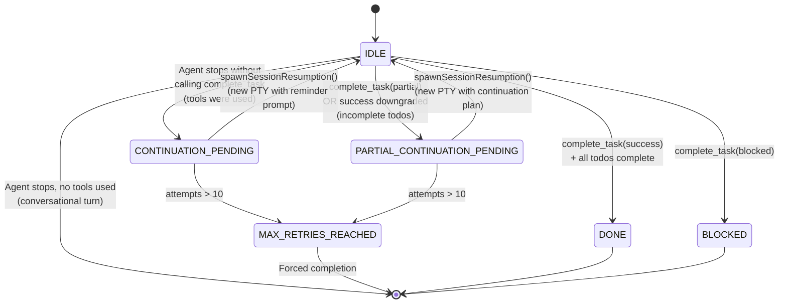
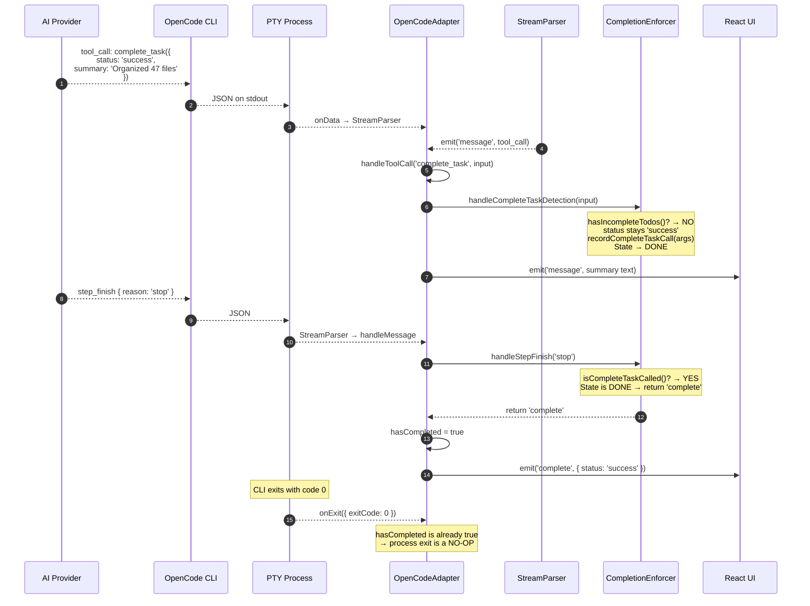
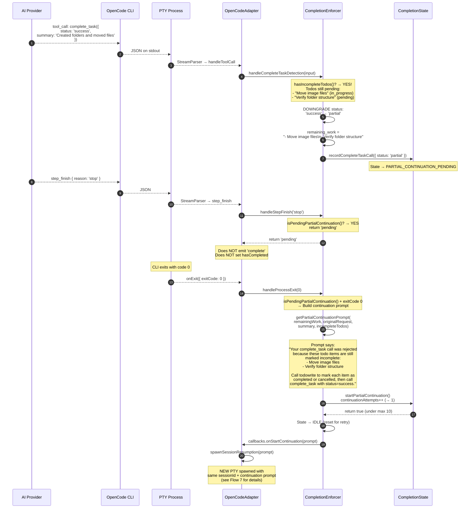
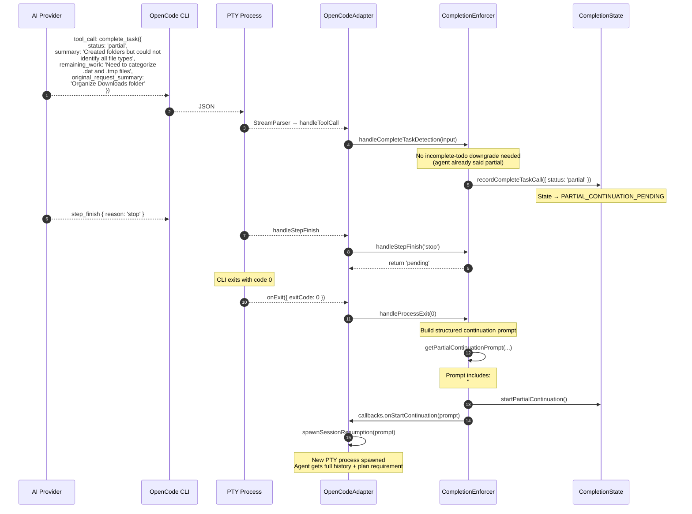
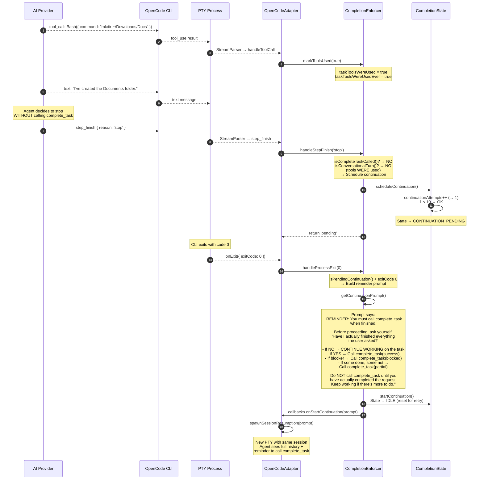
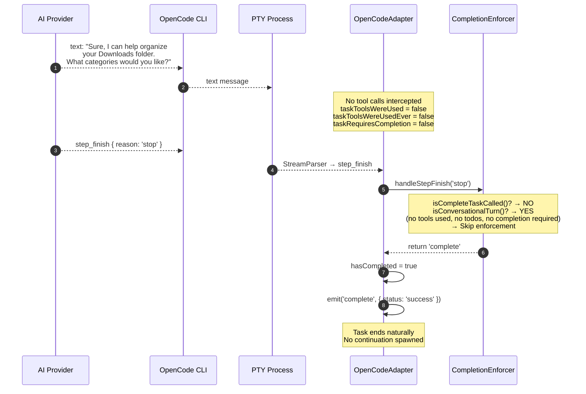
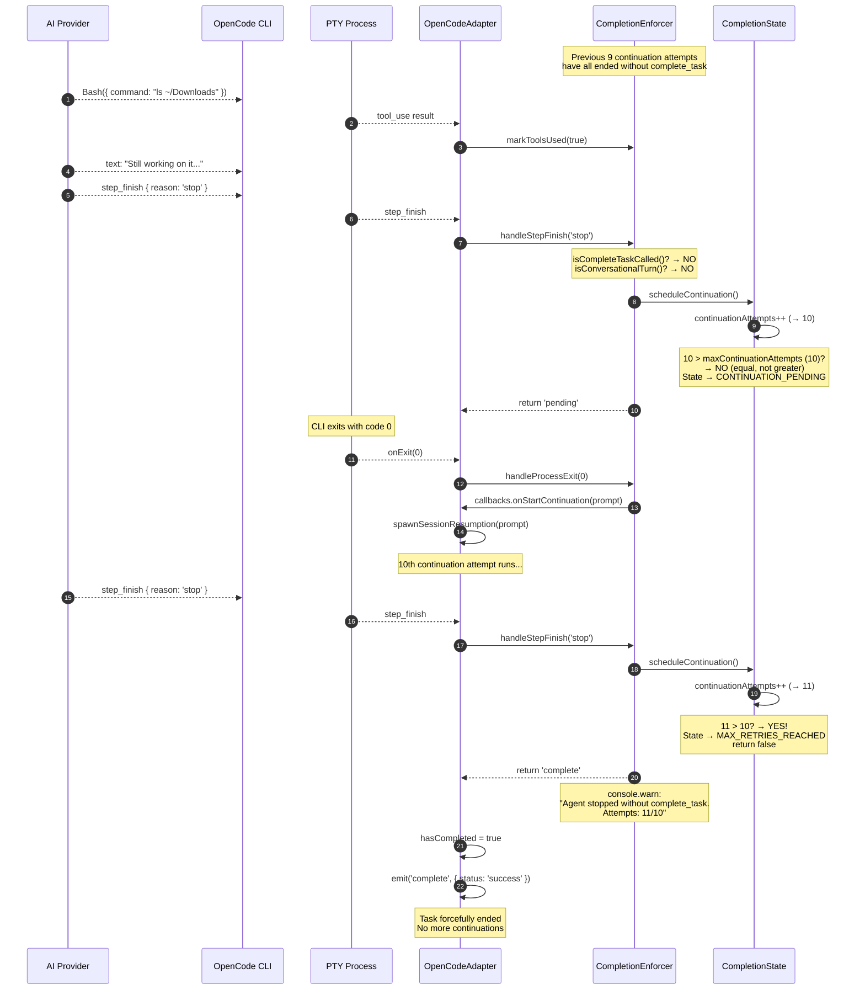
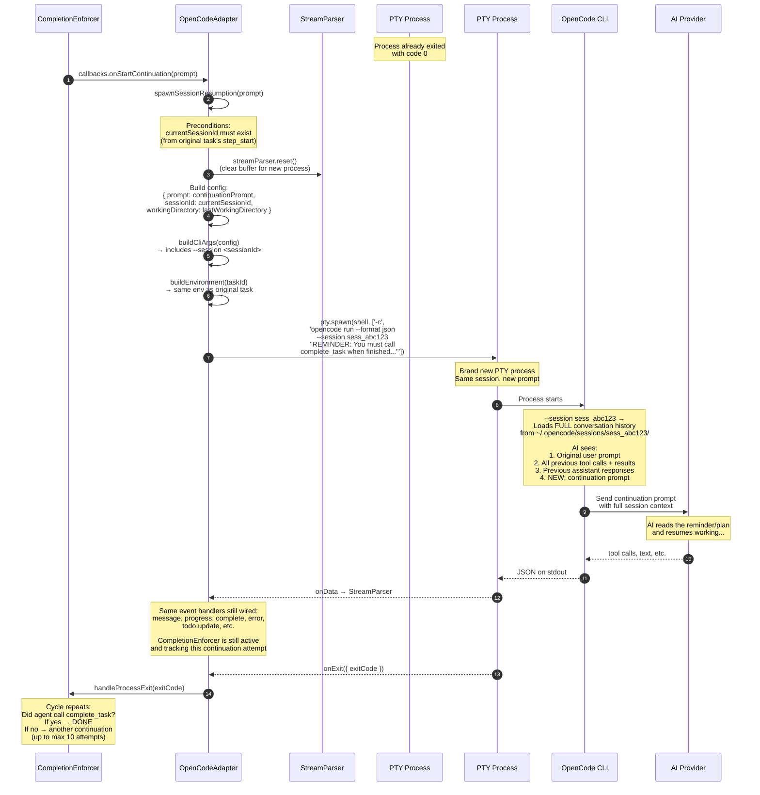

# Completion Enforcer — Control Flow Diagrams

> [!WARNING]
> **This document describes the pre-SDK-cutover PTY architecture.** The OpenCode SDK cutover port (commercial PR #720) replaced `node-pty` + `StreamParser` with `@opencode-ai/sdk` + `opencode serve`, so the `PTY Process` / `StreamParser` participants and byte-stream flows shown below no longer reflect runtime behaviour. The transport, participant names, and byte-stream fan-out are stale; the participants and data they exchange (adapter, TaskManager, daemon, UI) are still structurally accurate, as are the ordering and causality of events. Treat these diagrams as historical reference until they are rewritten in a follow-up docs PR. Current flow: `apps/daemon/src/opencode/server-manager.ts` spawns `opencode serve` per task; `packages/agent-core/src/internal/classes/OpenCodeAdapter.ts` subscribes to the SDK event stream; permissions/questions go through `client.permission.reply` / `client.question.reply` (not HTTP+MCP bridges).

> The CompletionEnforcer is Accomplish's guardrail layer on top of OpenCode.
> It ensures tasks reach a defined endpoint by tracking a state machine, validating
> todo completeness, and spawning continuation sessions when the agent falls short.

---

## State Machine Overview

---

## Flow 1: Happy Path — `complete_task(success)`, All Todos Done

The agent calls `complete_task` with `status: 'success'` and every todo is completed or cancelled. The enforcer validates and lets the task end normally.

---

## Flow 2: Agent Claims Success but Has Incomplete Todos

The agent calls `complete_task(success)` but some todos are still pending/in_progress. The enforcer **downgrades** the status to `partial` and triggers a continuation that forces the agent to finish or update its todo list.

---

## Flow 3: Agent Reports Partial Completion

The agent voluntarily calls `complete_task(partial)` admitting it didn't finish. The enforcer forces a structured continuation with a mandatory plan.

---

## Flow 4: Agent Stops Without Calling `complete_task`

The agent's turn ends (step_finish with reason `stop`/`end_turn`) but it never called `complete_task`. If tools were used, the enforcer re-prompts.

---

## Flow 5: Conversational Turn — No Enforcement Needed

The agent responds with only text (no tools used, no todos created). The enforcer recognizes this as a conversational exchange and lets it end without requiring `complete_task`.

---

## Flow 6: Max Retries Exhausted

After 10 continuation attempts (default), the enforcer gives up and forces the task to end regardless of completion state.

---

## Flow 7: Session Resumption Mechanism — `spawnSessionResumption()`

This is the engine behind all continuation flows. When the CompletionEnforcer decides the task isn't done, it calls back into the adapter which spawns a brand new PTY process using the same session ID, so OpenCode loads the full conversation history plus the continuation prompt.

