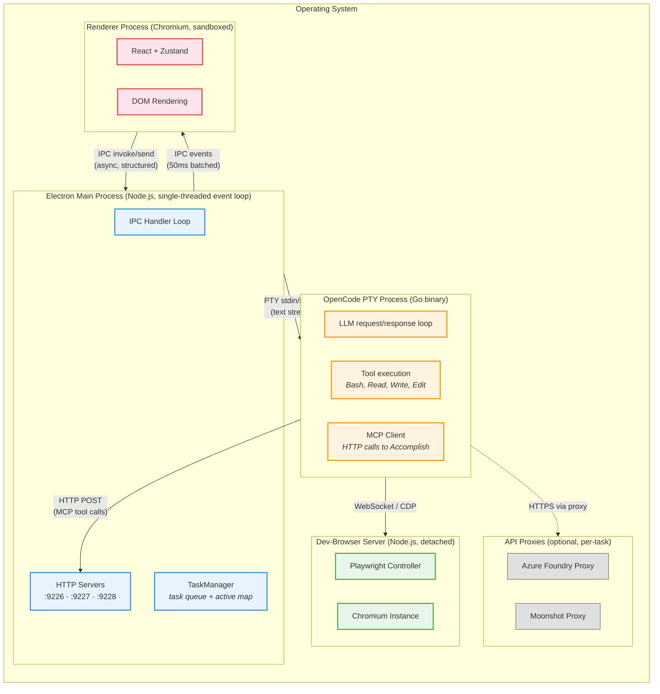
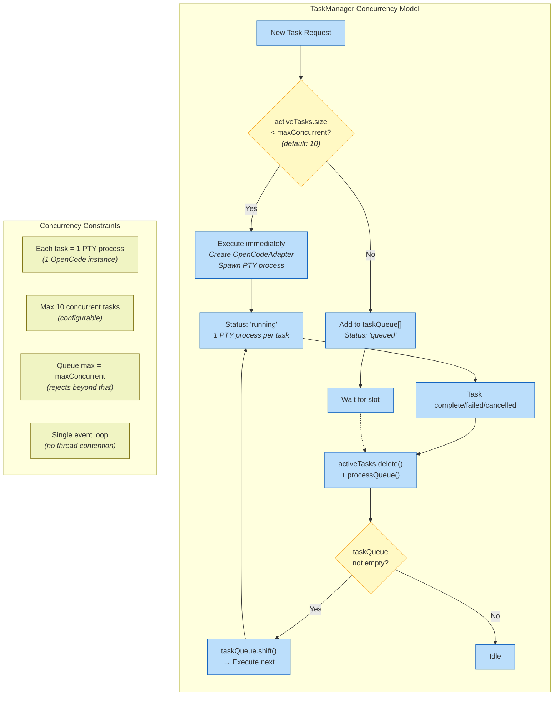
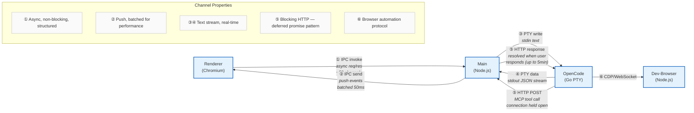
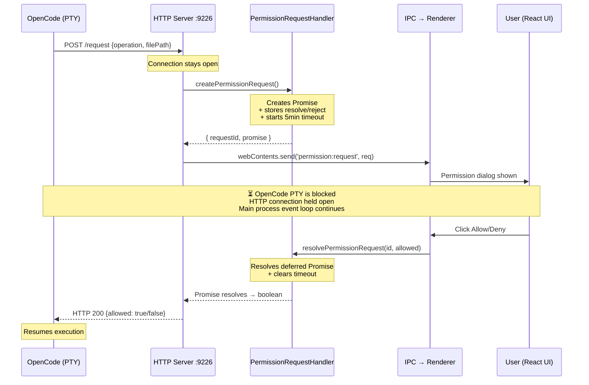
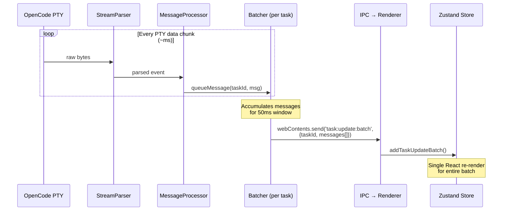
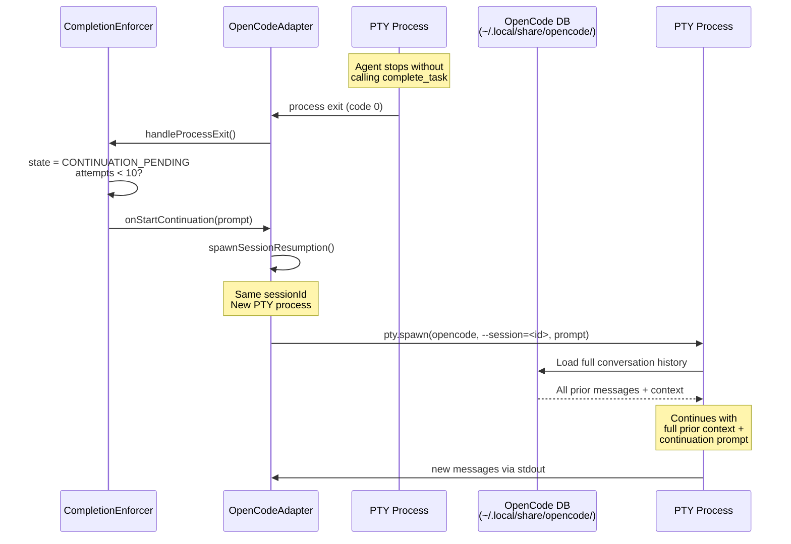

# Concurrency Viewpoint — Accomplish Architecture

> [!WARNING]
> **This document describes the pre-SDK-cutover PTY architecture.** The OpenCode SDK cutover port (commercial PR #720) replaced `node-pty` + `StreamParser` with `@opencode-ai/sdk` + `opencode serve`, so the `PTY Process` / `StreamParser` participants and byte-stream flows shown below no longer reflect runtime behaviour. The transport, participant names, and byte-stream fan-out are stale; the participants and data they exchange (adapter, TaskManager, daemon, UI) are still structurally accurate, as are the ordering and causality of events. Treat these diagrams as historical reference until they are rewritten in a follow-up docs PR. Current flow: `apps/daemon/src/opencode/server-manager.ts` spawns `opencode serve` per task; `packages/agent-core/src/internal/classes/OpenCodeAdapter.ts` subscribes to the SDK event stream; permissions/questions go through `client.permission.reply` / `client.question.reply` (not HTTP+MCP bridges).

> Rozanski & Woods Concurrency Viewpoint: maps the system's functional elements to runtime processes and threads, identifies inter-process communication, and describes synchronization and coordination mechanisms.

---

## 1. Process & Thread Model

All processes that exist at runtime and how they communicate.

---

## 2. Task Queue & Execution Model

How tasks are scheduled, queued, and executed — the core concurrency control.

---

## 3. Inter-Process Communication Map

Every communication channel, its protocol, direction, and blocking behavior.

---

## 4. Permission Request — Deferred Promise Pattern

The most interesting synchronization mechanism: how an MCP HTTP call blocks until a human responds in the UI.

---

## 5. Message Batching — Render Optimization

How high-frequency PTY output is batched to avoid overwhelming React rendering.

---

## 6. Session Resumption — Continuation Lifecycle

How the CompletionEnforcer spawns new PTY processes for task continuation, sharing the same OpenCode session.

---

## Summary: Concurrency Properties

| Property                   | Value                                 | Mechanism                                 |
| -------------------------- | ------------------------------------- | ----------------------------------------- |
| **Max concurrent tasks**   | 10 (default, configurable)            | `TaskManager.maxConcurrentTasks`          |
| **Task queue max**         | 10 (same as max concurrent)           | Rejects with error if exceeded            |
| **Process per task**       | 1 PTY (OpenCode Go binary)            | `pty.spawn()` per `executeTask()`         |
| **Main process threading** | Single-threaded event loop            | Node.js — no thread contention            |
| **Renderer threading**     | Single-threaded (Chromium)            | React renders on UI thread                |
| **Dev-browser server**     | Detached, outlives parent             | `child.unref()`, persists between tasks   |
| **Permission blocking**    | Deferred Promise, 5min timeout        | HTTP connection held open                 |
| **Message batching**       | 50ms window                           | `setTimeout` + array accumulation         |
| **SQLite concurrency**     | WAL mode (readers don't block writer) | `PRAGMA journal_mode = WAL`               |
| **Session resumption**     | New PTY, same session ID              | OpenCode loads history from its own DB    |
| **API proxies**            | Optional, per-provider                | Azure Foundry + Moonshot only             |
| **Continuation retries**   | Max 10 attempts                       | `CompletionState.maxContinuationAttempts` |
