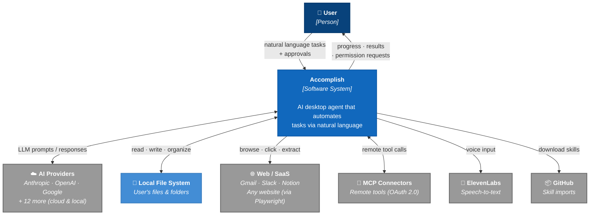
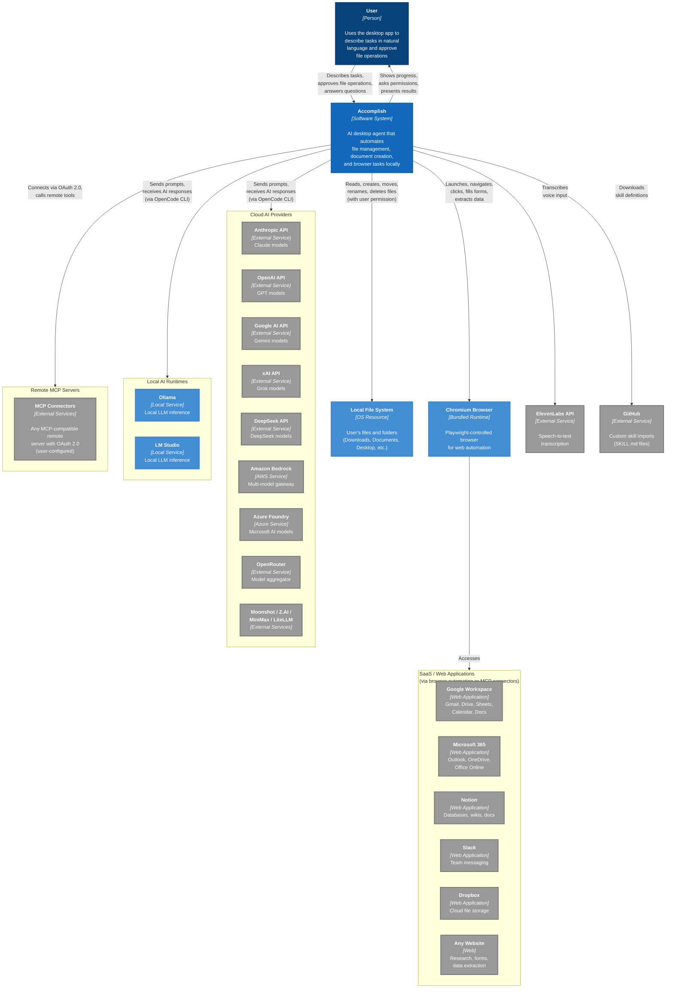

# Accomplish — System Context Diagram

> **Viewpoint**: Context (Rozanski & Woods)
>
> Shows the system as a single box, surrounded by the users and external entities
> it interacts with. No internal structure is exposed at this level.

### Simplified View

The essential shape: one user, one system, six categories of external entities.

---

### Detailed View

The same context exploded — every individual provider, SaaS app, and integration method.

---

## Relationship Summary

| External Entity                                          | Integration Method                                      | Direction                | Auth                                 |
| -------------------------------------------------------- | ------------------------------------------------------- | ------------------------ | ------------------------------------ |
| **Cloud AI Providers** (Anthropic, OpenAI, Google, etc.) | HTTP API via OpenCode CLI                               | Bidirectional            | API keys (AES-256-GCM encrypted)     |
| **Local AI Runtimes** (Ollama, LM Studio)                | HTTP API on localhost                                   | Bidirectional            | None (local)                         |
| **Local File System**                                    | OS file operations via OpenCode's Bash/Write/Read tools | Read + Write             | User permission dialog per operation |
| **Chromium Browser**                                     | Playwright CDP protocol (bundled)                       | Control                  | None (local process)                 |
| **Google Workspace**                                     | Browser automation (Playwright)                         | Read + Write             | User's browser session               |
| **Microsoft 365**                                        | Browser automation (Playwright)                         | Read + Write             | User's browser session               |
| **Notion / Slack / Dropbox**                             | Browser automation (Playwright)                         | Read + Write             | User's browser session               |
| **Any Website**                                          | Browser automation (Playwright)                         | Read + Write             | User's browser session               |
| **Remote MCP Servers**                                   | MCP protocol over HTTPS with OAuth 2.0                  | Bidirectional            | OAuth 2.0 + PKCE                     |
| **ElevenLabs**                                           | REST API                                                | Send audio, receive text | API key                              |
| **GitHub**                                               | HTTPS raw content download                              | Read only                | None (public repos)                  |

## Key Architectural Decisions at Context Level

1. **Local-first**: Accomplish runs entirely on the user's machine. No Accomplish backend exists. Data stays local.

2. **Bring-your-own-AI**: Users provide their own API keys or run local models. Accomplish is a tool, not a service.

3. **Browser as integration layer**: SaaS apps (Gmail, Sheets, Notion, Slack) are accessed via browser automation, not dedicated API integrations. This means no OAuth per service and no stored SaaS credentials — the user's existing browser sessions are reused.

4. **MCP for extensibility**: For direct API-level integrations, users can connect any MCP-compatible remote server with OAuth 2.0. This is the structured alternative to browser automation.

5. **Permission-gated file access**: Every file operation requires explicit user approval via a dialog. The gate is prompt-instructed (not hard-enforced) — see `functional-viewpoint.md` §8 (Permission & Question Request Flow).
