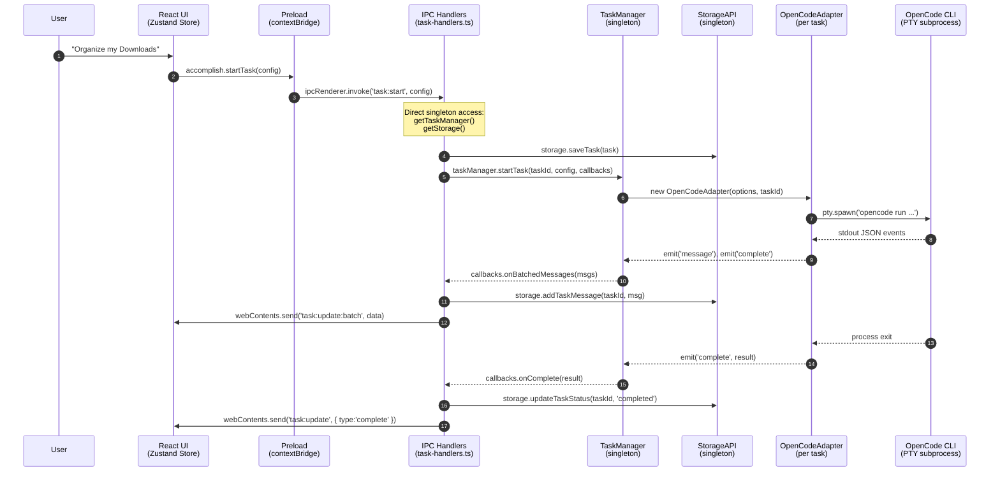
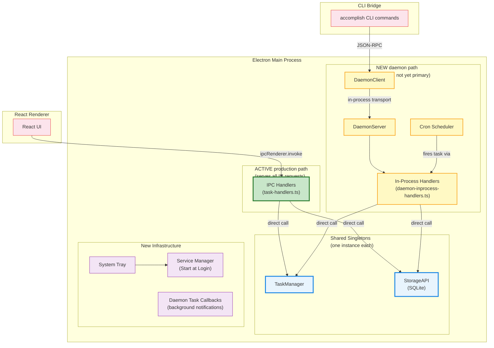
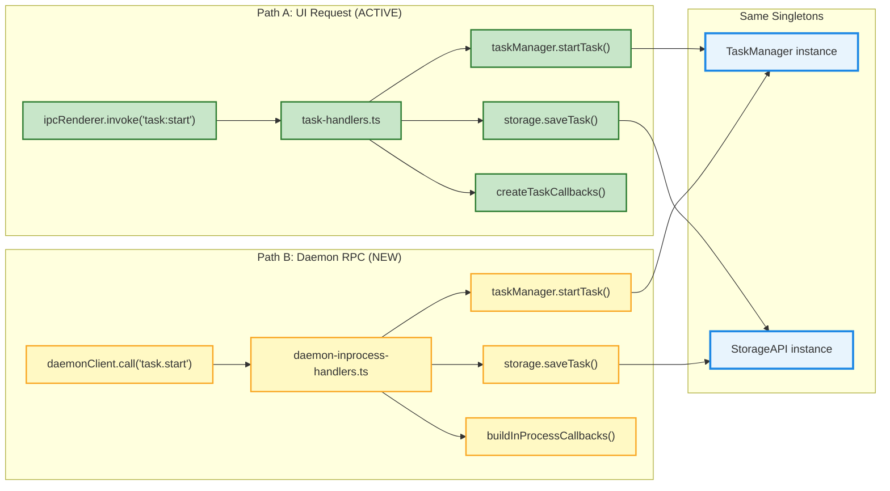
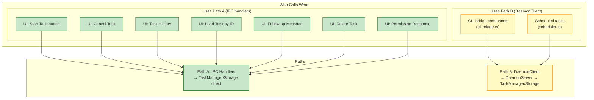
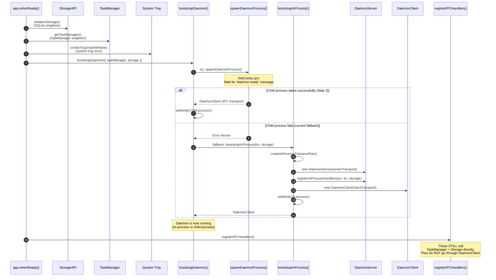
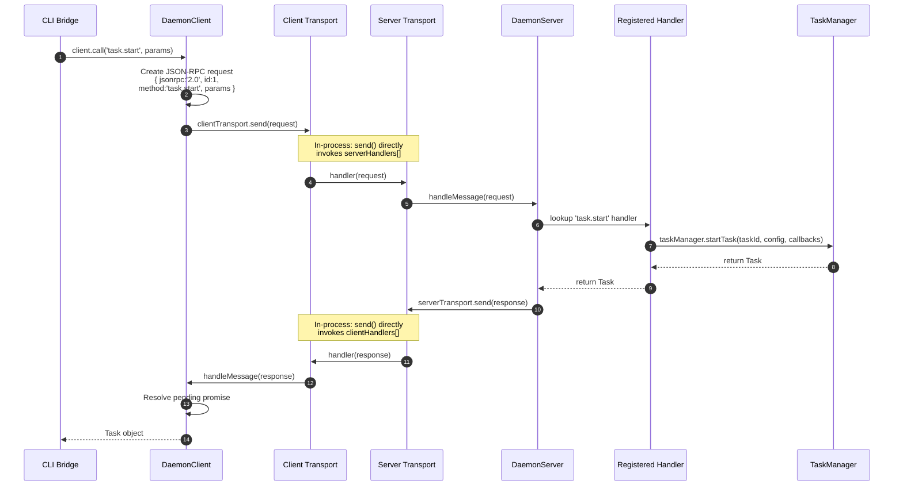
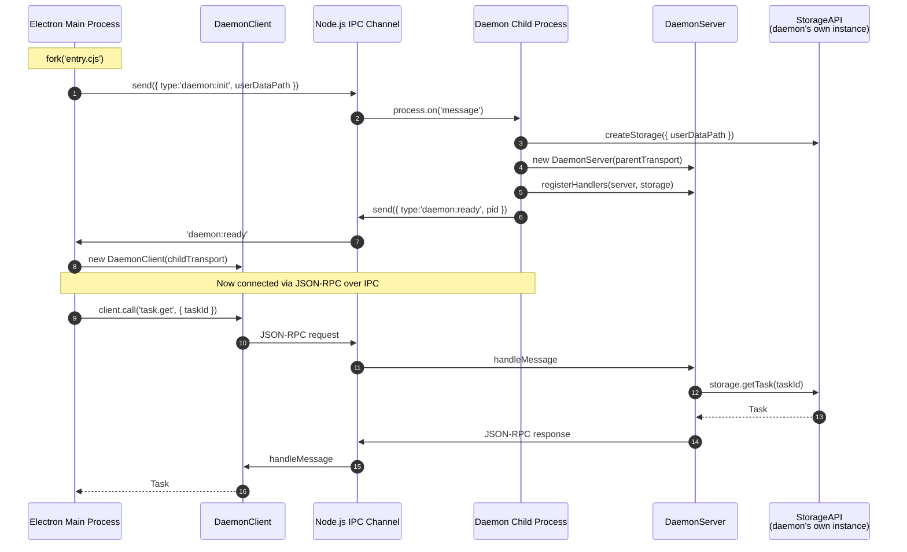
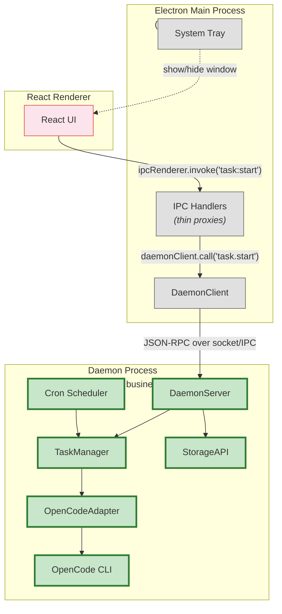

# Daemon Architecture — HISTORICAL (Pre-Migration)

> **⚠️ This document is historical.** It describes the architecture BEFORE the daemon migration (Phases 0–11). The current architecture is documented in [`daemon-final-architecture.md`](daemon-final-architecture.md).
>
> Retained for reference: shows the original IPC/TaskManager architecture, the three failed daemon implementations that were removed, and the migration analysis that informed the plan.

---

## 1. Before Daemon — Original Architecture (Still the Active Production Path)

This is how **every user-facing task still runs today**. The IPC handlers call TaskManager and Storage **directly** — no daemon involved.

**Key point:** IPC handlers → TaskManager → Storage. All direct function calls. No RPC layer.

---

## 2. What the Daemon Added (Running in Parallel)

The daemon was bootstrapped **alongside** the existing IPC handlers. Both use the **same singletons**.

**Key insight:** Both paths end at the same `TaskManager` and `StorageAPI` singletons. No data inconsistency — just two entry points.

---

## 3. The Duplication — Side by Side

This diagram shows the **exact same operations** implemented in two places.

The same pattern repeats for every operation:

| Operation      | Path A (IPC handler)                            | Path B (Daemon RPC)                                         |
| -------------- | ----------------------------------------------- | ----------------------------------------------------------- |
| Start task     | `task-handlers.ts` → `taskManager.startTask()`  | `daemon-inprocess-handlers.ts` → `taskManager.startTask()`  |
| Cancel task    | `task-handlers.ts` → `taskManager.cancelTask()` | `daemon-inprocess-handlers.ts` → `taskManager.cancelTask()` |
| Get task       | `task-handlers.ts` → `storage.getTask()`        | `daemon-inprocess-handlers.ts` → `storage.getTask()`        |
| List tasks     | `task-handlers.ts` → `storage.getTasks()`       | `daemon-inprocess-handlers.ts` → `storage.getTasks()`       |
| Delete task    | `task-handlers.ts` → `storage.deleteTask()`     | `daemon-inprocess-handlers.ts` → `storage.deleteTask()`     |
| Resume session | `task-handlers.ts` → `taskManager.startTask()`  | `daemon-inprocess-handlers.ts` → `taskManager.startTask()`  |

---

## 4. Who Uses Which Path Today

---

## 5. Daemon Bootstrap Sequence

How the daemon is initialized alongside the existing architecture at app startup.

---

## 6. In-Process Mode: How the Transport Works

In the current fallback mode, client and server are in the same process. Messages are delivered via direct function calls — no serialization, no sockets.

---

## 7. Child Process Mode: The Target Architecture (Step 3)

When the child process daemon works, the transport becomes real IPC between two processes. The daemon child owns its own Storage instance.

**Important limitation visible in the code:** The child process daemon (`entry.ts`) currently only registers **storage-backed** handlers (`task.get`, `task.list`, `task.delete`, `storage.*`). It does **NOT** register `task.start` or `task.cancel` because TaskManager still depends on Electron APIs (secure storage, app paths). That comment in `entry.ts`:

> _"Task execution remains in the Electron main process for now because the OpenCode CLI adapter depends on Electron APIs. This will be migrated in a future step once the adapter is decoupled."_

---

## 8. Intended End State (Future Step 3 Complete)

When fully migrated, the IPC handlers become thin proxies. All business logic lives behind the DaemonClient.

In the end state:

- **Electron main process** = UI shell + DaemonClient proxy + Tray
- **Daemon process** = TaskManager + Storage + Scheduler + OpenCodeAdapter
- **Window can close** → daemon keeps running → tasks survive
- **Window reopens** → DaemonClient reconnects → UI catches up via RPC

---

## Two Callback Variants

The daemon introduced a second set of task callbacks for background execution:

```mermaid
graph TB
    subgraph ORIGINAL["createTaskCallbacks()<br/>(task-callbacks.ts)"]
        direction TB
        O1["Fixed window + sender reference"]
        O2["forwardToRenderer() via sender.send()"]
        O3["Sets hasRendererSendFailure flag on error"]
        O4["Browser failure detection + recovery"]
        O5["No OS notifications"]
    end

    subgraph DAEMON_CB["createDaemonTaskCallbacks()<br/>(task-callbacks.ts)"]
        direction TB
        D1["Dynamic getWindow() — window may not exist"]
        D2["forwardToRenderer() via win.webContents.send()"]
        D3["Silently catches send errors"]
        D4["No browser recovery"]
        D5["sendBackgroundNotification() on complete/error"]
        D6["updateTray() on status changes"]
    end

    subgraph USED_BY_O["Used by"]
        UI_TASK["UI-initiated tasks<br/>(task-handlers.ts)"]
    end

    subgraph USED_BY_D["Used by"]
        DAEMON_TASK["Daemon-initiated tasks<br/>(scheduled, CLI)"]
    end

    UI_TASK --> ORIGINAL
    DAEMON_TASK --> DAEMON_CB

    classDef original fill:#c8e6c9,stroke:#2e7d32
    classDef daemon fill:#fff9c4,stroke:#f9a825

    class O1,O2,O3,O4,O5 original
    class D1,D2,D3,D4,D5,D6 daemon
```

The daemon callbacks handle the case where the window is minimized, hidden, or destroyed — sending OS-native notifications instead of relying on the renderer being available.
