# Daemon Final Architecture — Flow Diagrams

> [!WARNING]
> **This document describes the pre-SDK-cutover PTY architecture.** The OpenCode SDK cutover port (commercial PR #720) replaced `node-pty` + `StreamParser` with `@opencode-ai/sdk` + `opencode serve`, so the `PTY Process` / `StreamParser` participants and byte-stream flows shown below no longer reflect runtime behaviour. The transport, participant names, and byte-stream fan-out are stale; the participants and data they exchange (adapter, TaskManager, daemon, UI) are still structurally accurate, as are the ordering and causality of events. Treat these diagrams as historical reference until they are rewritten in a follow-up docs PR. Current flow: `apps/daemon/src/opencode/server-manager.ts` spawns `opencode serve` per task; `packages/agent-core/src/internal/classes/OpenCodeAdapter.ts` subscribes to the SDK event stream; permissions/questions go through `client.permission.reply` / `client.question.reply` (not HTTP+MCP bridges).

> **Current architecture** (implemented in Phases 0–11): standalone daemon process that survives Electron exit. The Electron app is a **thin UI/integration shell** (tray, native notifications, file pickers, auth browser flows, renderer IPC forwarding) that connects to the daemon via Unix socket / Windows named pipe JSON-RPC.
>
> Task scheduler is implemented with SQLite persistence, cron matching, and a dedicated Settings tab.

---

## Architecture Ownership

| Owner                     | Responsibilities                                                                                                                                                                                                        |
| ------------------------- | ----------------------------------------------------------------------------------------------------------------------------------------------------------------------------------------------------------------------- |
| **`apps/daemon`**         | Task execution, task/session lifecycle, permission/question HTTP services, thought streaming, durable task state, reconnectable notification stream                                                                     |
| **`apps/desktop`**        | Thin UI/integration shell: trusted-window checks, renderer IPC surface, tray, native notifications, native dialogs/file pickers, auth/browser flows (OAuth popups), forwarding daemon notifications to renderer         |
| **`packages/agent-core`** | Daemon protocol/server/client/transport abstractions, TaskManager/OpenCodeAdapter/runtime building blocks, storage primitives, **shared config-building helpers** (skills, connectors, sandbox, workspace, attachments) |

**Key principle:** There is ONE task-start config assembly path — shared helpers in agent-core, consumed by both desktop (during bridge period) and daemon. We never maintain two separate config-building brains.

---

## Data-Dir Contract & Daemon Identity

All launch modes MUST resolve to the **same storage root**. Socket and PID paths are derived from `dataDir` — not global constants — so that dev/prod or multiple profiles never collide.

| Launch mode                         | How data-dir is determined                                     |
| ----------------------------------- | -------------------------------------------------------------- |
| Desktop-launched daemon             | `spawn(node, [daemon, '--data-dir', app.getPath('userData')])` |
| Login-item daemon (macOS/Windows)   | LaunchAgent/startup entry passes `--data-dir <userData>`       |
| Login-item daemon (Linux systemd)   | `ExecStart=... --data-dir <userData>`                          |
| Manual/standalone daemon (dev only) | `--data-dir` optional; defaults to `~/.accomplish` for dev     |

**Identity files derived from dataDir:**

| File           | macOS / Linux                   | Windows                                      |
| -------------- | ------------------------------- | -------------------------------------------- |
| Database       | `<dataDir>/accomplish.db`       | `<dataDir>\accomplish.db`                    |
| Socket         | `<dataDir>/daemon.sock`         | `\\.\pipe\accomplish-daemon-<hash(dataDir)>` |
| PID lock       | `<dataDir>/daemon.pid`          | `<dataDir>\daemon.pid`                       |
| Secure storage | `<dataDir>/secure-storage.json` | `<dataDir>\secure-storage.json`              |

Without this contract, dev/prod or multiple profiles connect to the wrong database, socket, or PID file.

---

## Unattended Permission Policy

When a task requires user permission and **no UI client is connected**:

1. Daemon sends `notify('permission.request')` — no clients receive it
2. MCP tool HTTP connection stays open, waiting
3. After `PERMISSION_REQUEST_TIMEOUT_MS` (5 minutes) → **auto-deny**
4. AI adapts: completes with `status: 'partial'` or `status: 'blocked'`
5. Result persisted in SQLite with full message history
6. When user reopens UI → sees failed/partial task → can follow up to retry

This is the **safe default**. Future enhancements (queue-and-pause, external notification channels) are out of scope.

---

## RPC Method Contract

Normalized method names (resolved `task.stop` vs `task.cancel` conflict):

| Method                    | Params                                                               | Result               | Notes                                             |
| ------------------------- | -------------------------------------------------------------------- | -------------------- | ------------------------------------------------- |
| `daemon.ping`             | —                                                                    | `{ status, uptime }` | Health check, already exists                      |
| `daemon.shutdown`         | —                                                                    | void                 | **New.** Graceful drain (30s) + exit              |
| `task.start`              | `{ prompt, taskId?, workspaceId?, attachments?, workingDirectory? }` | `Task`               |                                                   |
| `task.cancel`             | `{ taskId }`                                                         | void                 | Normalized (was `task.stop` in standalone daemon) |
| `task.interrupt`          | `{ taskId }`                                                         | void                 |                                                   |
| `task.get`                | `{ taskId }`                                                         | `Task`               |                                                   |
| `task.list`               | —                                                                    | `Task[]`             |                                                   |
| `task.delete`             | `{ taskId }`                                                         | void                 |                                                   |
| `task.getTodos`           | `{ taskId }`                                                         | `TodoItem[]`         |                                                   |
| `task.clearHistory`       | —                                                                    | void                 |                                                   |
| `session.resume`          | `{ sessionId, prompt, existingTaskId?, attachments? }`               | `Task`               |                                                   |
| `permission.respond`      | `{ requestId, decision, ... }`                                       | void                 |                                                   |
| `task.schedule`           | `{ cron, prompt, workspaceId? }`                                     | `ScheduledTask`      | Create persistent schedule                        |
| `task.listScheduled`      | `{ workspaceId? }`                                                   | `ScheduledTask[]`    | Server-side workspace filtering                   |
| `task.cancelScheduled`    | `{ scheduleId }`                                                     | void                 |                                                   |
| `task.setScheduleEnabled` | `{ scheduleId, enabled }`                                            | void                 | Re-computes next_run_at on enable                 |

## Shutdown Semantics

Three distinct behaviors, never conflated:

| Action                                  | What happens                                       | Daemon impact                                                                                   |
| --------------------------------------- | -------------------------------------------------- | ----------------------------------------------------------------------------------------------- |
| **Hide window** (click X)               | `window.hide()`, tray stays                        | Daemon lives, socket connected, notifications flow                                              |
| **Quit Electron** (Cmd+Q / tray → Quit) | `client.close()`, `app.quit()`                     | Daemon lives. Socket disconnects. Process NOT killed.                                           |
| **Stop daemon** (explicit user action)  | `client.call('daemon.shutdown')` then `app.quit()` | Daemon gracefully drains tasks (30s), then exits. `daemon.shutdown` is a registered RPC method. |

---

## 1. High-Level Architecture

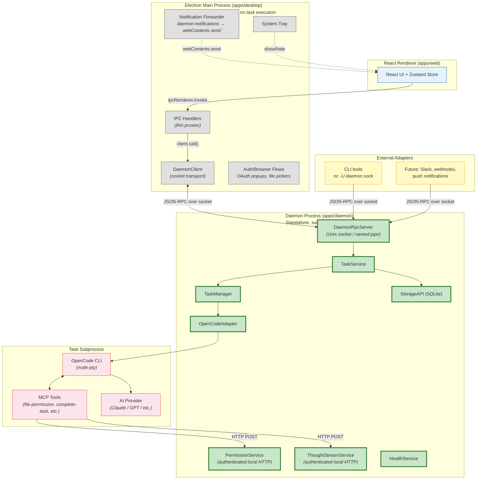

---

## 2. App Startup — Daemon Spawn & Connect

Shows all three scenarios: daemon already running (started by OS login item), Electron needs to spawn it, and first-ever launch.

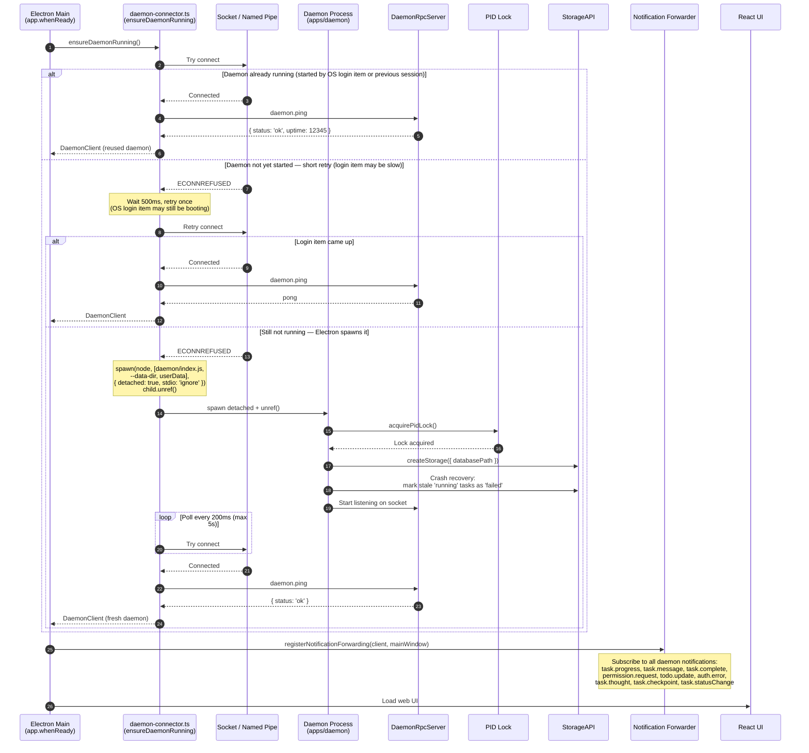

---

## 3. Task Execution — UI-Initiated (Detail)

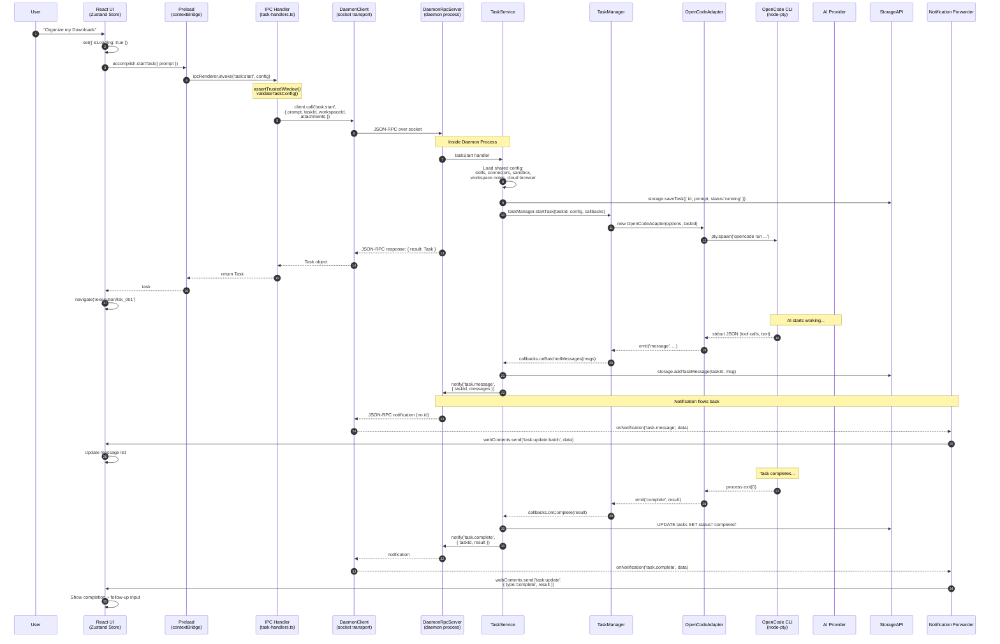

---

## 4. Task Execution — Scheduled / External (No Electron)

Explicitly shows the "no UI connected" branch as a first-class path.

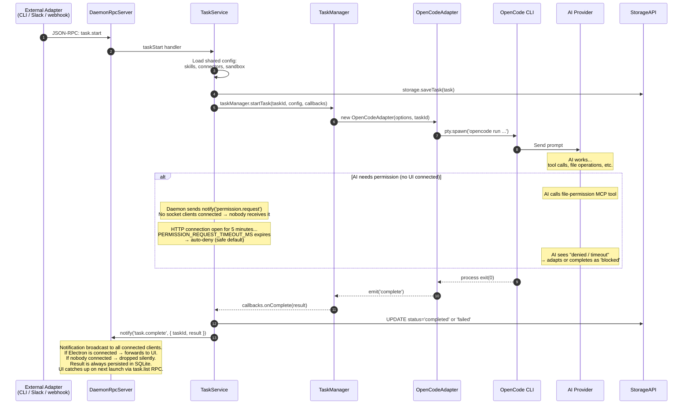

---

## 5. Permission Flow Through Daemon (UI Connected)

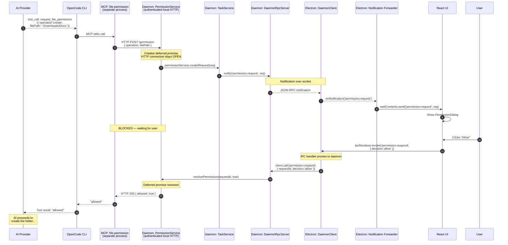

---

## 6. Follow-Up Message (Session Resume via Daemon)

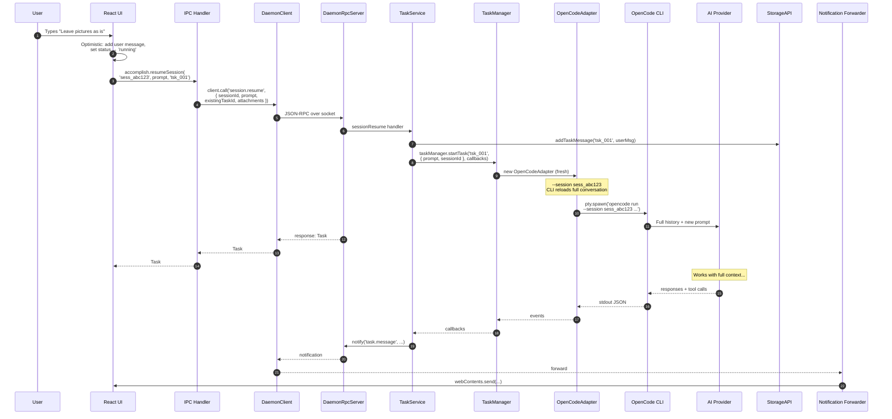

---

## 7. Window Close → Daemon Survives → Reconnect

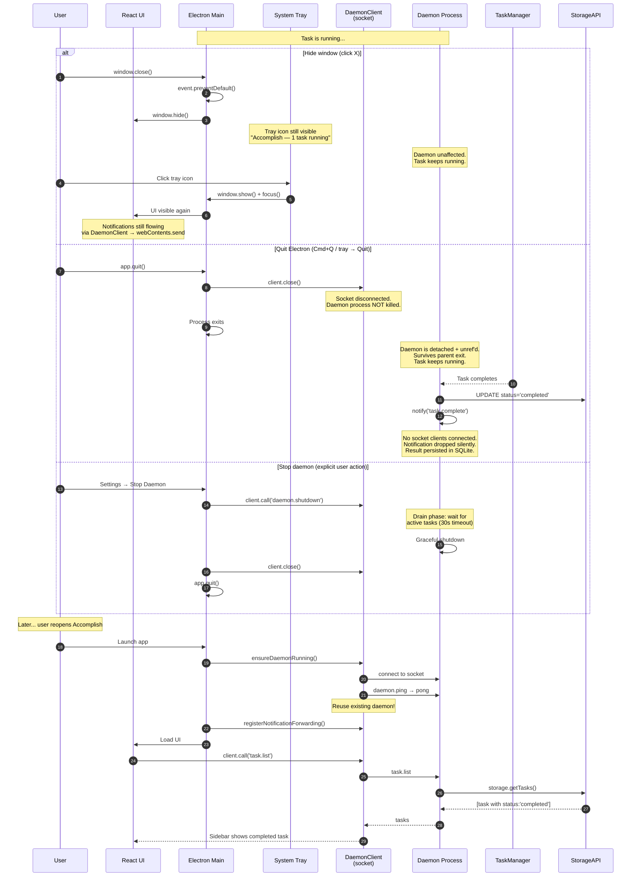

---

## 8. Daemon Crash → Recovery

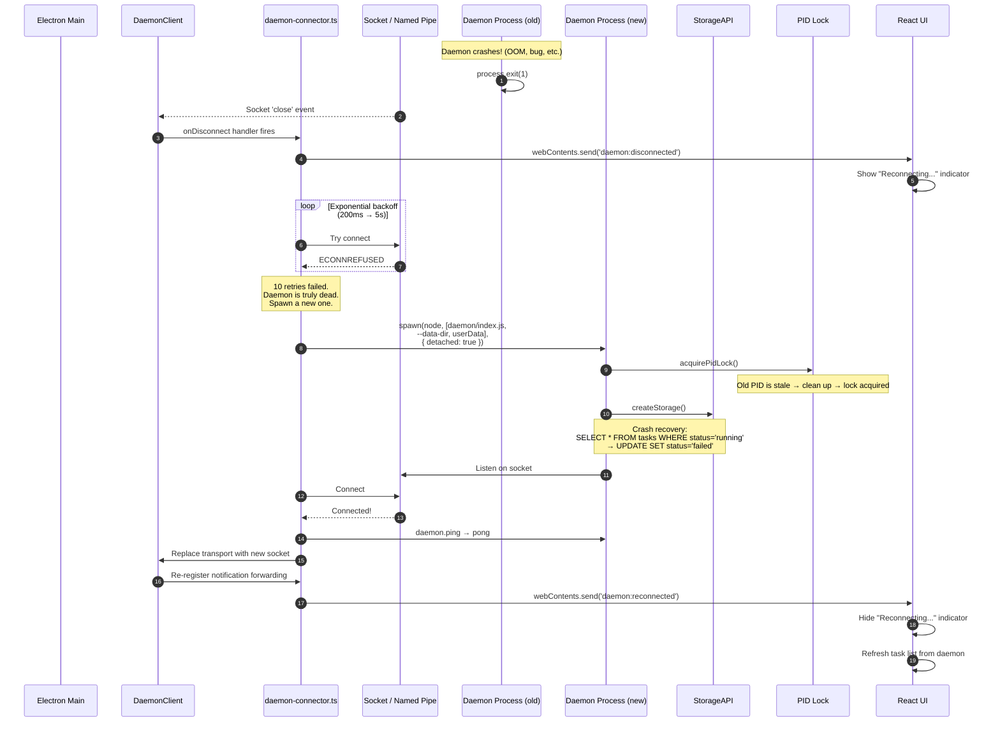

---

## 9. Daemon Settings UI — Monitoring & Control

The daemon tab merges into General settings. Users can monitor status, control the daemon, and configure close-button behavior.

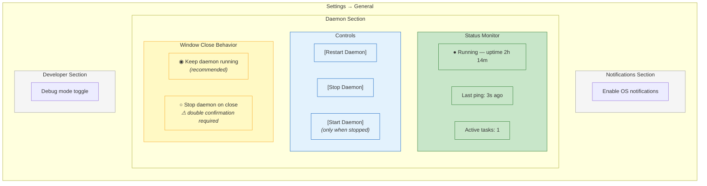

### Close Button Behavior Flow

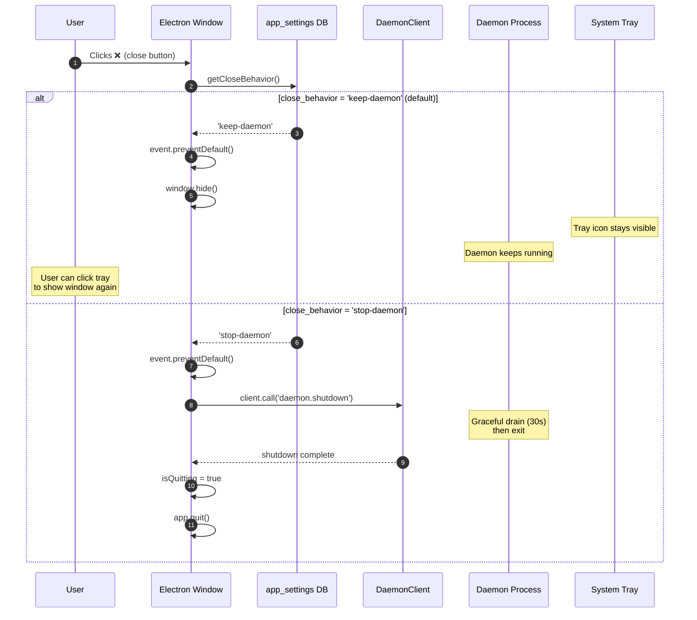

### Changing Close Behavior (Double Confirmation)

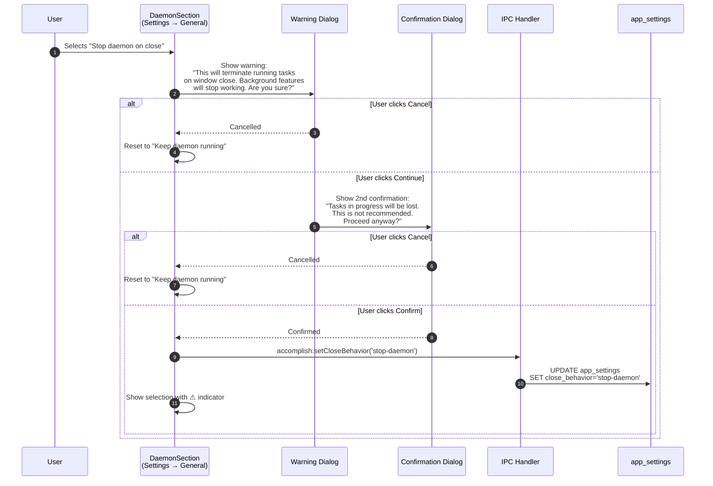

---

## 10. Shared Config Assembly (One Brain)

Shows how skills, connectors, sandbox, workspace, and attachments flow through a single shared config path in agent-core — used by both desktop (bridge period) and daemon.

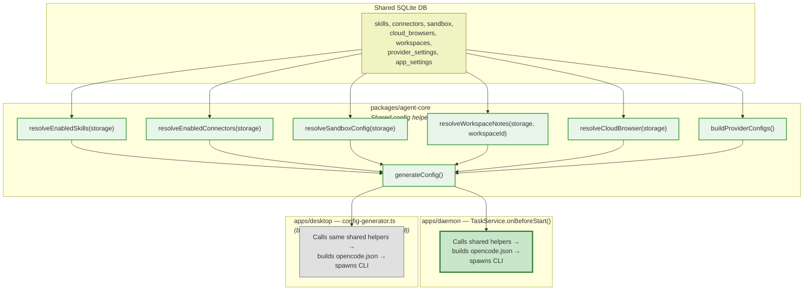

---

## 12. Migration Path Summary

```mermaid
graph LR
    subgraph P0["Phase 0: Cleanup"]
        DEL["Delete 9 dead files<br/>~1,084 lines"]
    end

    subgraph P1["Phase 1: Data-Dir"]
        DD["Standardize<br/>--data-dir contract"]
    end

    subgraph P2["Phase 2: Parity"]
        PAR["Move config assembly<br/>to shared agent-core<br/>Wire into daemon"]
    end

    subgraph P3["Phase 3: Transport"]
        ST["Client socket transport<br/>+ daemon connector<br/>+ spawn detached"]
    end

    subgraph P4["Phase 4: Bootstrap"]
        BS["Rewire bootstrap<br/>+ notification forwarding<br/>+ shutdown semantics"]
    end

    subgraph P5["Phase 5: Proxy"]
        PX["IPC handlers →<br/>daemon RPC proxies"]
    end

    subgraph P6["Phase 6: Service"]
        SVC["Login-item starts daemon<br/>+ reconnection logic"]
    end

    subgraph P7["Phase 7: Reads"]
        RD["Task reads →<br/>daemon RPC<br/>(eliminate split-brain)"]
    end

    subgraph P8["Phase 8: Cleanup"]
        FIN["Remove old execution path<br/>+ packaging"]
    end

    P0 --> P1 --> P2 --> P3 --> P4 --> P5 --> P6 --> P7 --> P8

    classDef done fill:#c8e6c9,stroke:#2e7d32
    classDef active fill:#fff9c4,stroke:#f9a825
    classDef future fill:#e3f2fd,stroke:#1565c0

    class P0 done
    class P1,P2,P3 active
    class P4,P5,P6,P7,P8 future
```
