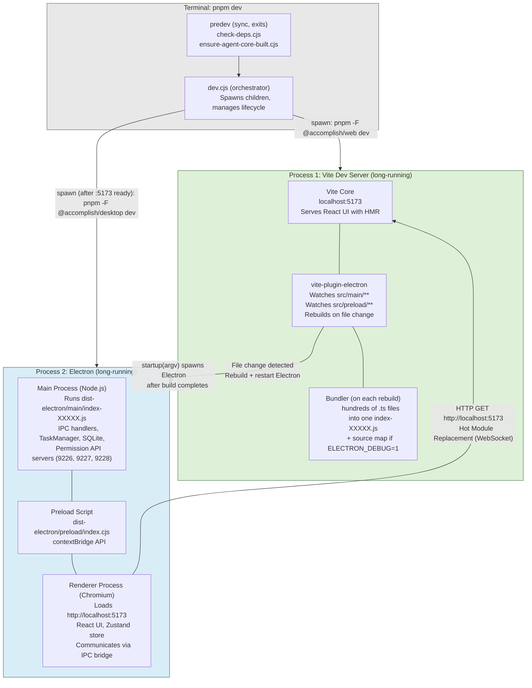
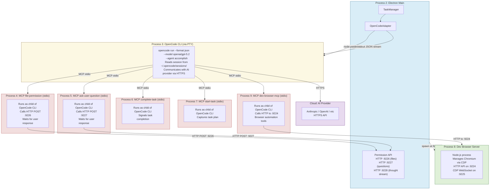
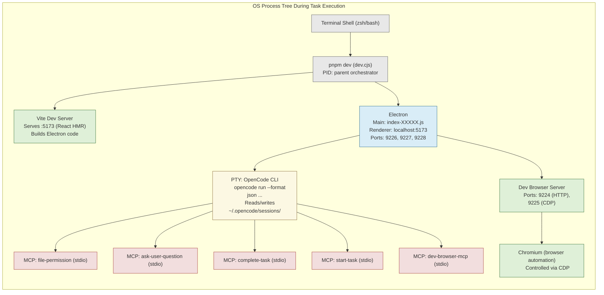
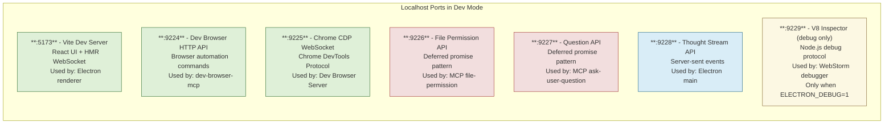
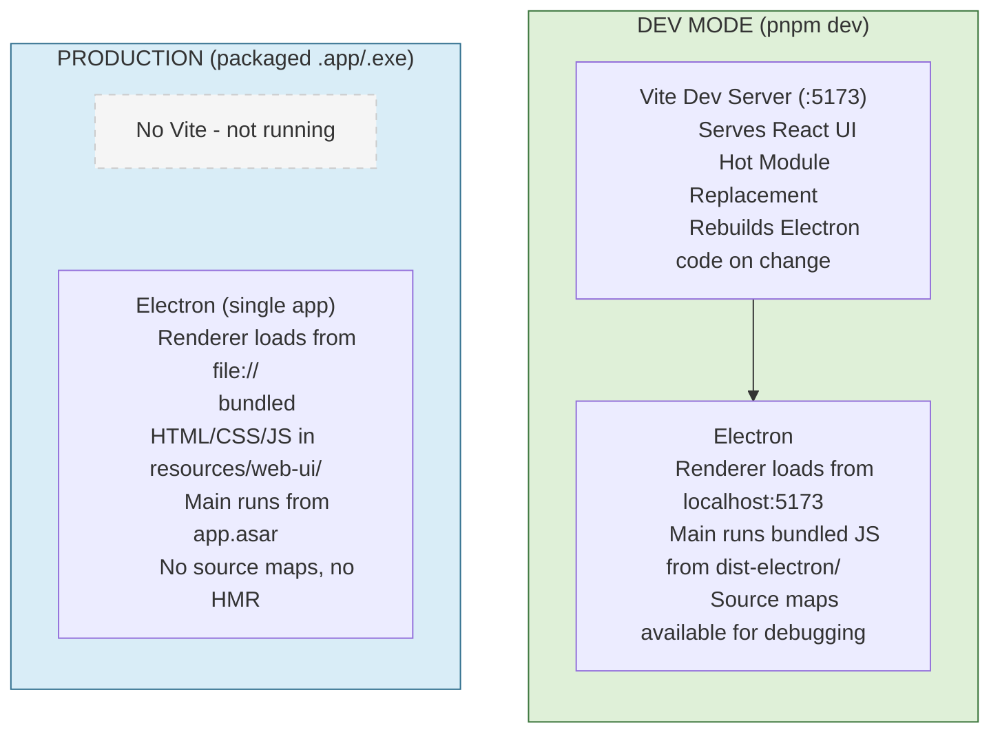
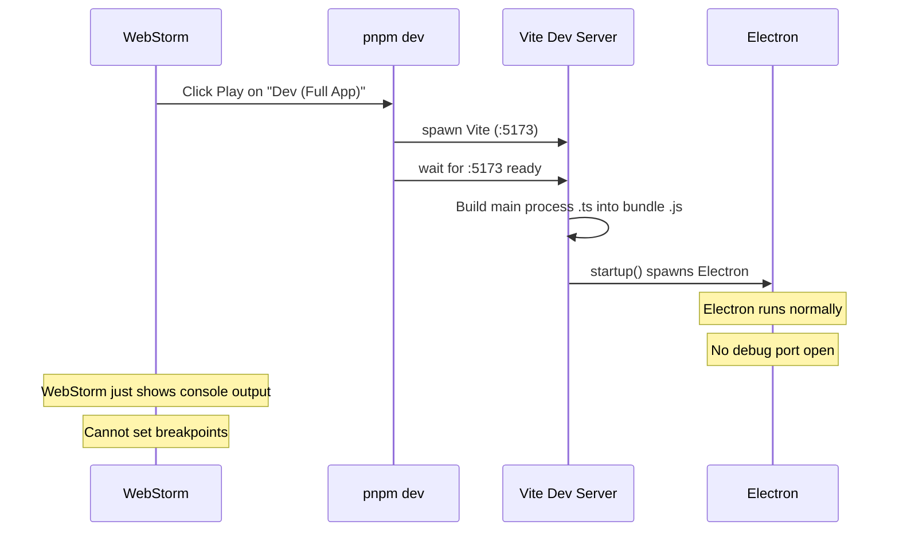
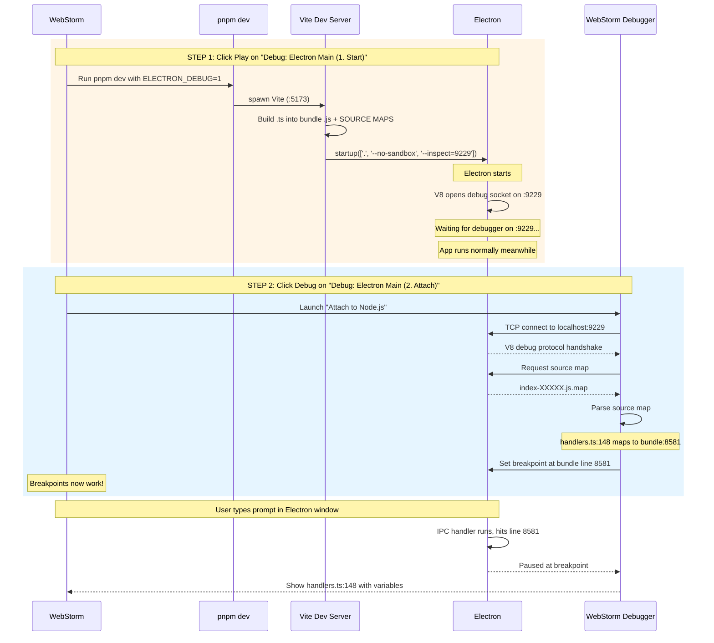
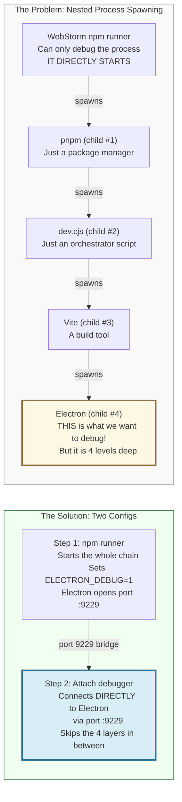

# Accomplish — Dev Mode Process Architecture

## What `pnpm dev` Spawns

## During Task Execution (additional processes)

## Full Process Tree

## Port Map

## Dev vs Production Process Differences

## WebStorm Debug: Why Two Steps?

### Normal Run (no debug) — one step

### Debug Run — two steps needed

### Why can't it be one step?

