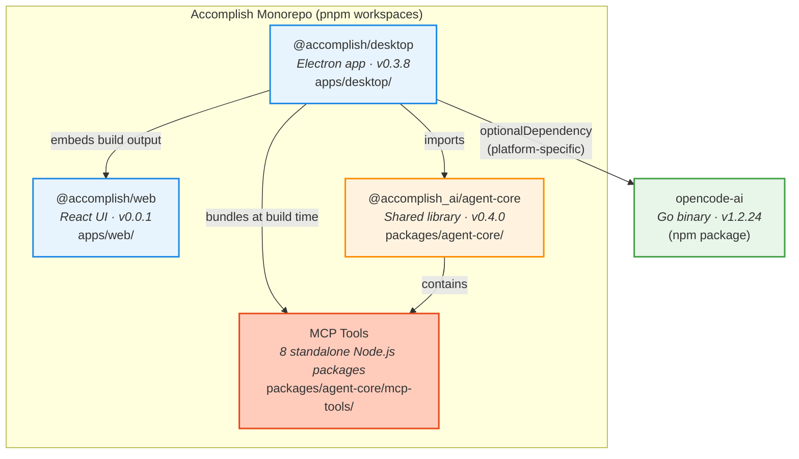
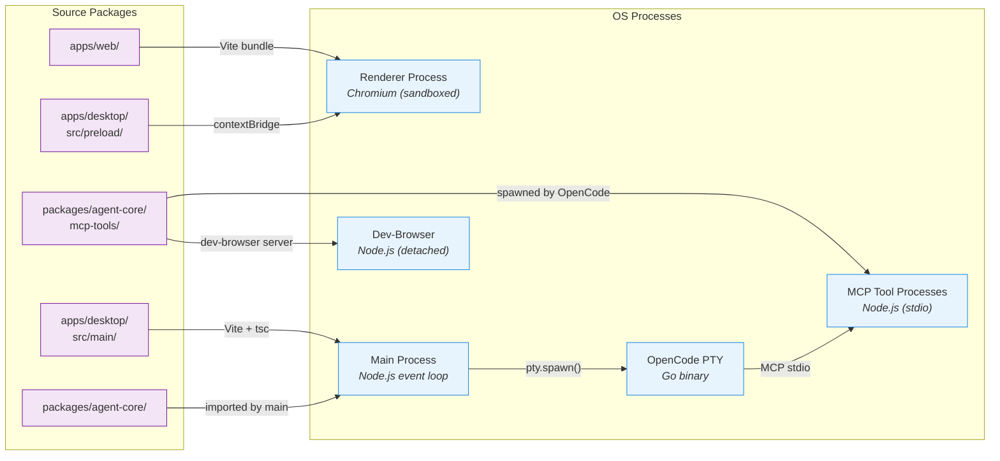
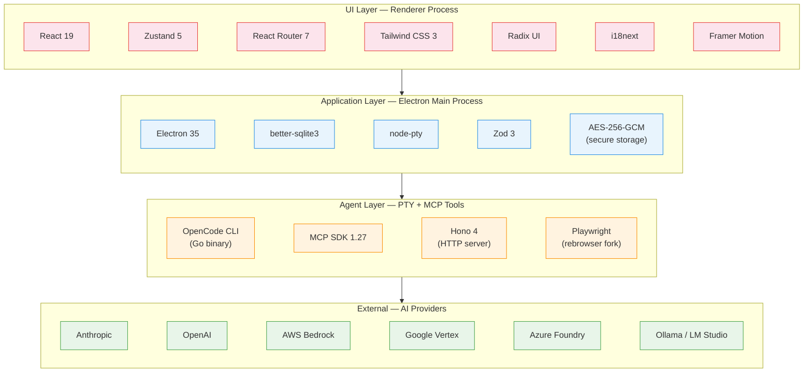
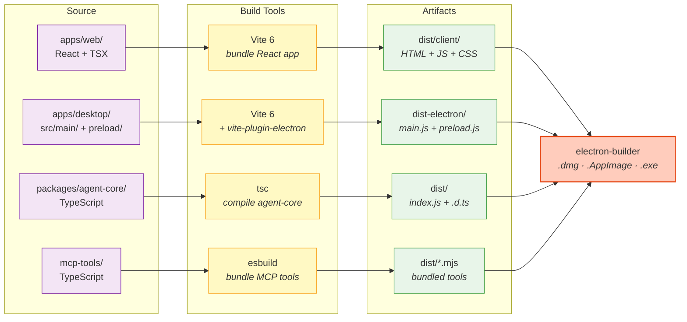
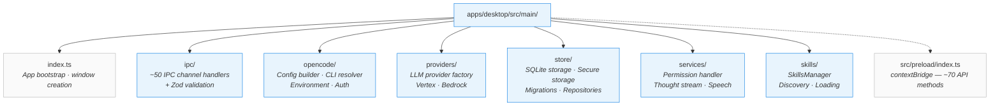
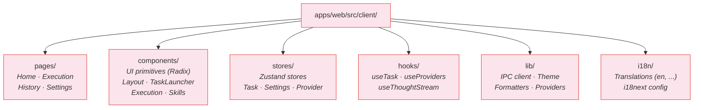
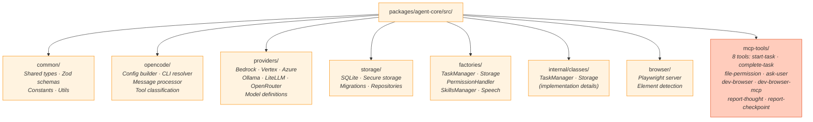

# Development Viewpoint — Accomplish Architecture

> Rozanski & Woods Development Viewpoint: describes the code structure, module organization, build pipeline, and technology choices that developers need to understand.

---

## 1. Package Dependency Graph

The monorepo contains two apps and one shared library, coordinated by **pnpm workspaces**.

---

## 2. Source → Runtime Process Mapping

How source packages map to OS processes at runtime.

---

## 3. Technology Stack by Layer

---

## 4. Build Pipeline

From source to distributable — how each package is compiled and how they combine.

---

## 5. Module Structure — electron-app

Key directories inside `apps/desktop/src/main/` and their responsibilities.

---

## 6. Module Structure — Web (Renderer)

Key directories inside `apps/web/src/client/`.

---

## 7. Module Structure — agent-core

Key directories inside `packages/agent-core/src/`.

---

## Summary

| Aspect               | Details                                                            |
| -------------------- | ------------------------------------------------------------------ |
| **Monorepo**         | pnpm workspaces (`apps/*`, `packages/*`)                           |
| **Apps**             | `@accomplish/desktop` (Electron 35), `@accomplish/web` (React 19)  |
| **Shared library**   | `@accomplish_ai/agent-core` (TypeScript ESM)                       |
| **Build tools**      | Vite 6, tsc, esbuild, electron-builder                             |
| **OpenCode CLI**     | Go binary v1.2.24, distributed as npm packages (platform-specific) |
| **Database**         | SQLite (better-sqlite3) + AES-256-GCM encrypted secure storage     |
| **Process spawning** | node-pty for PTY lifecycle management                              |
| **MCP tools**        | 8 standalone Node.js packages, bundled with esbuild                |
| **UI stack**         | React 19 + Zustand 5 + Tailwind CSS + Radix UI + i18next           |
| **Testing**          | Vitest + Playwright E2E                                            |
| **Node requirement** | ≥ 20.0.0                                                           |
| **Package manager**  | pnpm 9.15.0                                                        |
