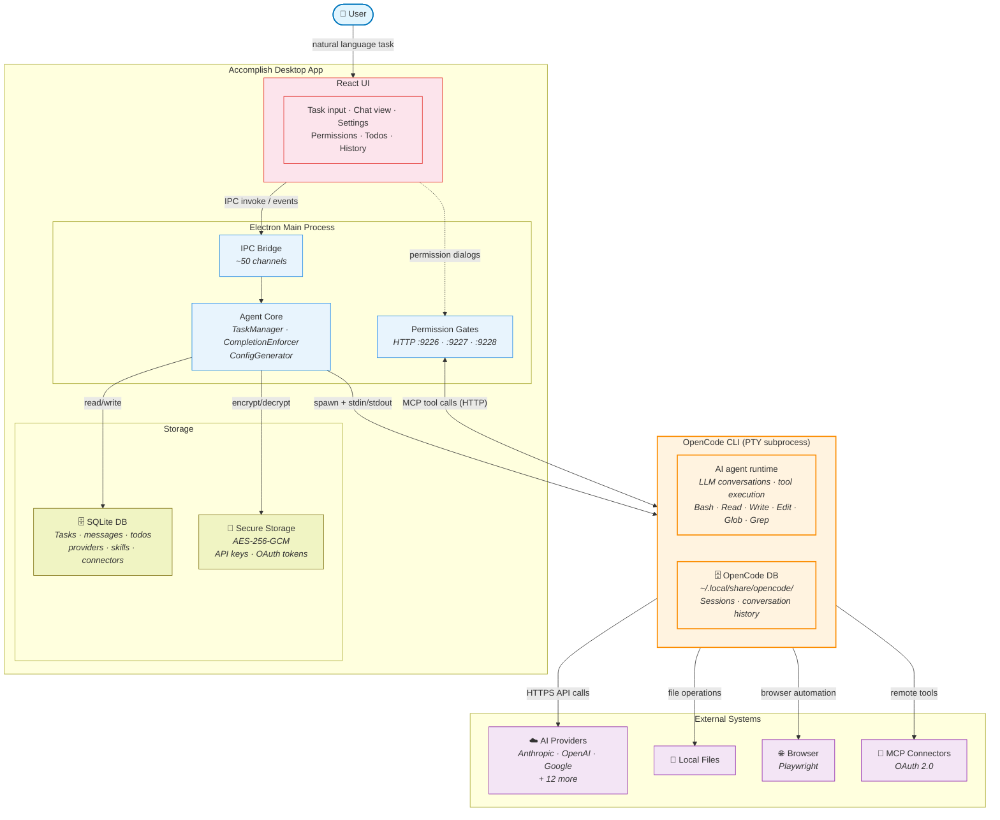
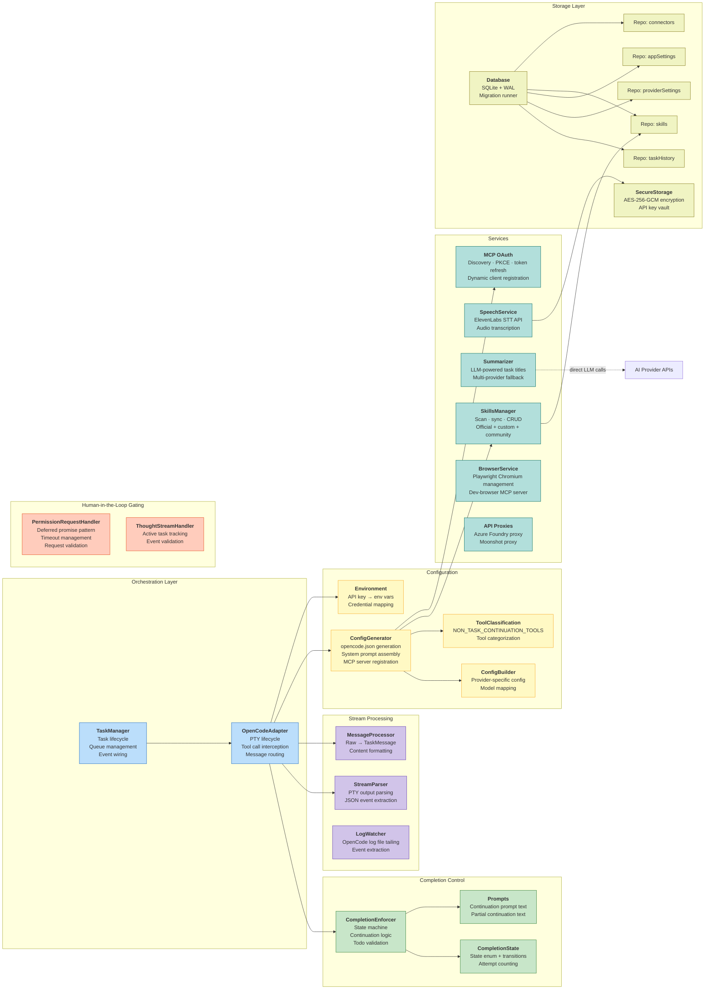
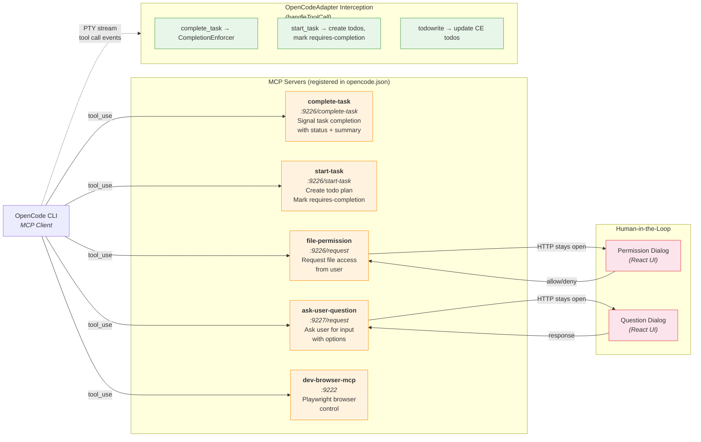
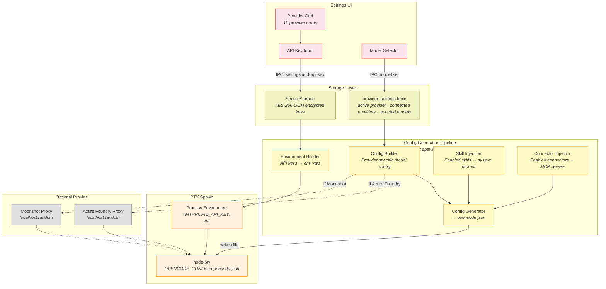
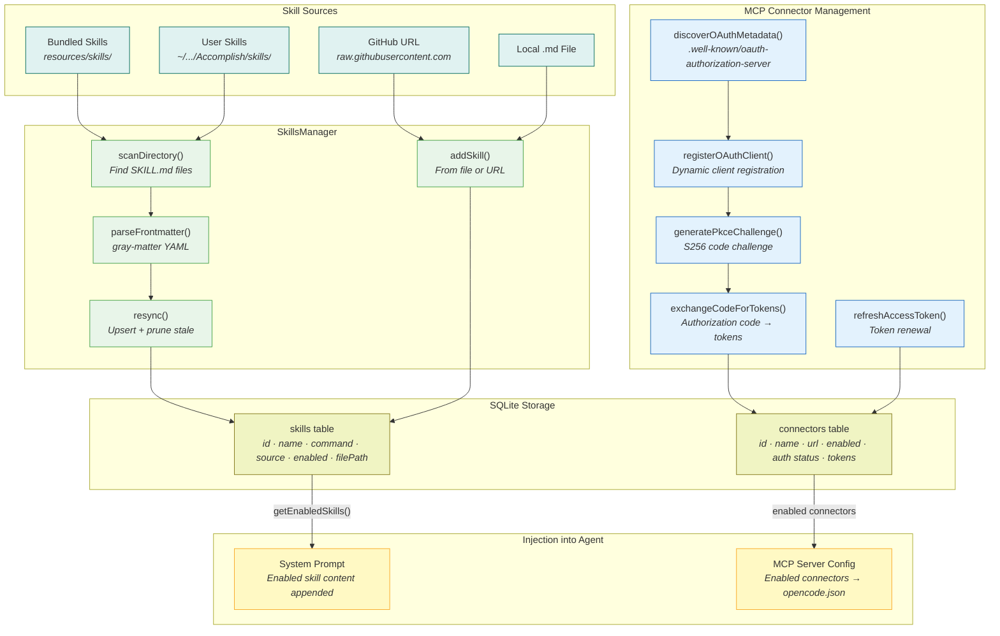
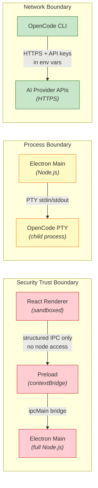

# Functional Viewpoint — Accomplish Architecture

> [!WARNING]
> **This document describes the pre-SDK-cutover PTY architecture.** The OpenCode SDK cutover port (commercial PR #720) replaced `node-pty` + `StreamParser` with `@opencode-ai/sdk` + `opencode serve`, so the `PTY Process` / `StreamParser` participants and byte-stream flows shown below no longer reflect runtime behaviour. The transport, participant names, and byte-stream fan-out are stale; the participants and data they exchange (adapter, TaskManager, daemon, UI) are still structurally accurate, as are the ordering and causality of events. Treat these diagrams as historical reference until they are rewritten in a follow-up docs PR. Current flow: `apps/daemon/src/opencode/server-manager.ts` spawns `opencode serve` per task; `packages/agent-core/src/internal/classes/OpenCodeAdapter.ts` subscribes to the SDK event stream; permissions/questions go through `client.permission.reply` / `client.question.reply` (not HTTP+MCP bridges).

> Rozanski & Woods Functional Viewpoint: identifies the system's functional elements, their responsibilities, interfaces, and primary interactions.

These diagrams are **prerequisite reading** before diving into the sequence-level flow diagrams (`task-flow-phases.md`, `completion-enforcer-flows.md`). They show _what the building blocks are_ without prescribing _when things happen_.

---

## 1. High-Level Architecture Overview

Start here. This diagram shows the four major building blocks, their single-sentence purpose, and the communication channels between them. No internal details — just the shape of the system.

**Key takeaway:** Accomplish never calls LLMs directly. It orchestrates OpenCode (a PTY subprocess) which does all AI interaction and file operations. Accomplish's role is configuration, gating, completion enforcement, and UI.

---

## 2. Detailed Functional Component Map

The same system exploded — every internal component, its responsibility, and data/control arrows. Refer back to Diagram 1 to stay oriented.

```mermaid
graph TB
  subgraph DESKTOP["<b>apps/desktop</b> — Electron Shell"]
    direction TB
    MAIN["Electron Main Process"]
    PRELOAD["Preload Bridge<br/><i>(contextBridge)</i>"]
    HANDLERS["IPC Handlers<br/><i>(handlers.ts)</i>"]
    CALLBACKS["Task Callbacks<br/><i>(task-callbacks.ts)</i>"]
    PERM_API["Permission API Server<br/><i>:9226 file · :9227 question</i>"]
    THOUGHT_API["Thought Stream Server<br/><i>:9228</i>"]
    STORAGE_DESKTOP["Storage Wiring<br/><i>(storage.ts)</i>"]
    SECURE_STORE["Secure Storage<br/><i>(AES-256-GCM)</i>"]
    AUTH_BROWSER["Auth Browser<br/><i>(OAuth flows)</i>"]
    SKILLS_DESKTOP["Skills Manager Wiring"]
    LOG_DESKTOP["Log Collector + Writer"]
    SUMMARIZER_DESKTOP["Summarizer Wiring"]
  end

  subgraph WEB["<b>apps/web</b> — React UI"]
    direction TB
    ROUTER["Router<br/><i>Home · Execution</i>"]
    TASK_STORE["Task Store<br/><i>(Zustand)</i>"]
    SETTINGS_UI["Settings Dialog<br/><i>Provider · Skills · Connectors</i>"]
    EXEC_PAGE["Execution Page<br/><i>Messages · Todos · Permissions</i>"]
    LAUNCHER["Task Launcher<br/><i>(Cmd+K)</i>"]
  end

  subgraph CORE["<b>packages/agent-core</b> — Core Logic (ESM)"]
    direction TB
    TASK_MGR["TaskManager"]
    OC_ADAPTER["OpenCodeAdapter"]
    CE["CompletionEnforcer"]
    CONFIG_GEN["Config Generator"]
    STREAM_PARSER["Stream Parser"]
    MSG_PROC["Message Processor"]
    PERM_HANDLER["Permission Request Handler"]
    THOUGHT_HANDLER["Thought Stream Handler"]
    SKILLS_MGR["Skills Manager"]
    SPEECH_SVC["Speech Service"]
    SUMMARIZER["Summarizer"]
    PROVIDERS["Provider Registry<br/><i>15 providers</i>"]
    MCP_OAUTH["MCP OAuth Client"]
    BROWSER_SVC["Browser Service<br/><i>Playwright/Chromium</i>"]
    PROXIES["API Proxies<br/><i>Azure Foundry · Moonshot</i>"]
    ENV_BUILDER["Environment Builder"]
    LOG_WATCHER["OpenCode Log Watcher"]
    DB["SQLite Database<br/><i>WAL mode · 8 migrations</i>"]
  end

  subgraph OPENCODE["<b>OpenCode CLI</b> — External Process"]
    direction TB
    OC_SESSION["Session + Conversation"]
    OC_LLM["LLM Interaction"]
    OC_TOOLS["Built-in Tools<br/><i>Bash · Read · Write · Edit · Glob · Grep</i>"]
    OC_MCP["MCP Client"]
  end

  %% UI → Desktop IPC
  ROUTER --> PRELOAD
  TASK_STORE --> PRELOAD
  SETTINGS_UI --> PRELOAD
  LAUNCHER --> PRELOAD
  PRELOAD -->|"ipcRenderer.invoke"| HANDLERS

  %% Desktop → Core
  HANDLERS -->|"startTask / cancelTask"| TASK_MGR
  HANDLERS --> STORAGE_DESKTOP
  HANDLERS --> SECURE_STORE
  HANDLERS --> SKILLS_DESKTOP
  CALLBACKS -->|"onMessage / onComplete"| TASK_STORE

  %% Core internal
  TASK_MGR -->|"creates per task"| OC_ADAPTER
  OC_ADAPTER -->|"spawns PTY"| OPENCODE
  OC_ADAPTER --> CE
  OC_ADAPTER --> STREAM_PARSER
  OC_ADAPTER --> MSG_PROC
  OC_ADAPTER --> CONFIG_GEN
  OC_ADAPTER --> ENV_BUILDER
  CONFIG_GEN --> SKILLS_MGR
  CONFIG_GEN --> MCP_OAUTH
  CE -->|"onStartContinuation"| OC_ADAPTER
  PERM_HANDLER <-->|"HTTP"| PERM_API
  THOUGHT_HANDLER <-->|"HTTP"| THOUGHT_API

  %% OpenCode ↔ MCP servers
  OC_MCP -->|"complete_task"| PERM_API
  OC_MCP -->|"start_task"| PERM_API
  OC_MCP -->|"ask_user_question"| PERM_API
  OC_MCP -->|"request_file_permission"| PERM_API
  OC_MCP -->|"report_thought"| THOUGHT_API
  OC_MCP -->|"dev-browser"| BROWSER_SVC

  %% OpenCode → External
  OC_LLM -->|"API calls"| PROVIDERS
  OC_TOOLS -->|"reads/writes"| FS["Local File System"]

  %% Styling
  classDef desktop fill:#e8f4fd,stroke:#1e88e5,stroke-width:2px
  classDef web fill:#fce4ec,stroke:#e53935,stroke-width:2px
  classDef core fill:#e8f5e9,stroke:#43a047,stroke-width:2px
  classDef opencode fill:#fff3e0,stroke:#fb8c00,stroke-width:2px
  classDef external fill:#f3e5f5,stroke:#8e24aa,stroke-width:1px

  class MAIN,PRELOAD,HANDLERS,CALLBACKS,PERM_API,THOUGHT_API,STORAGE_DESKTOP,SECURE_STORE,AUTH_BROWSER,SKILLS_DESKTOP,LOG_DESKTOP,SUMMARIZER_DESKTOP desktop
  class ROUTER,TASK_STORE,SETTINGS_UI,EXEC_PAGE,LAUNCHER web
  class TASK_MGR,OC_ADAPTER,CE,CONFIG_GEN,STREAM_PARSER,MSG_PROC,PERM_HANDLER,THOUGHT_HANDLER,SKILLS_MGR,SPEECH_SVC,SUMMARIZER,PROVIDERS,MCP_OAUTH,BROWSER_SVC,PROXIES,ENV_BUILDER,LOG_WATCHER,DB core
  class OC_SESSION,OC_LLM,OC_TOOLS,OC_MCP opencode
  class FS external
```

---

## 3. Agent-Core Functional Decomposition

A focused view of `packages/agent-core` — the heart of the system — showing every class, its single responsibility, and the dependency arrows.

---

## 4. IPC & Communication Channel Map

Shows every communication mechanism in the system — IPC channels, HTTP ports, PTY streams, and event buses.

```mermaid
graph TB
  subgraph RENDERER["React Renderer Process"]
    UI["React Components"]
    STORE["Zustand Store"]
  end

  subgraph BRIDGE["Preload Bridge"]
    CB["contextBridge<br/><i>window.accomplish</i>"]
  end

  subgraph MAIN["Electron Main Process"]
    IPC_H["IPC Handlers<br/><i>~50 handle() calls</i>"]
    TASK_CB["Task Callbacks<br/><i>12 event listeners</i>"]
    HTTP_PERM["HTTP :9226<br/><i>File permissions</i>"]
    HTTP_Q["HTTP :9227<br/><i>User questions</i>"]
    HTTP_T["HTTP :9228<br/><i>Thought stream</i>"]
  end

  subgraph AGENT_CORE["Agent Core"]
    TM["TaskManager"]
    ADAPTER["OpenCodeAdapter"]
    PRH["PermissionRequestHandler"]
  end

  subgraph PTY_PROC["PTY Subprocess"]
    OC["OpenCode CLI"]
    MCP_C["MCP Client"]
  end

  %% Invoke (request/response)
  UI -->|"ipcRenderer.invoke(channel, ...args)"| CB
  CB -->|"ipcMain.handle(channel)"| IPC_H
  IPC_H -->|"return value"| CB
  CB -->|"Promise resolve"| UI

  %% Push events (main → renderer)
  TASK_CB -->|"webContents.send('task:update')"| CB
  TASK_CB -->|"webContents.send('task:update:batch')"| CB
  TASK_CB -->|"webContents.send('permission:request')"| CB
  TASK_CB -->|"webContents.send('task:progress')"| CB
  TASK_CB -->|"webContents.send('todo:update')"| CB
  TASK_CB -->|"webContents.send('task:summary')"| CB
  TASK_CB -->|"webContents.send('task:status-change')"| CB
  CB -->|"ipcRenderer.on()"| STORE

  %% Main ↔ Core
  IPC_H -->|"JS function calls"| TM
  TM -->|"EventEmitter callbacks"| TASK_CB

  %% Core ↔ PTY
  ADAPTER -->|"pty.write()"| OC
  OC -->|"pty.onData()"| ADAPTER

  %% MCP HTTP
  MCP_C -->|"HTTP POST /request"| HTTP_PERM
  MCP_C -->|"HTTP POST /request"| HTTP_Q
  MCP_C -->|"HTTP POST /thought"| HTTP_T
  HTTP_PERM -->|"deferred Promise"| PRH
  HTTP_Q -->|"deferred Promise"| PRH

  %% Styling
  classDef renderer fill:#fce4ec,stroke:#e53935
  classDef bridge fill:#e0e0e0,stroke:#616161
  classDef main fill:#e8f4fd,stroke:#1e88e5
  classDef core fill:#e8f5e9,stroke:#43a047
  classDef pty fill:#fff3e0,stroke:#fb8c00

  class UI,STORE renderer
  class CB bridge
  class IPC_H,TASK_CB,HTTP_PERM,HTTP_Q,HTTP_T main
  class TM,ADAPTER,PRH core
  class OC,MCP_C pty
```

---

## 5. MCP Tool Registration & Routing

Shows which MCP tools are registered, what they do, and how calls route from OpenCode through HTTP servers back into the application.

---

## 6. Provider & Configuration Pipeline

How provider settings flow from the UI through configuration generation to OpenCode spawning.

---

## 7. Skills & Connectors Functional Model

How skills and MCP connectors are managed, stored, and injected into the agent's system prompt.

---

## Component Responsibility Matrix

| Component                    | Package    | Responsibility                                                      | Key Interfaces                                                               |
| ---------------------------- | ---------- | ------------------------------------------------------------------- | ---------------------------------------------------------------------------- |
| **TaskManager**              | agent-core | Task queue, lifecycle, event wiring (12 listeners)                  | `startTask()`, `cancelTask()`, EventEmitter callbacks                        |
| **OpenCodeAdapter**          | agent-core | PTY spawn/kill, tool call interception, message routing             | `spawn()`, `handleToolCall()`, `spawnSessionResumption()`                    |
| **CompletionEnforcer**       | agent-core | State machine ensuring task completion via retries                  | `handleCompleteTaskDetection()`, `handleStepFinish()`, `handleProcessExit()` |
| **ConfigGenerator**          | agent-core | Generates `opencode.json` with prompt, MCP servers, provider config | `generateConfig()` → JSON file                                               |
| **StreamParser**             | agent-core | Parses raw PTY bytes into structured events                         | `parse(data)` → events                                                       |
| **MessageProcessor**         | agent-core | Converts raw events into `TaskMessage` objects                      | `process(event)` → `TaskMessage`                                             |
| **PermissionRequestHandler** | agent-core | Deferred promise pattern for human-in-the-loop gating               | `createPermissionRequest()` → `{ requestId, promise }`                       |
| **ThoughtStreamHandler**     | agent-core | Validates thought/checkpoint events from MCP tools                  | `validateThoughtEvent()`, `validateCheckpointEvent()`                        |
| **SkillsManager**            | agent-core | Skill CRUD, filesystem scan, GitHub import                          | `resync()`, `addSkill()`, `getEnabledSkills()`                               |
| **SpeechService**            | agent-core | ElevenLabs STT transcription                                        | `transcribeAudio()` → text                                                   |
| **Summarizer**               | agent-core | LLM-powered task title generation (multi-provider fallback)         | `generateTaskSummary()` → 3-5 word title                                     |
| **MCP OAuth**                | agent-core | OAuth 2.0 discovery, PKCE, token lifecycle for connectors           | `discoverOAuthMetadata()`, `exchangeCodeForTokens()`                         |
| **BrowserService**           | agent-core | Playwright Chromium install, dev-browser MCP server spawn           | `ensureDevBrowserServer()`                                                   |
| **API Proxies**              | agent-core | Protocol translation for Azure Foundry and Moonshot                 | `ensureAzureFoundryProxy()`, `ensureMoonshotProxy()`                         |
| **Database**                 | agent-core | SQLite with WAL mode, 8 migrations, 5 repositories                  | `better-sqlite3` via repositories                                            |
| **SecureStorage**            | agent-core | AES-256-GCM encrypted key/value store                               | `getApiKey()`, `setApiKey()`                                                 |
| **IPC Handlers**             | desktop    | ~50 `ipcMain.handle()` calls bridging UI to core                    | `task:start`, `session:resume`, `permission:respond`, etc.                   |
| **Task Callbacks**           | desktop    | 12 event listeners translating core events to IPC pushes            | `onMessage`, `onComplete`, `onToolCallComplete`, etc.                        |
| **Permission API**           | desktop    | HTTP servers on :9226/:9227 bridging MCP to Electron UI             | `startPermissionApiServer()`, `startQuestionApiServer()`                     |
| **Preload Bridge**           | desktop    | `contextBridge.exposeInMainWorld('accomplish', ...)`                | ~70 API methods exposed to renderer                                          |
| **Task Store**               | web        | Zustand store: single source of truth for UI state                  | `useTaskStore()` with ~25 actions                                            |
| **Router**                   | web        | Hash router: `/` (Home) and `/execution/:id`                        | `createHashRouter()`                                                         |

---

## Key Architectural Boundaries

**Three distinct boundaries:**

1. **Security boundary** — Renderer is sandboxed; can only call methods explicitly exposed via `contextBridge`. No `require()`, no `fs`, no direct IPC.
2. **Process boundary** — OpenCode runs as a separate PTY subprocess. Communication is limited to stdin/stdout text streams + HTTP (MCP).
3. **Network boundary** — Only OpenCode makes outbound HTTPS calls to AI providers. API keys are injected as environment variables, never sent via IPC or stored in the renderer.
