# Functional Viewpoint — Accomplish Architecture

> **Status:** Current — reflects the post-SDK-cutover architecture (commercial PR #720, landed in OSS as PR #938, commit `3620532d`). This is the single functional-domain document: prior per-flow files (`task-flow-phases.md`, `task-flow-slides.md`, `completion-enforcer-flows.md`) and the PTY-era structural doc have been collapsed into this one. Git history has the removed files if you need the old versions.

> Rozanski & Woods Functional Viewpoint: identifies the system's functional elements, their responsibilities, interfaces, and primary interactions. Scenario-level sequence flows (§8 permission/question, §10 completion enforcement) are included as "interaction scenarios" at the short-and-useful scope; detailed per-phase task-flow sequences have been retired along with the PTY-era implementation they described.

## What changed vs. the PTY era

The cutover replaced three things that used to span process / protocol boundaries:

| Concern                  | PTY era (gone)                                                       | SDK era (current)                                                                                     |
| ------------------------ | -------------------------------------------------------------------- | ----------------------------------------------------------------------------------------------------- |
| **OpenCode transport**   | `node-pty` spawning `opencode run` + `StreamParser` over byte-stream | `@opencode-ai/sdk/v2` talking HTTP to one `opencode serve` per task; SSE for events                   |
| **Permission gating**    | HTTP shims on `:9226` / `:9227` invoked by MCP tools inside OpenCode | Native SDK events (`permission.asked`, `question.asked`) + `client.permission.reply` / `.reply`       |
| **Tool completion hook** | `complete-task` / `start-task` MCP servers over HTTP                 | Tool-part events on the SDK event stream, intercepted by `OpenCodeAdapter` for the CompletionEnforcer |

Net result: **two HTTP bridges and a byte-stream parser are gone.** They are replaced by one per-task HTTP server (`opencode serve`) and an SSE subscription. The daemon still owns everything; the Electron shell is still thin.

## Cast of characters (process view)

Four distinct OS processes cooperate at runtime. This is the biggest shift from the PTY era, where task execution lived inside Electron; now it is fully extracted into the daemon.

| Process                              | Lifetime                                                                                        | Speaks                                                          | Owns                                                                                            |
| ------------------------------------ | ----------------------------------------------------------------------------------------------- | --------------------------------------------------------------- | ----------------------------------------------------------------------------------------------- |
| **Electron Main**                    | User-session scoped; exits on Cmd+Q                                                             | IPC (renderer), JSON-RPC (daemon), native OS APIs               | Tray, native dialogs, OAuth browser popups, notification forwarding                             |
| **React Renderer** (inside Electron) | Same as Electron Main                                                                           | `contextBridge` only                                            | UI state (Zustand)                                                                              |
| **Daemon**                           | **Standalone** — started by Electron or login-item; **survives Electron exit**; one per dataDir | JSON-RPC over Unix socket / named pipe; SSE to `opencode serve` | TaskService, OpenCodeServerManager, Scheduler, WhatsApp, Thought-stream HTTP, all persistence   |
| **`opencode serve`** (per task)      | Lazily spawned on `task.start`; 60s idle TTL after terminal; killed on daemon shutdown          | HTTP + SSE (loopback, random ephemeral port)                    | One session, its conversation, tool execution, registered MCP servers, permission/question flow |

Every diagram in this document shows all four. The Daemon — the newest and most load-bearing participant — is always rendered as a dedicated green subgraph. The per-task `opencode serve` children hang off its `OpenCodeServerManager`.

---

## 1. High-Level Architecture Overview

Start here. This diagram shows the four major building blocks, their single-sentence purpose, and the communication channels between them. No internal details — just the shape of the system.

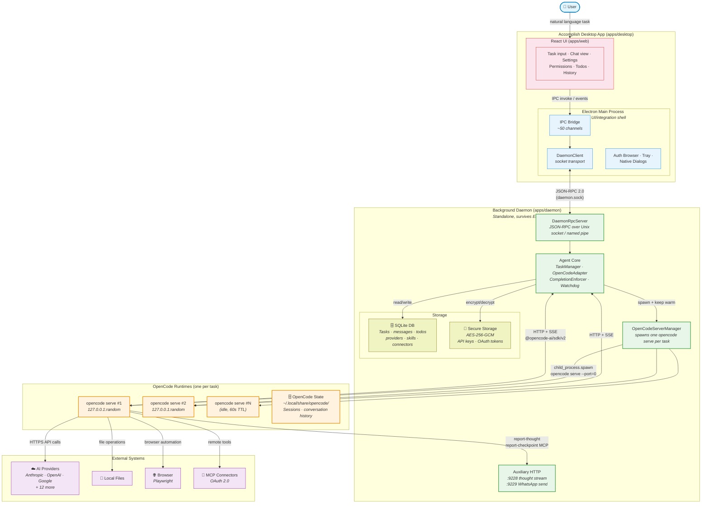

**Key takeaways:**

1. **Electron is a thin shell.** All task execution happens in the daemon. Electron forwards IPC to/from the daemon via a socket-backed `DaemonClient` and adds native capabilities (tray, dialogs, OAuth popups) the daemon can't perform.
2. **One `opencode serve` per task.** `OpenCodeServerManager` lazily spawns a child process when a task starts, keeps it alive for 60s after the task completes for possible follow-up / resume reuse, and tears down the whole process tree on daemon shutdown.
3. **Accomplish never calls LLMs directly.** Each per-task `opencode serve` orchestrates the LLM conversation and tool execution. Accomplish's role is configuration, gating, completion enforcement, persistence, and UI.

---

## 2. Detailed Functional Component Map

The same system exploded — every internal component, its responsibility, and data/control arrows. Refer back to Diagram 1 to stay oriented.

```mermaid
graph TB
  subgraph DESKTOP["<b>apps/desktop</b> — Electron Shell (thin)"]
    direction TB
    MAIN["Electron Main Process"]
    PRELOAD["Preload Bridge<br/><i>(contextBridge)</i>"]
    HANDLERS["IPC Handlers<br/><i>thin proxies to daemon</i>"]
    DAEMON_CLIENT["DaemonClient<br/><i>socket transport</i>"]
    DAEMON_BOOT["Daemon Bootstrap<br/><i>spawn + reconnect</i>"]
    NOTIF_FWD["Notification Forwarder<br/><i>daemon RPC → webContents.send</i>"]
    AUTH_BROWSER["Auth Browser<br/><i>OAuth popups · shell.openExternal</i>"]
    TRAY["System Tray · Native Dialogs"]
  end

  subgraph WEB["<b>apps/web</b> — React UI"]
    direction TB
    ROUTER["Router<br/><i>Home · Execution</i>"]
    TASK_STORE["Task Store<br/><i>(Zustand)</i>"]
    SETTINGS_UI["Settings Dialog<br/><i>Provider · Skills · Connectors · Integrations</i>"]
    EXEC_PAGE["Execution Page<br/><i>Messages · Todos · Permissions</i>"]
    LAUNCHER["Task Launcher<br/><i>(Cmd+K)</i>"]
  end

  subgraph DAEMON["<b>apps/daemon</b> — Standalone Node.js process"]
    direction TB
    RPC_SRV["DaemonRpcServer<br/><i>JSON-RPC over Unix socket / named pipe</i>"]
    ROUTES["daemon-routes.ts<br/><i>~25 RPC methods</i>"]
    TASK_SVC["TaskService<br/><i>orchestrates task lifecycle</i>"]
    TASK_CB["TaskCallbacks<br/><i>adapter events → RPC notify</i>"]
    SVR_MGR["OpenCodeServerManager<br/><i>per-task opencode serve pool</i>"]
    THOUGHT_API["ThoughtStreamService<br/><i>HTTP :9228 · MCP hook</i>"]
    WA_SVC["WhatsAppDaemonService<br/><i>Baileys socket, inbound messages</i>"]
    WA_API["WhatsAppSendApi<br/><i>HTTP :9229 · MCP hook</i>"]
    SCHED["SchedulerService<br/><i>cron-driven task.start</i>"]
    OPENAI_OAUTH["OpenAiOauthManager<br/><i>transient opencode serve<br/>for ChatGPT OAuth</i>"]
    HEALTH["HealthService"]
    STORAGE_SVC["StorageService"]
  end

  subgraph CORE["<b>packages/agent-core</b> — Core Logic (ESM, shared)"]
    direction TB
    TASK_MGR["TaskManager<br/><i>queue + lifecycle</i>"]
    OC_ADAPTER["OpenCodeAdapter<br/><i>SDK v2 bridge · event loop</i>"]
    CE["CompletionEnforcer<br/><i>state machine + continuation</i>"]
    WATCHDOG["TaskInactivityWatchdog<br/><i>soft + hard timeouts</i>"]
    MSG_PROC["MessageProcessor<br/><i>SDK part → TaskMessage</i>"]
    SKILLS_MGR["Skills Manager"]
    SUMMARIZER["Summarizer"]
    CFG_GEN["Config Generator<br/><i>opencode.json per task</i>"]
    CFG_BUILD["Provider Config Builder"]
    AUTH_SYNC["API Key → auth.json sync"]
    MCP_OAUTH["MCP OAuth Client<br/><i>discovery · PKCE · refresh</i>"]
    BROWSER_SVC["Browser Service<br/><i>dev-browser-mcp spawn</i>"]
    PROXIES["API Proxies<br/><i>Azure Foundry · Moonshot</i>"]
    SPEECH["Speech Service<br/><i>ElevenLabs STT</i>"]
    LOG_WATCHER["OpenCode Log Watcher<br/><i>auth-error signal tail</i>"]
    SECURE["SecureStorage<br/><i>AES-256-GCM</i>"]
    DB["SQLite Database<br/><i>WAL mode · migrations</i>"]
    RPC_TRANSPORT["RPC Transport<br/><i>socket + protocol</i>"]
  end

  subgraph OPENCODE["<b>opencode serve</b>  (one subprocess per task)"]
    direction TB
    OC_HTTP["HTTP + SSE server<br/><i>127.0.0.1:random</i>"]
    OC_SESSION["Session + Conversation"]
    OC_LLM["LLM Interaction"]
    OC_TOOLS["Built-in Tools<br/><i>Bash · Read · Write · Edit · Glob · Grep</i>"]
    OC_MCP["Registered MCP Servers<br/><i>thought · checkpoint · whatsapp-send<br/>connectors · dev-browser</i>"]
    OC_PERMS["Native Permission Gate<br/><i>emits permission.asked event</i>"]
    OC_QS["Native Question Flow<br/><i>emits question.asked event</i>"]
  end

  %% UI ↔ Desktop
  ROUTER --> PRELOAD
  TASK_STORE --> PRELOAD
  SETTINGS_UI --> PRELOAD
  LAUNCHER --> PRELOAD
  EXEC_PAGE --> PRELOAD
  PRELOAD -->|"ipcRenderer.invoke"| HANDLERS
  NOTIF_FWD -->|"webContents.send"| PRELOAD

  %% Desktop ↔ Daemon
  HANDLERS -->|"client.call(method, params)"| DAEMON_CLIENT
  DAEMON_CLIENT <-->|"JSON-RPC 2.0<br/>daemon.sock"| RPC_SRV
  DAEMON_BOOT -->|"spawn detached"| DAEMON
  RPC_SRV -->|"rpc.notify(channel, data)"| DAEMON_CLIENT
  DAEMON_CLIENT --> NOTIF_FWD

  %% Daemon internal
  RPC_SRV --> ROUTES
  ROUTES --> TASK_SVC
  ROUTES --> SCHED
  ROUTES --> OPENAI_OAUTH
  ROUTES --> WA_SVC
  ROUTES --> HEALTH
  ROUTES --> STORAGE_SVC
  TASK_SVC --> TASK_CB
  TASK_SVC --> SVR_MGR
  TASK_SVC --> TASK_MGR
  SCHED -->|"startTask(source=scheduler)"| TASK_SVC
  WA_SVC -->|"startTask(source=whatsapp)"| TASK_SVC
  TASK_CB -->|"emit → rpc.notify"| RPC_SRV

  %% Agent-core relationships
  TASK_MGR -->|"creates per task"| OC_ADAPTER
  OC_ADAPTER --> CE
  OC_ADAPTER --> WATCHDOG
  OC_ADAPTER --> MSG_PROC
  OC_ADAPTER --> LOG_WATCHER
  CE -->|"onStartContinuation"| OC_ADAPTER

  %% Daemon → agent-core config
  SVR_MGR --> CFG_GEN
  TASK_SVC --> CFG_GEN
  CFG_GEN --> CFG_BUILD
  CFG_GEN --> SKILLS_MGR
  CFG_GEN --> MCP_OAUTH
  CFG_GEN --> AUTH_SYNC
  AUTH_SYNC --> SECURE
  SKILLS_MGR --> DB

  %% Per-task opencode serve
  SVR_MGR -->|"child_process.spawn<br/>env: OPENCODE_CONFIG"| OC_HTTP
  OC_ADAPTER -.->|"getServerUrl(taskId)"| SVR_MGR
  OC_ADAPTER <-->|"createOpencodeClient(baseUrl)<br/>session.create · session.prompt<br/>event.subscribe (SSE)<br/>permission.reply · question.reply"| OC_HTTP

  %% opencode internals
  OC_HTTP --> OC_SESSION
  OC_SESSION --> OC_LLM
  OC_SESSION --> OC_TOOLS
  OC_SESSION --> OC_MCP
  OC_SESSION --> OC_PERMS
  OC_SESSION --> OC_QS
  OC_LLM -->|"HTTPS"| EXTERNAL["AI Provider APIs"]
  OC_TOOLS --> FS["Local File System"]

  %% MCP tools reach back into the daemon HTTP surface
  OC_MCP -->|"POST /thought · /checkpoint"| THOUGHT_API
  OC_MCP -->|"POST /send"| WA_API

  %% RPC surface for permission + OAuth
  ROUTES -->|"permission.respond"| TASK_SVC
  TASK_SVC -->|"sendResponse"| OC_ADAPTER
  OPENAI_OAUTH -.->|"createTransientOpencodeClient"| SVR_MGR

  %% Styling
  classDef desktop fill:#e8f4fd,stroke:#1e88e5,stroke-width:2px
  classDef web fill:#fce4ec,stroke:#e53935,stroke-width:2px
  classDef daemon fill:#e8f5e9,stroke:#43a047,stroke-width:2px
  classDef core fill:#fff9c4,stroke:#f9a825,stroke-width:2px
  classDef opencode fill:#fff3e0,stroke:#fb8c00,stroke-width:2px
  classDef external fill:#f3e5f5,stroke:#8e24aa,stroke-width:1px

  class MAIN,PRELOAD,HANDLERS,DAEMON_CLIENT,DAEMON_BOOT,NOTIF_FWD,AUTH_BROWSER,TRAY desktop
  class ROUTER,TASK_STORE,SETTINGS_UI,EXEC_PAGE,LAUNCHER web
  class RPC_SRV,ROUTES,TASK_SVC,TASK_CB,SVR_MGR,THOUGHT_API,WA_SVC,WA_API,SCHED,OPENAI_OAUTH,HEALTH,STORAGE_SVC daemon
  class TASK_MGR,OC_ADAPTER,CE,WATCHDOG,MSG_PROC,SKILLS_MGR,SUMMARIZER,CFG_GEN,CFG_BUILD,AUTH_SYNC,MCP_OAUTH,BROWSER_SVC,PROXIES,SPEECH,LOG_WATCHER,SECURE,DB,RPC_TRANSPORT core
  class OC_HTTP,OC_SESSION,OC_LLM,OC_TOOLS,OC_MCP,OC_PERMS,OC_QS opencode
  class EXTERNAL,FS external
```

**Notes on the ownership boundary:**

- The daemon (`apps/daemon`) is the only place task execution happens. It spawns `opencode serve` directly (via `child_process.spawn`) — no Electron, no PTY.
- `apps/desktop` is purely Electron-specific concerns (tray, native dialogs, OAuth popups, IPC forwarding). It neither holds task state nor talks to `opencode serve` directly.
- `packages/agent-core` is the shared substrate. Both the daemon (runtime) and the desktop (daemon client + config building during startup) import from it, but only the daemon instantiates `TaskManager` / `OpenCodeAdapter`.

---

## 3. Agent-Core Functional Decomposition

A focused view of `packages/agent-core` — the shared substrate the daemon runs on — showing every class, its single responsibility, and the dependency arrows.

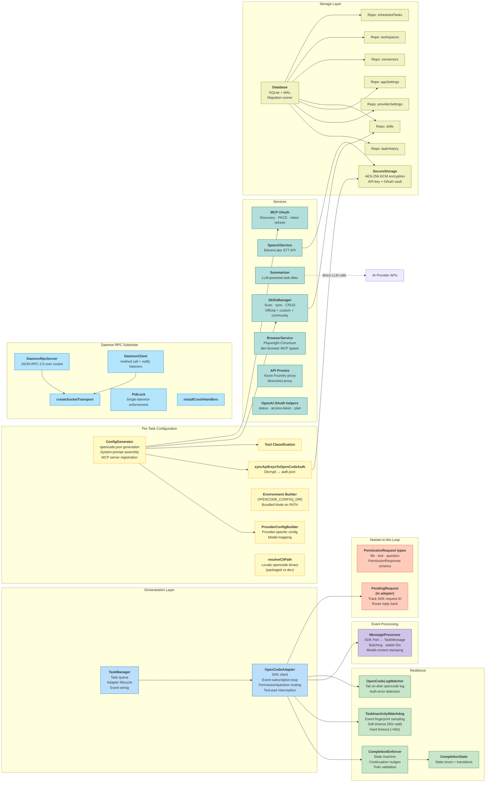

**What's gone vs. the PTY-era `agent-core`:**

- `StreamParser` — no byte-stream to parse; the SDK delivers structured events.
- `PermissionRequestHandler` / `ThoughtStreamHandler` in the deferred-promise shape — `PendingRequest` inside the adapter replaces the former; the latter still exists at the RPC layer but doesn't gate task progression.
- PTY spawn helpers (`buildCliArgs`, `buildEnvironment` per-task) — `ConfigGenerator` still builds the environment, but the spawn happens in `OpenCodeServerManager`, not `OpenCodeAdapter`.

**What's new:**

- `TaskInactivityWatchdog` — a dedicated stall detector. With no PTY back-pressure to observe, the SDK model needs an explicit "no events for 90s + 60s → fail" safety net.
- `OpenCodeAdapter.PendingRequest` — tracks the SDK's native `permission.asked` / `question.asked` request IDs so the `sendResponse` reply can round-trip to the correct SDK call (`client.permission.reply` or `client.question.reply`).
- `AUTH_SYNC` — `syncApiKeysToOpenCodeAuth` writes decrypted provider credentials into `~/.local/share/opencode/auth.json` just before `opencode serve` starts, since the SDK server reads provider credentials from disk rather than env vars.

---

## 4. Communication Channel Map

Shows every communication mechanism in the system — IPC channels, socket RPC, SSE streams, and the handful of HTTP endpoints that remain.

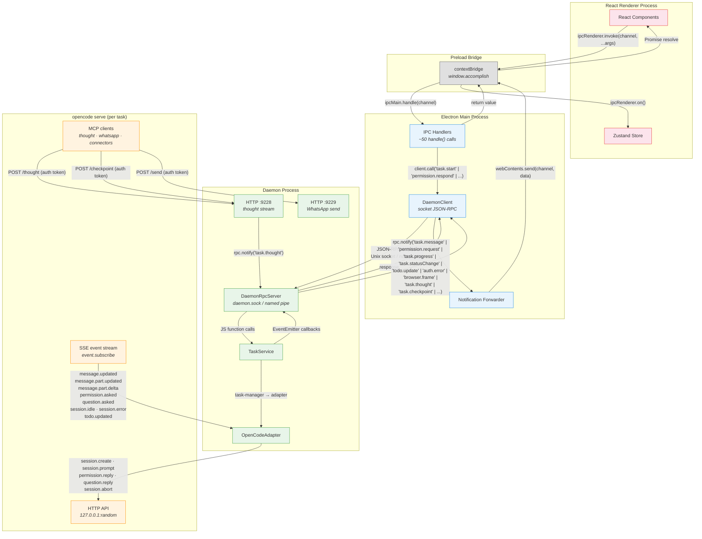

**Channels inventory:**

| Channel                    | Transport                          | Direction      | Purpose                                                                               |
| -------------------------- | ---------------------------------- | -------------- | ------------------------------------------------------------------------------------- |
| Renderer ↔ Main            | `ipcRenderer.invoke` / `on`        | Bidirectional  | UI → task commands; main → streaming updates                                          |
| Main ↔ Daemon              | Unix socket / Windows named pipe   | Bidirectional  | JSON-RPC 2.0; task lifecycle, permission.respond, session.resume, etc.                |
| Daemon notify → Main       | same socket                        | Daemon → Main  | `rpc.notify` for messages, permission prompts, progress, todos, auth errors, frames   |
| Adapter ↔ `opencode serve` | HTTP + SSE (loopback, random port) | Bidirectional  | SDK v2 method calls (request/reply) + event stream (SSE) for session state            |
| MCP tool → Daemon          | HTTP `:9228` / `:9229` + token     | MCP → Daemon   | `report-thought`, `report-checkpoint`, `whatsapp-send` (still MCP-callback for those) |
| Daemon → External          | HTTPS                              | Daemon → Cloud | AI provider APIs (only during the Summarizer path); OpenCode does its own LLM calls   |

**Ports that are gone:**

`:9226` (file permission HTTP) and `:9227` (user question HTTP) are **removed**. Their MCP shims (`file-permission`, `ask-user-question`, `complete-task`, `start-task`) were replaced by native SDK events and tool-part observation on the SSE stream.

---

## 5. OpenCode Server Manager — per-task runtime pool

The component most readers will find new. This diagram focuses on **why** and **how** `opencode serve` instances are managed.

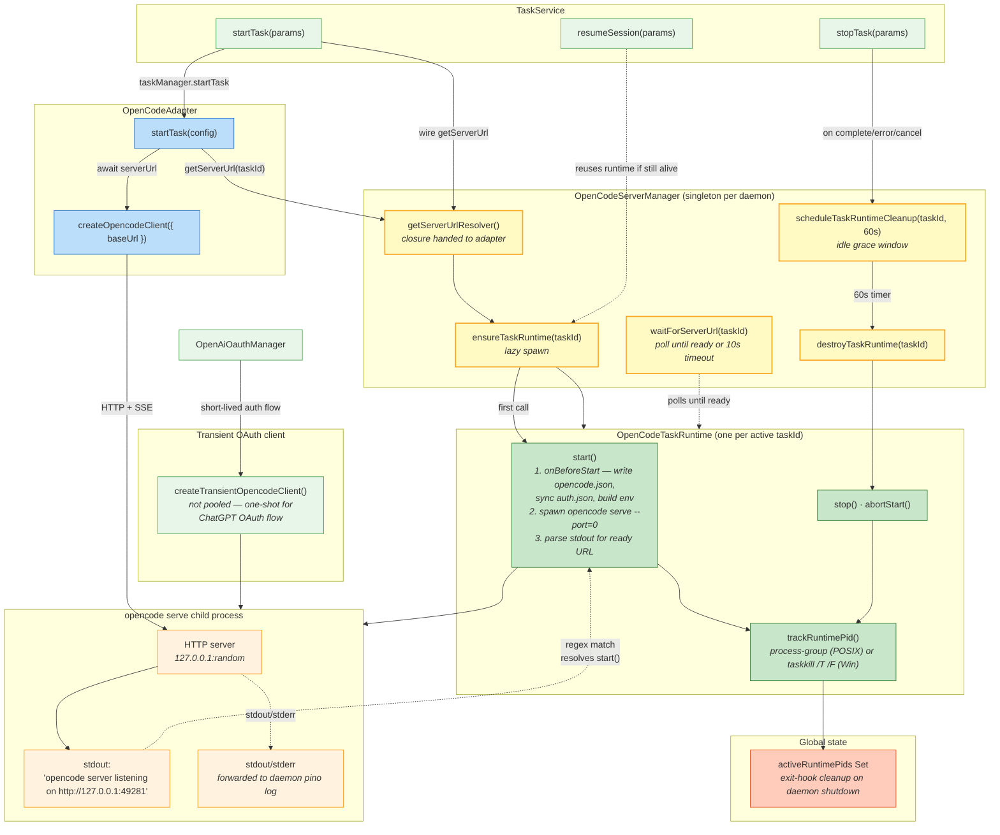

### 5.1 Whose HTTP server is this, anyway?

**It is OpenCode's own HTTP server, not one Accomplish wrote.**

`opencode` (the [opencode-ai npm package](https://www.npmjs.com/package/opencode-ai)) ships a `serve` subcommand that boots a local HTTP + Server-Sent-Events server inside the opencode runtime. That server exposes the v2 API — sessions, prompts, events, permissions, questions, tool-part streams — which is exactly what [`@opencode-ai/sdk/v2`](https://www.npmjs.com/package/@opencode-ai/sdk) is built to talk to. Accomplish's daemon does not implement any of this protocol; it only:

1. Spawns `opencode serve --hostname=127.0.0.1 --port=0` as a child process (random ephemeral port).
2. Greps its stdout for the ready line (`opencode server listening on http://127.0.0.1:NNNN`).
3. Hands that URL to `createOpencodeClient({ baseUrl })` inside `OpenCodeAdapter`.

So the HTTP server exists because the supported programmatic contract with OpenCode **is** HTTP + SSE. In the PTY era, Accomplish drove opencode through the `opencode run` CLI and parsed its stdout. That form offered no structured event model, no permission primitives, and was sensitive to terminal control codes. `opencode serve` + SDK is the opencode team's recommended integration path; moving to it was the whole point of the cutover.

The two remaining auxiliary HTTP endpoints on the daemon (`:9228` thought stream, `:9229` WhatsApp send) are **orthogonal** — they are plain MCP tool callback servers that OpenCode's MCP-tool clients POST to. They are not part of the SDK transport.

### 5.2 Why one server per task — even for follow-ups?

Short answer: **runtime isolation wins against a small startup cost that is already mostly amortized for follow-ups by a 60-second warm-reuse window.**

Long answer, per design pressure:

| Pressure                           | What a single shared `opencode serve` would force                                                                                                                                                                       | What per-task buys                                                                        |
| ---------------------------------- | ----------------------------------------------------------------------------------------------------------------------------------------------------------------------------------------------------------------------- | ----------------------------------------------------------------------------------------- |
| **Per-task configuration**         | Every task would run with the same `opencode.json` — provider, enabled skills, enabled connectors, system-prompt suffix. Reconfiguring requires a restart, which means a shared server can't adapt to the current task. | Each task picks its own provider, skill set, MCP list. Config lives in the spawned child. |
| **Event-stream scoping**           | `event.subscribe()` is **server-wide**, not session-scoped. Sharing means the adapter must demux every event (`permission.asked`, `message.part.updated`) by `sessionID` and risks cross-task leakage on a bug.         | Every adapter has its own dedicated SSE stream. Zero demux, zero leakage.                 |
| **Crash blast radius**             | A provider / plugin / OOM bug inside `opencode serve` takes down every concurrent task.                                                                                                                                 | One task crashes; the others keep their own runtimes and finish.                          |
| **Port hygiene and multi-profile** | Static port collides with co-running Accomplish profiles, other apps, or a crashed daemon.                                                                                                                              | `--port=0` gets a fresh ephemeral port per child.                                         |
| **Graceful shutdown & reclaim**    | Killing a shared server to reclaim memory or reset state affects every active task.                                                                                                                                     | One runtime's teardown is a private event.                                                |

**Does a follow-up spawn a fresh server?** Not if it arrives quickly. `OpenCodeServerManager` holds the runtime in its map keyed by `taskId` and sets a 60-second cleanup timer on terminal events (`complete` / `error` / `cancelled`). Three cases:

1. **UI follow-up via the same taskId, within 60s** (e.g., user typing the next prompt into an existing chat). `resumeSession({ existingTaskId })` → `_runTask(taskId, …)` → `getServerUrl(taskId)` → `ensureTaskRuntime(taskId)` sees the cached runtime, cancels the cleanup timer, and the adapter reconnects to the already-running `opencode serve` on the same port. **No spawn, no handshake.**
2. **UI follow-up after 60s.** The runtime has already been torn down. A fresh one is spawned, and the adapter calls `session.create` / `session.prompt` with the prior `sessionID`. OpenCode persists sessions on disk (`~/.local/share/opencode/`) so the new runtime sees the full prior conversation — only the process is new.
3. **A completely new task (new taskId).** Always gets its own runtime. Prior and new tasks each have dedicated servers and can run in parallel.

**Is this design "right"?** It is right for a few concrete reasons:

- **The isolation wins are real.** We are orchestrating an AI runtime that loads user plugins (MCP servers), hits the network, and sometimes enters unbounded loops. Per-task isolation makes both bugs and cancellation local.
- **The common cost is hidden.** Interactive follow-ups (the hot path) hit the 60-second warm window and spawn nothing. Only cold starts and first-in-session runs pay the ~1–2s spawn cost, and the user already expects latency on those.
- **It mirrors the SDK's intended deployment shape.** OpenCode's own documentation treats `opencode serve` as session-local. Pooling it across unrelated sessions would be going against the grain.

The downside is memory. Ten concurrent tasks mean ten `opencode serve` processes and ten plugin-subprocess groups. For Accomplish's current `maxConcurrentTasks=10` and typical usage (1–2 tasks at a time) this has not been a problem, but if the workload ever shifts toward very high concurrency, a session-multiplexed variant would be the right refactor to revisit. For today, per-task is the correct call.

### 5.3 Lifecycle invariants

- **Lazy spawn.** No `opencode serve` runs until `task.start` fires. Daemon idle cost is zero opencode processes.
- **60-second idle reuse.** On a task's terminal transition (success / error / cancelled), `scheduleTaskRuntimeCleanup(taskId, 60_000)` defers teardown. Any follow-up that reaches `ensureTaskRuntime(taskId)` within that window cancels the timer via `clearCleanupTimer` and reuses the warm child.
- **Process-tree kill.** Runtime shutdown uses POSIX `process.kill(-pid, 'SIGKILL')` (process group) or Windows `taskkill /PID pid /T /F` to make sure opencode's MCP plugin subprocesses go too.
- **Daemon-exit sweep.** `activeRuntimePids` is a module-level set; a `process.on('exit')` handler iterates it and kills every tracked pid. Prevents port leaks from daemon crashes. Registered lazily on first `spawnOpenCodeServer` via `ensureRuntimeCleanupRegistered`.
- **Transient clients.** `OpenAiOauthManager` uses `createTransientOpencodeClient()` for the ChatGPT OAuth flow — a one-shot `opencode serve` that is spawned, used to drive `auth.provider`, and then closed. Never pooled or keyed by taskId.

---

## 6. Provider & Configuration Pipeline

How provider settings flow from the UI through daemon-side configuration generation into a spawned `opencode serve`.

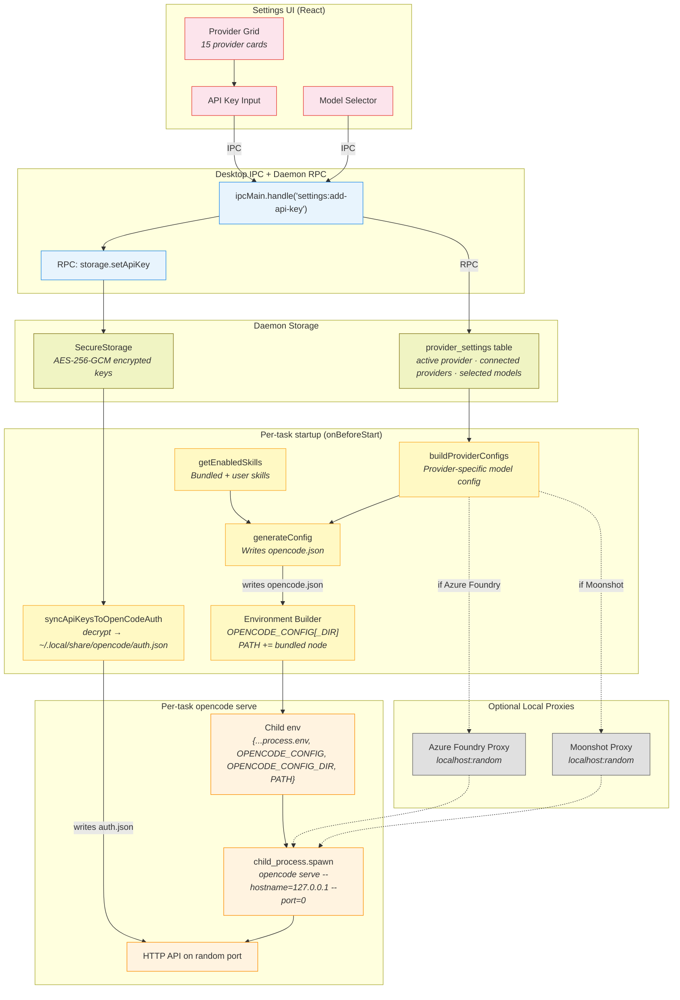

**Notable pipeline changes from the PTY era:**

- Credentials are written to `auth.json` (a file `opencode serve` reads at startup) rather than injected as process env vars, because the SDK server has its own config-loading conventions and the file format covers credentials the env-var approach can't (OAuth tokens, per-provider endpoints).
- `opencode.json` no longer registers `complete-task` / `start-task` / `file-permission` / `ask-user-question` as MCP servers. Those MCP shims were the bridge layer that the SDK events replaced.
- `onBeforeStart` is invoked by the daemon's `OpenCodeServerManager` (before `opencode serve` spawns) **and** forwarded to the adapter via `AdapterOptions.onBeforeStart` (so `externalEnv` stays in sync for consumers that still inspect it). The two calls produce equivalent env.

---

## 7. Skills & Connectors Functional Model

How skills and MCP connectors are managed, stored, and injected into the per-task agent configuration. (Structurally unchanged from the PTY era — included for completeness.)

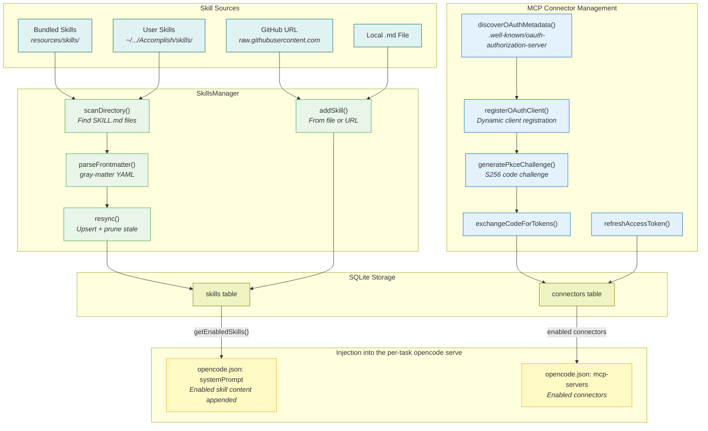

---

## 8. Permission & Question Request Flow

A focused view of the single most-changed path in the cutover — human-in-the-loop gating. Same goal as before (user approves file writes, answers clarification questions), entirely different transport.

```mermaid
graph LR
  subgraph OC["opencode serve (per task)"]
    TOOL["Tool invocation<br/><i>Write/Edit/Bash/…</i>"]
    Q_ASK["ask-user-question tool"]
    PERM_EV["emits permission.asked<br/><i>(SSE event)</i>"]
    Q_EV["emits question.asked<br/><i>(SSE event)</i>"]
  end

  subgraph ADAPTER["OpenCodeAdapter (daemon)"]
    SUB["event.subscribe loop<br/><i>handleSdkEvent</i>"]
    PEND["PendingRequest map<br/><i>sdk request id ↔ oss request id</i>"]
    EMIT["emit('permission-request')"]
    SEND["sendResponse(response)"]
    REPLY["client.permission.reply / question.reply"]
  end

  subgraph DAEMON_RPC["Daemon RPC surface"]
    NOTIFY["rpc.notify('permission.request', req)"]
    RESPOND["RPC method: permission.respond"]
  end

  subgraph DESKTOP["Electron Main"]
    FWD["Notification Forwarder"]
    IPC["ipcMain.handle('permission:respond')"]
  end

  subgraph UI_R["React UI"]
    DIALOG["Permission / Question Dialog"]
    USER_CLICK["User clicks Allow / Deny /<br/>picks answer option"]
  end

  TOOL -->|"requires permission"| PERM_EV
  Q_ASK --> Q_EV
  PERM_EV --> SUB
  Q_EV --> SUB
  SUB --> PEND
  PEND --> EMIT
  EMIT --> NOTIFY
  NOTIFY -->|"socket"| FWD
  FWD -->|"webContents.send"| DIALOG
  DIALOG --> USER_CLICK
  USER_CLICK -->|"ipcRenderer.invoke"| IPC
  IPC -->|"client.call"| RESPOND
  RESPOND --> SEND
  SEND -->|"looks up PendingRequest"| PEND
  SEND --> REPLY
  REPLY -->|"HTTP"| OC

  classDef oc fill:#fff3e0,stroke:#fb8c00
  classDef adapter fill:#bbdefb,stroke:#1565c0
  classDef rpc fill:#e8f5e9,stroke:#43a047
  classDef desktop fill:#e8f4fd,stroke:#1e88e5
  classDef ui fill:#fce4ec,stroke:#e53935

  class TOOL,Q_ASK,PERM_EV,Q_EV oc
  class SUB,PEND,EMIT,SEND,REPLY adapter
  class NOTIFY,RESPOND rpc
  class FWD,IPC desktop
  class DIALOG,USER_CLICK ui
```

**Source-based auto-deny safeguard:** When a permission prompt reaches `task-callbacks.onPermissionRequest` for a task whose source is not `'ui'` (WhatsApp, scheduler) and there is no live RPC client connected, the callback auto-denies via the same reply path. This replaces the PTY-era "HTTP callback times out after 5 minutes" safeguard the deleted `PermissionService` provided.

---

## 9. Free-tier Gateway Integration (`@accomplish/llm-gateway-client`)

Accomplish ships in two flavours: the **OSS build** (open-source, bring-your-own provider keys) and the **Free build** (adds an Accomplish-operated LLM gateway with metered credits). The Free build is produced by a separate CI repo that fuses this repo with a private sibling package, `@accomplish/llm-gateway-client`. The OSS codebase — this repo — treats that private package as an **optional runtime dependency**: absent in OSS builds, present in Free builds, and wired in via a single interface with a null-object fallback.

```mermaid
graph TB
  subgraph BUILD["Build-time boundary"]
    direction TB
    CI_OSS["OSS build<br/><i>only this repo</i>"]
    CI_FREE["Free build (private CI)<br/><i>this repo + llm-gateway-client<br/>+ accomplish-release</i>"]
    BUILD_ENV["build.env<br/><i>ACCOMPLISH_GATEWAY_URL=...</i>"]
  end

  subgraph RUNTIME["Runtime boundary (daemon process)"]
    direction TB
    BOOT["daemon/index.ts bootstrap"]
    DYN["Dynamic import<br/><i>await import('@accomplish/llm-gateway-client')</i>"]
    NOOP["noopRuntime<br/><i>fail-closed fallback<br/>isAvailable()=false</i>"]
    REAL["createRuntime()<br/><i>real AccomplishRuntime impl</i>"]
    TAG["setProxyTaskId(taskId &#124; undefined)<br/><i>hot-path callback</i>"]
  end

  subgraph USE["Consumers of AccomplishRuntime"]
    direction TB
    CG["ConfigGenerator<br/><i>buildAccomplishAiConfig(ctx)</i>"]
    RPC["Daemon RPC methods<br/><i>accomplish-ai.connect<br/>.get-usage · .disconnect<br/>.usage-update notify</i>"]
    ADAPT["OpenCodeAdapter.setProxyTaskId<br/><i>start → tag · teardown → clear</i>"]
  end

  subgraph EXT["External"]
    GW["Accomplish LLM Gateway<br/><i>HTTPS proxy to AI providers<br/>per-task credit accounting</i>"]
    AI["AI Provider APIs<br/><i>Anthropic · OpenAI · Google · …</i>"]
  end

  CI_OSS -.->|"package absent"| BOOT
  CI_FREE -->|"package present"| BOOT
  CI_FREE --> BUILD_ENV
  BUILD_ENV -->|"Electron build-config → daemon env"| BOOT

  BOOT --> DYN
  DYN -->|"ERR_MODULE_NOT_FOUND (OSS)"| NOOP
  DYN -->|"resolved (Free)"| REAL
  DYN -->|"also pulls"| TAG

  NOOP -.->|"isAvailable()=false"| CG
  REAL --> CG
  REAL --> RPC
  TAG --> ADAPT

  CG -->|"provider config<br/>(only if isAvailable)"| GW
  RPC -->|"HTTPS (DPoP-signed)"| GW
  ADAPT -->|"per-task tag on<br/>outgoing LLM req"| GW
  GW -->|"upstream"| AI

  classDef build fill:#e0e0e0,stroke:#616161
  classDef runtime fill:#e8f5e9,stroke:#43a047
  classDef consumer fill:#bbdefb,stroke:#1565c0
  classDef ext fill:#f3e5f5,stroke:#8e24aa

  class CI_OSS,CI_FREE,BUILD_ENV build
  class BOOT,DYN,NOOP,REAL,TAG runtime
  class CG,RPC,ADAPT consumer
  class GW,AI ext
```

### 9.1 Package boundary — named in exactly four places

The private package's name appears on **only four lines** of OSS source. Everything else depends on the `AccomplishRuntime` _interface_ owned by agent-core.

| Location                                                                               | What it does                                                                                                                                                                                                     |
| -------------------------------------------------------------------------------------- | ---------------------------------------------------------------------------------------------------------------------------------------------------------------------------------------------------------------- |
| [apps/daemon/tsup.config.ts](apps/daemon/tsup.config.ts)                               | Marks the package `external` so the bundler doesn't attempt resolution at build time.                                                                                                                            |
| [apps/daemon/src/types/gateway-client.d.ts](apps/daemon/src/types/gateway-client.d.ts) | Ambient `declare module` so TypeScript can type `import('@accomplish/llm-gateway-client')` when the package is absent.                                                                                           |
| [apps/daemon/src/index.ts](apps/daemon/src/index.ts)                                   | Two dynamic loads inside `main()`: `await import(...)` → `createRuntime()`, then a separate `require(...)` → `setProxyTaskId`. Both fail-closed to OSS behaviour on `ERR_MODULE_NOT_FOUND` / `MODULE_NOT_FOUND`. |

### 9.2 The interface — `AccomplishRuntime` + `noopRuntime`

Defined in [`packages/agent-core/src/opencode/accomplish-runtime.ts`](packages/agent-core/src/opencode/accomplish-runtime.ts) and re-exported from [`agent-core`](packages/agent-core/src/index.ts):

| Method                             | When called                                                                                                               |
| ---------------------------------- | ------------------------------------------------------------------------------------------------------------------------- |
| `connect(storageDeps)`             | `accomplish-ai.connect` RPC — user clicks "Use Accomplish AI" in Settings                                                 |
| `disconnect()`                     | `accomplish-ai.disconnect` RPC — user logs out                                                                            |
| `getUsage()`                       | `accomplish-ai.get-usage` RPC — Settings reads live credit balance                                                        |
| `onUsageUpdate(listener)`          | Daemon startup — subscribes to push updates from response headers                                                         |
| `buildProviderConfig(storageDeps)` | Per-task startup — `buildAccomplishAiConfig` asks for the opencode provider config to route LLM calls through the gateway |
| `isAvailable()`                    | Everywhere — null-object predicate, `false` in OSS, `true` in Free                                                        |

`noopRuntime` is a fail-closed implementation shipped with agent-core. `isAvailable()` returns `false`, the async methods throw `accomplish_runtime_unavailable`, `buildProviderConfig()` returns empty. Call sites never need `if (runtime) { ... }` branches — they rely on `isAvailable()` or let the null-object's empty return silently drop the integration.

### 9.3 The hot-path callback — `setProxyTaskId` in the adapter

[`OpenCodeAdapter.options.setProxyTaskId`](packages/agent-core/src/internal/classes/OpenCodeAdapter.ts) is an optional callback with two call sites:

- [OpenCodeAdapter.ts:374](packages/agent-core/src/internal/classes/OpenCodeAdapter.ts#L374) — `this.options.setProxyTaskId?.(taskId)` on `startTask`
- [OpenCodeAdapter.ts:1332](packages/agent-core/src/internal/classes/OpenCodeAdapter.ts#L1332) — `this.options.setProxyTaskId?.(undefined)` on `teardown`

**Why in the adapter?** The gateway receives the actual LLM request bodies (via an env-injected HTTPS proxy that `opencode serve` uses for provider calls). It needs to attribute each request to a task ID for credit accounting, per-task rate limiting, and abuse detection. The adapter is the smallest scope with a 1:1 correspondence to a task lifecycle: it gets the taskId at session creation and knows the exact moment the session tears down. Any higher layer (TaskManager, TaskService) would force propagating the ID through more hops or through `AsyncLocalStorage`; any lower layer (inside opencode) doesn't know Accomplish's task concept.

In OSS, `setProxyTaskId` is `undefined` and the optional-chain `?.` short-circuits — zero cost.

### 9.4 Env-var propagation — `ACCOMPLISH_GATEWAY_URL`

The daemon doesn't read this variable itself; the private runtime does, when it wakes up. The OSS code only has to propagate it correctly:

```
build.env (Free CI) or build.env.template (local Free dev)
    ↓
getBuildConfig().accomplishGatewayUrl         [apps/desktop/.../build-config.ts:95]
    ↓
daemonEnv.ACCOMPLISH_GATEWAY_URL = bc.accomplishGatewayUrl
    ↓ (spawned daemon inherits env)          [apps/desktop/.../daemon-connector.ts:201]
process.env.ACCOMPLISH_GATEWAY_URL            (read by llm-gateway-client at createRuntime())
```

### 9.5 "Free dev" local workflow

For contributors who have access to the private package and want to run the Free variant under `pnpm dev`:

1. Clone `llm-gateway-client` as a sibling folder to `accomplish/`.
2. `pnpm -F @accomplish/daemon add @accomplish/llm-gateway-client@file:/Users/…/dev/accomplish/llm-gateway-client`
3. Set `ACCOMPLISH_GATEWAY_URL=<dev-gateway>` in `build.env` (or inline on the `pnpm dev` command).
4. `pnpm dev` — the daemon's dynamic `import()` now resolves the local package; all four consumer paths light up.

Reverting to OSS mode is `pnpm -F @accomplish/daemon remove @accomplish/llm-gateway-client` + restart. No other code changes required — that's the whole point of the null-object pattern.

---

## 10. Completion Enforcement

The `CompletionEnforcer` guards against two failure modes common with agent workflows:

1. The LLM silently stops mid-workflow without declaring it's done (or not done).
2. The LLM claims "success" while the todo plan still has incomplete items — pretending to finish to escape the loop.

Both are handled in agent-core at [`packages/agent-core/src/opencode/completion/`](packages/agent-core/src/opencode/completion/).

### 10.1 State machine (SDK-era reachable subset)

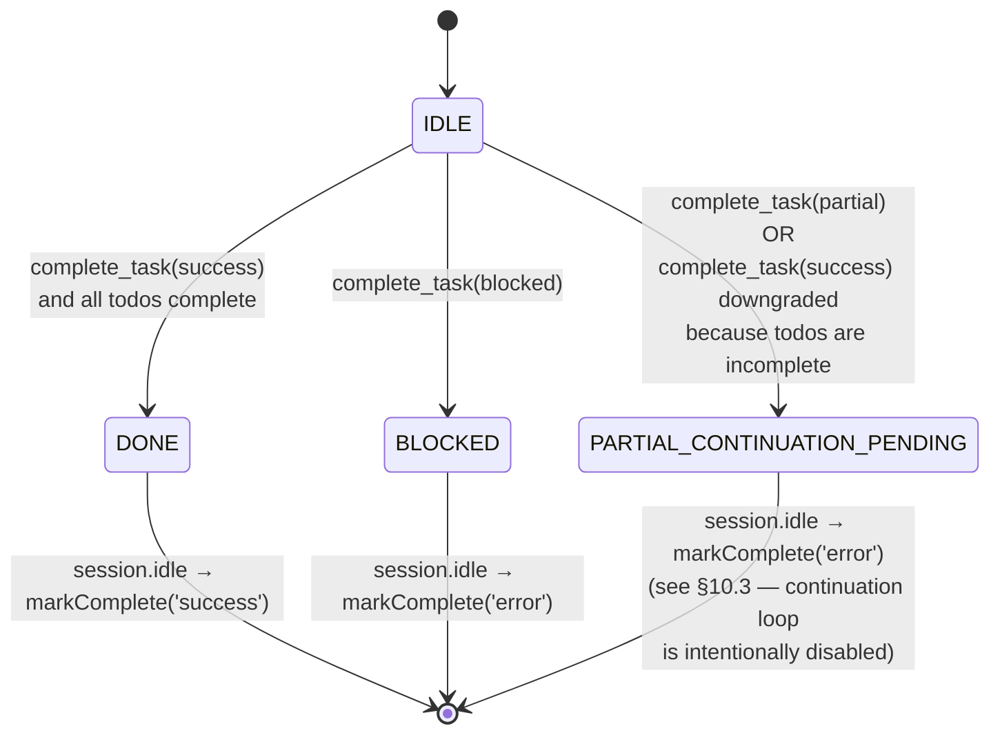

State names are the `CompletionFlowState` enum ([completion-state.ts](packages/agent-core/src/opencode/completion/completion-state.ts)). The PTY-era state machine also had `CONTINUATION_PENDING` and `MAX_RETRIES_REACHED` plus a retry loop that re-prompted the agent to finish — see §10.3 for why that path is dormant in SDK-era.

### 10.2 Trigger flow — how the adapter drives the enforcer

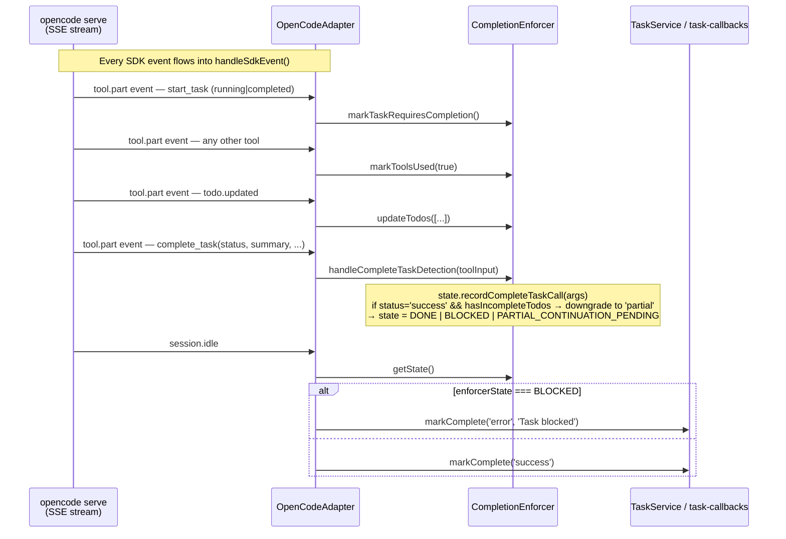

The crucial design contract: **the enforcer is a recorder, not a driver.** The adapter observes `session.idle` from the SDK, reads `enforcer.getState()`, and decides the final disposition. The enforcer's job is to get the state right by the time `session.idle` fires — nothing more.

### 10.3 Why the continuation-nudge loop is dormant in SDK-era

The PTY-era enforcer had a second responsibility: when the agent stopped without calling `complete_task` but had been doing real work, the enforcer would schedule a _continuation nudge_ — a follow-up prompt reminding the agent to finish or declare blocked. That loop is implemented (see [`handleStepFinish`](packages/agent-core/src/opencode/completion/completion-enforcer.ts) and [`handleProcessExit`](packages/agent-core/src/opencode/completion/completion-enforcer.ts)) but **neither method is called from the SDK-era adapter**. The adapter explicitly opts out in a large comment at [OpenCodeAdapter.ts:818–836](packages/agent-core/src/internal/classes/OpenCodeAdapter.ts#L818):

> DO NOT invoke `completionEnforcer.handleProcessExit(0)` here. That path was designed for the PTY era where the `opencode run` child exited when the turn ended — firing exactly once. In SDK mode, `session.idle` repeats, and each invocation would re-enter the nudge path … until `MAX_RETRIES_REACHED` stops the storm (~10 attempts). Symptom: the user sees 5–10 successive defensive assistant bubbles after a simple "add 6" request before the task finally ends.

Consequence: in SDK-era, `PARTIAL_CONTINUATION_PENDING` is entered (recorded) but never _consumed_ as a prompt trigger — on the next `session.idle` it becomes `markComplete('error')` just like `BLOCKED`. The `onStartContinuation` callback wired into the adapter is effectively dead; the prompts in [`prompts.ts`](packages/agent-core/src/opencode/completion/prompts.ts) still exist but aren't fired from the live path. Re-enabling continuation under the SDK model would need a different trigger (e.g., a one-shot boolean guarding `handleStepFinish` to the first `stop` per prompt) rather than the PTY pattern.

### 10.4 Auto-downgrade — the one enforcement bite that remains

The live safeguard is in `handleCompleteTaskDetection`: if the agent calls `complete_task(status='success')` while any todo is still `pending` or `in_progress`, the enforcer silently rewrites the status to `'partial'` and populates `remaining_work` with the incomplete-todo summary. The state machine lands in `PARTIAL_CONTINUATION_PENDING` (recorded as an error on idle, per §10.3). Rationale: agents have been known to call `complete_task(success)` as an escape hatch when they're stuck; requiring _both_ an explicit success claim _and_ a complete todo plan catches that specific pattern.

---

## Component Responsibility Matrix

| Component                          | Package      | Responsibility                                                                                                      | Key Interfaces                                                                                                    |
| ---------------------------------- | ------------ | ------------------------------------------------------------------------------------------------------------------- | ----------------------------------------------------------------------------------------------------------------- | -------------------- | --- |
| **TaskManager**                    | agent-core   | Task queue, lifecycle, adapter event wiring                                                                         | `startTask()`, `cancelTask()`, `sendResponse()`                                                                   |
| **OpenCodeAdapter**                | agent-core   | SDK v2 client, SSE event loop, permission/question routing, tool-part interception                                  | `startTask()`, `resumeSession()`, `sendResponse()`, `cancelTask()`                                                |
| **CompletionEnforcer**             | agent-core   | Records agent's completion intent, auto-downgrades claimed-`success` with incomplete todos (see §10)                | `handleCompleteTaskDetection()`, `markToolsUsed()`, `markTaskRequiresCompletion()`, `updateTodos()`, `getState()` |
| **TaskInactivityWatchdog**         | agent-core   | Stall detection (90s soft / +60s hard) via fingerprint sampling                                                     | `sample()` callback; `onSoftTimeout` / `onHardTimeout`                                                            |
| **MessageProcessor**               | agent-core   | SDK Part → TaskMessage conversion, message batching, model-context stamping                                         | `toTaskMessage()`, `queueMessage()`, `flushAndCleanupBatcher()`                                                   |
| **ConfigGenerator**                | agent-core   | Generates per-task `opencode.json` (prompt, MCP servers, providers, skills)                                         | `generateConfig()` → JSON file path                                                                               |
| **syncApiKeysToOpenCodeAuth**      | agent-core   | Decrypts SecureStorage keys into `~/.local/share/opencode/auth.json` before `opencode serve` spawn                  | one call per task startup                                                                                         |
| **OpenCodeServerManager**          | apps/daemon  | Per-task `opencode serve` pool: spawn, readiness wait, idle reuse, process-tree cleanup, transient OAuth clients    | `ensureTaskRuntime()`, `waitForServerUrl()`, `scheduleTaskRuntimeCleanup()`, `createTransientOpencodeClient()`    |
| **TaskService**                    | apps/daemon  | Daemon-side task orchestrator, source-based routing, server-manager owner                                           | `startTask()`, `stopTask()`, `resumeSession()`, `sendResponse()`                                                  |
| **DaemonRpcServer / DaemonClient** | agent-core   | JSON-RPC 2.0 over Unix socket / Windows named pipe, notify fan-out                                                  | `registerMethod()`, `notify()`, `call()`, `onNotification()`                                                      |
| **ThoughtStreamService**           | apps/daemon  | HTTP `:9228` endpoint for MCP `report-thought` / `report-checkpoint` tools                                          | `POST /thought`, `POST /checkpoint`                                                                               |
| **WhatsAppSendApi**                | apps/daemon  | HTTP `:9229` endpoint for MCP `whatsapp-send` tool                                                                  | `POST /send`                                                                                                      |
| **WhatsAppDaemonService**          | apps/daemon  | Baileys socket, inbound message → `taskService.startTask(source='whatsapp')`                                        | `connect()`, `disconnect()`                                                                                       |
| **SchedulerService**               | apps/daemon  | Cron-driven `startTask(source='scheduler')`                                                                         | `createSchedule()`, `listSchedules()`, `deleteSchedule()`, `setEnabled()`                                         |
| **OpenAiOauthManager**             | apps/daemon  | ChatGPT OAuth flow driven through a transient `opencode serve`                                                      | `startLogin()`, `awaitCompletion()`, `status()`, `getAccessToken()`                                               |
| **AccomplishRuntime (interface)**  | agent-core   | Null-object (`noopRuntime`) in OSS; real impl loaded from private `@accomplish/llm-gateway-client` in Free (see §9) | `connect()`, `disconnect()`, `getUsage()`, `onUsageUpdate()`, `buildProviderConfig()`, `isAvailable()`            |
| **SkillsManager**                  | agent-core   | Skill CRUD, filesystem scan, GitHub import                                                                          | `resync()`, `addSkill()`, `getEnabledSkills()`                                                                    |
| **MCP OAuth**                      | agent-core   | OAuth 2.0 discovery, PKCE, token lifecycle for connectors                                                           | `discoverOAuthMetadata()`, `exchangeCodeForTokens()`                                                              |
| **BrowserService**                 | agent-core   | Playwright Chromium install, dev-browser MCP server spawn                                                           | `ensureDevBrowserServer()`                                                                                        |
| **API Proxies**                    | agent-core   | Protocol translation for Azure Foundry and Moonshot                                                                 | `ensureAzureFoundryProxy()`, `ensureMoonshotProxy()`                                                              |
| **Summarizer**                     | agent-core   | LLM-powered task title generation (multi-provider fallback)                                                         | `generateTaskSummary()`                                                                                           |
| **SpeechService**                  | agent-core   | ElevenLabs STT transcription                                                                                        | `transcribeAudio()`                                                                                               |
| **Database**                       | agent-core   | SQLite WAL + migrations + repositories                                                                              | `better-sqlite3` via repositories                                                                                 |
| **SecureStorage**                  | agent-core   | AES-256-GCM encrypted key/value store                                                                               | `getApiKey()`, `setApiKey()`                                                                                      |
| **IPC Handlers**                   | apps/desktop | Thin proxies between renderer and daemon-client                                                                     | `ipcMain.handle('task:start'                                                                                      | 'permission:respond' | …)` |
| **DaemonClient**                   | apps/desktop | Socket transport + retry + crash-recovery respawn                                                                   | `call()`, `onNotification()`, `close()`                                                                           |
| **Notification Forwarder**         | apps/desktop | Subscribes to every daemon notification channel → `webContents.send()`                                              | internal                                                                                                          |
| **Preload Bridge**                 | apps/desktop | `contextBridge.exposeInMainWorld('accomplish', ...)`                                                                | ~70 API methods exposed to renderer                                                                               |
| **Task Store**                     | apps/web     | Zustand store: single source of truth for UI state                                                                  | `useTaskStore()` with ~25 actions                                                                                 |

---

## Key Architectural Boundaries

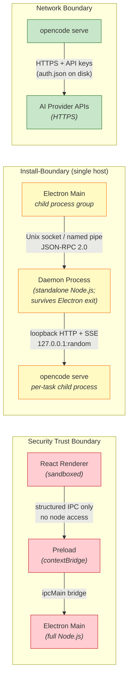

**Four distinct boundaries (one more than before):**

1. **Security boundary** — Renderer is sandboxed; can only call methods explicitly exposed via `contextBridge`. No `require()`, no `fs`, no direct IPC. Same as before.
2. **Electron ↔ Daemon process boundary** — The daemon is a separate OS process that survives Electron quit. Communication is exclusively Unix socket / Windows named pipe, JSON-RPC 2.0. Socket path is derived from the shared `dataDir` so both processes pick the same profile.
3. **Daemon ↔ `opencode serve` process boundary** — Each task spawns its own `opencode serve` child with a random ephemeral port on loopback. The SDK client is the sole consumer. The daemon kills the process tree on shutdown via POSIX process group or Windows `taskkill /T /F`.
4. **Network boundary** — Only `opencode serve` makes outbound HTTPS calls to AI providers. API keys are written to `auth.json` on disk (in the user-scoped OpenCode data dir) before the server starts; keys never leave the user's machine in plaintext except through the TLS connection to the provider.
