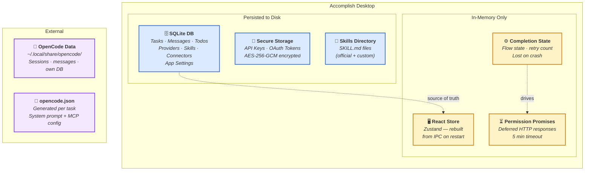
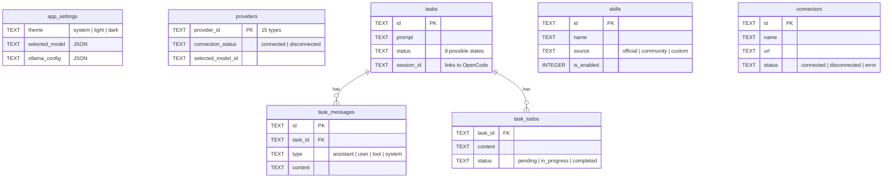
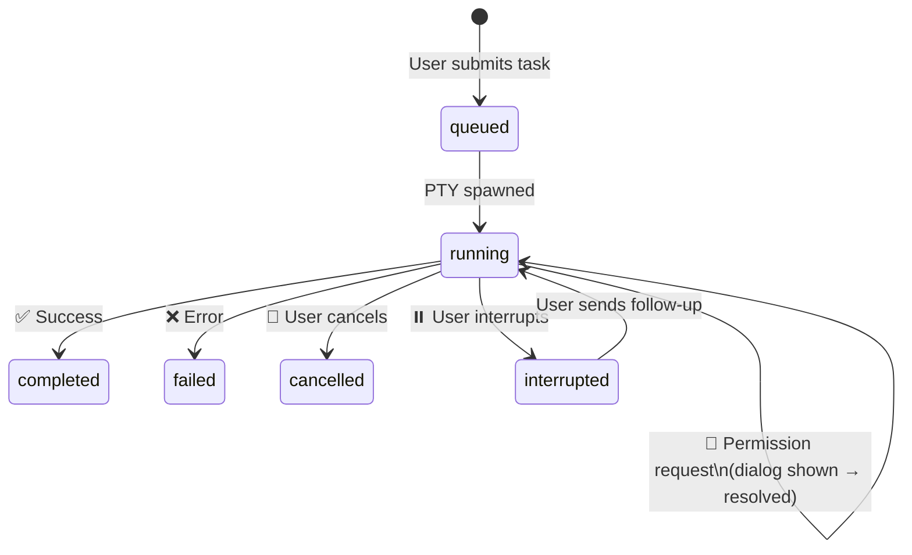
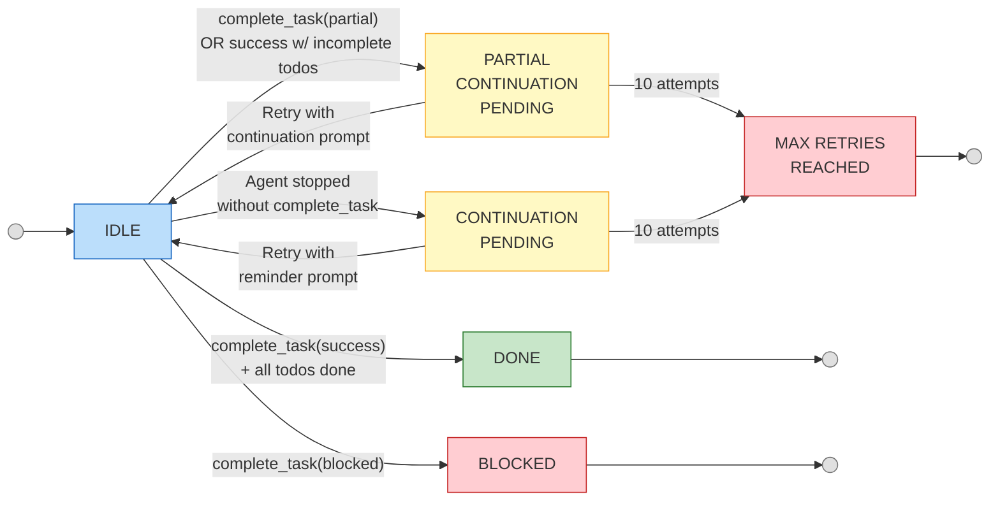
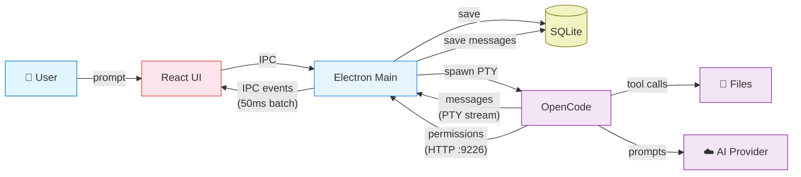
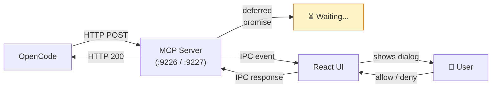

# Information Viewpoint — Slide-Ready Diagrams

> Simplified versions of the diagrams in `information-viewpoint.md`, designed for presentation slides.
> For full detail, refer to the complete document.

---

## 1. Where Data Lives

---

## 2. Database Schema (Simplified)

---

## 3. Task Lifecycle

---

## 4. Completion Enforcer State Machine

---

## 5. Data Flow — Task Execution

---

## 6. Permission Gate Flow

---

## 7. Key Numbers

| Metric                       | Value                   |
| ---------------------------- | ----------------------- |
| **SQLite tables**            | 10 (+ schema_meta)      |
| **Task statuses**            | 8 (pending → cancelled) |
| **Completion states**        | 6 (IDLE → MAX_RETRIES)  |
| **AI providers**             | 15                      |
| **IPC channels**             | ~50                     |
| **Max continuation retries** | 10                      |
| **Permission timeout**       | 5 minutes               |
| **Message batch delay**      | 50ms                    |
| **Encryption**               | AES-256-GCM             |
| **DB mode**                  | WAL (concurrent reads)  |
