# Information Viewpoint — Rozanski & Woods

This document captures all stateful data, information models, state machines, and data flows within the Accomplish system. It follows the Rozanski & Woods Information Viewpoint to document data ownership, lifecycle, and structure.

---

## 1. Database Entity-Relationship Diagram

SQLite database (WAL mode, foreign keys enabled). Current schema version: 9.

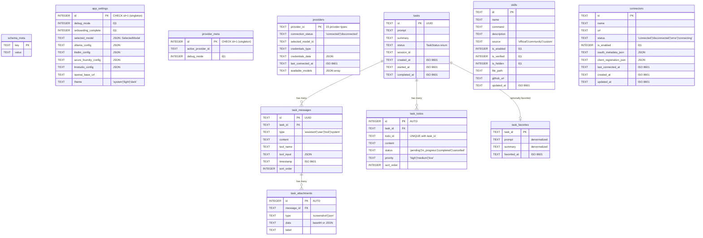

---

## 2. Secure Storage Model

AES-256-GCM encrypted file-based storage, separate from SQLite.

**File locations (macOS):**

- SQLite DB: `~/Library/Application Support/Accomplish/accomplish.db` (prod) / `accomplish-dev.db` (dev)
- Secure Storage: `~/Library/Application Support/Accomplish/secure-storage.json`
- Logs: `~/Library/Application Support/Accomplish/logs/`
- Skills: `~/Library/Application Support/Accomplish/skills/`
- OpenCode configs: `~/Library/Application Support/Accomplish/opencode/`

SQLite is opened with WAL mode (`journal_mode = WAL`), so it can be safely read by external tools while the app is running.

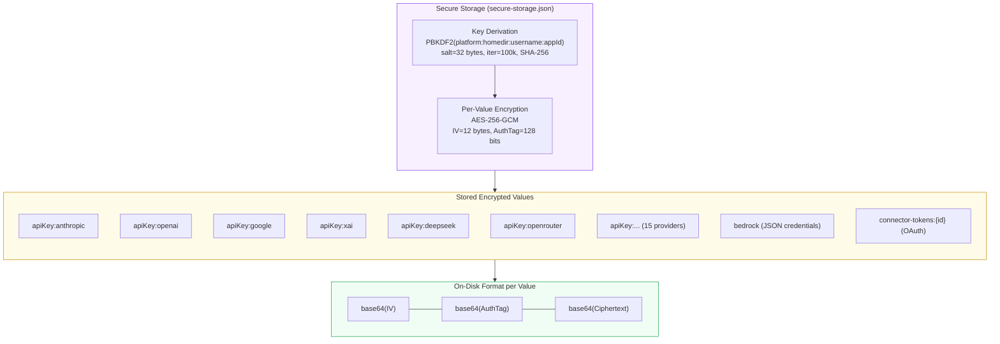

---

## 3. Task Status State Machine

All transitions for the `TaskStatus` type as observed in `TaskManager`, `handlers.ts`, and `task-callbacks.ts`.

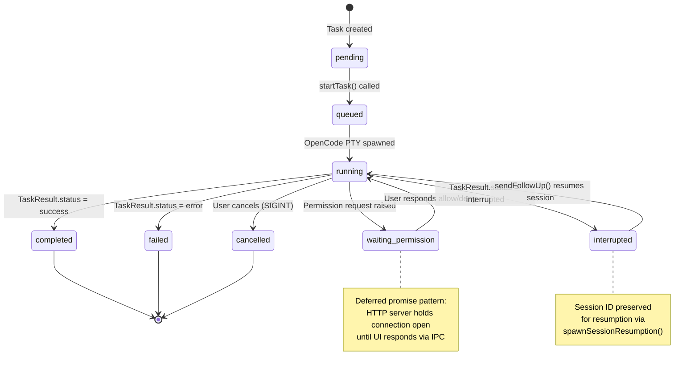

---

## 4. CompletionEnforcer State Machine

The internal `CompletionFlowState` enum governing task completion enforcement and automatic continuation retries.

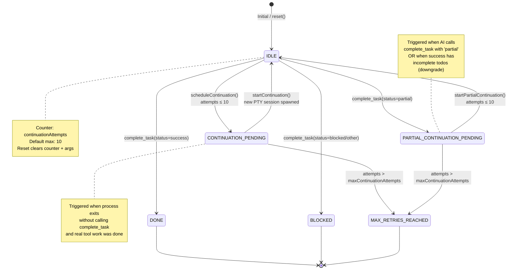

---

## 5. Provider Connection State Machine

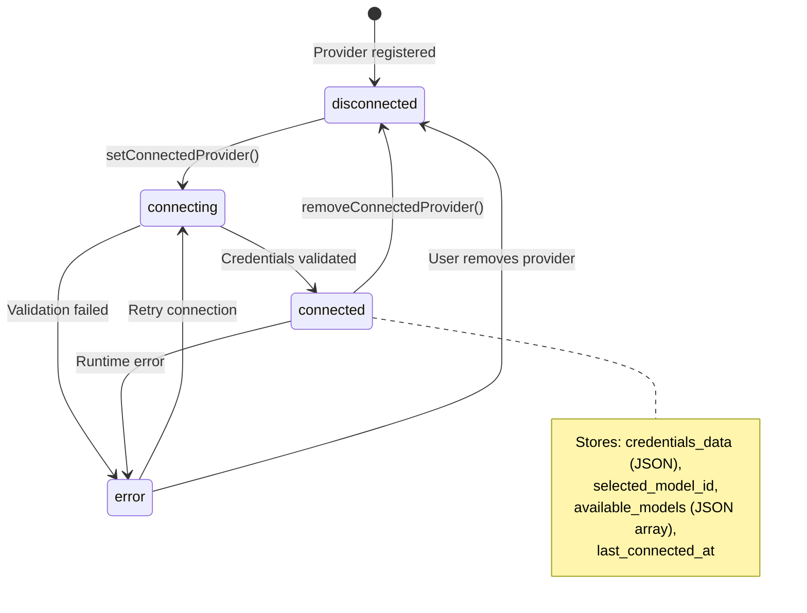

---

## 6. Connector (MCP Server) State Machine

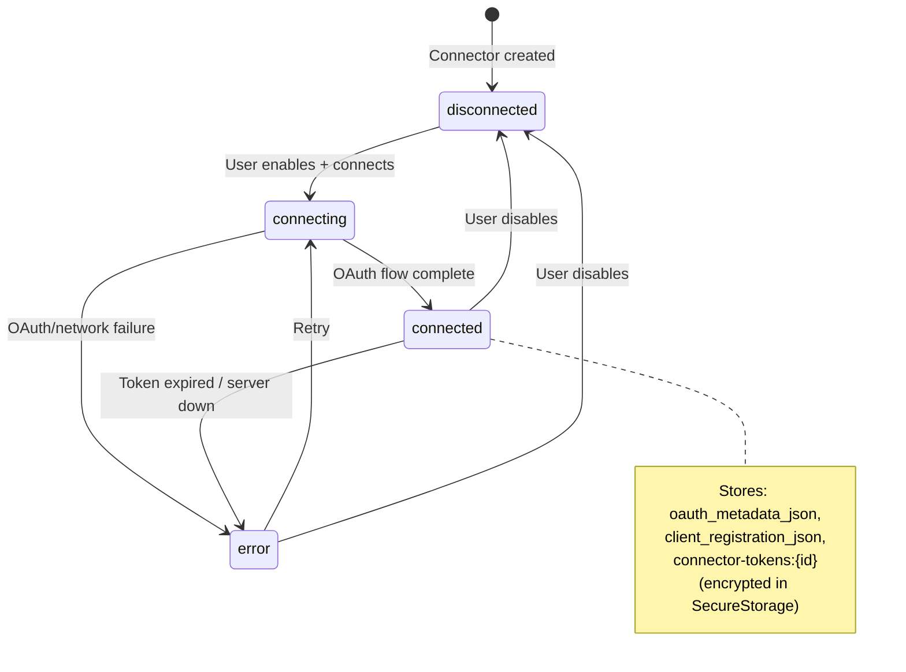

---

## 7. Todo Item State Machine

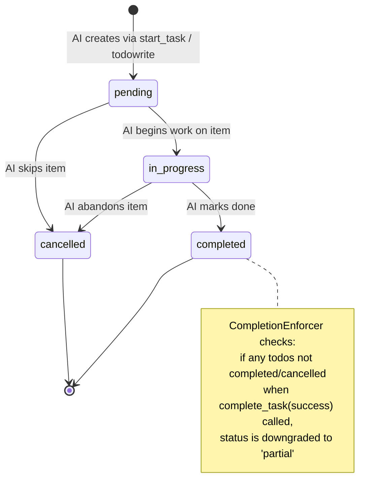

---

## 8. OpenCode Message Type Flow

The sequence of message types emitted by OpenCode CLI through the PTY, as parsed by `OpenCodeAdapter`.

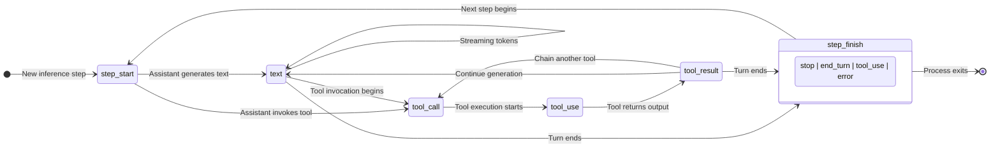

---

## 9. Permission Request Lifecycle

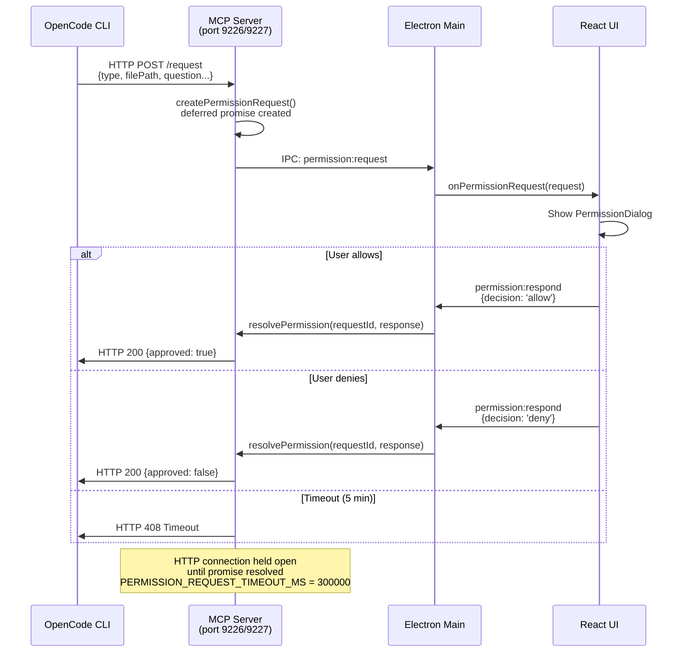

---

## 10. React State Architecture (Zustand Store)

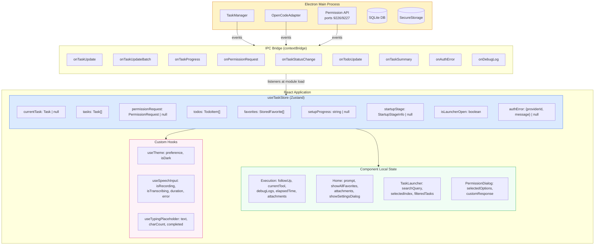

---

## 11. Data Ownership Map

Which process/layer owns which data, and the persistence mechanism.

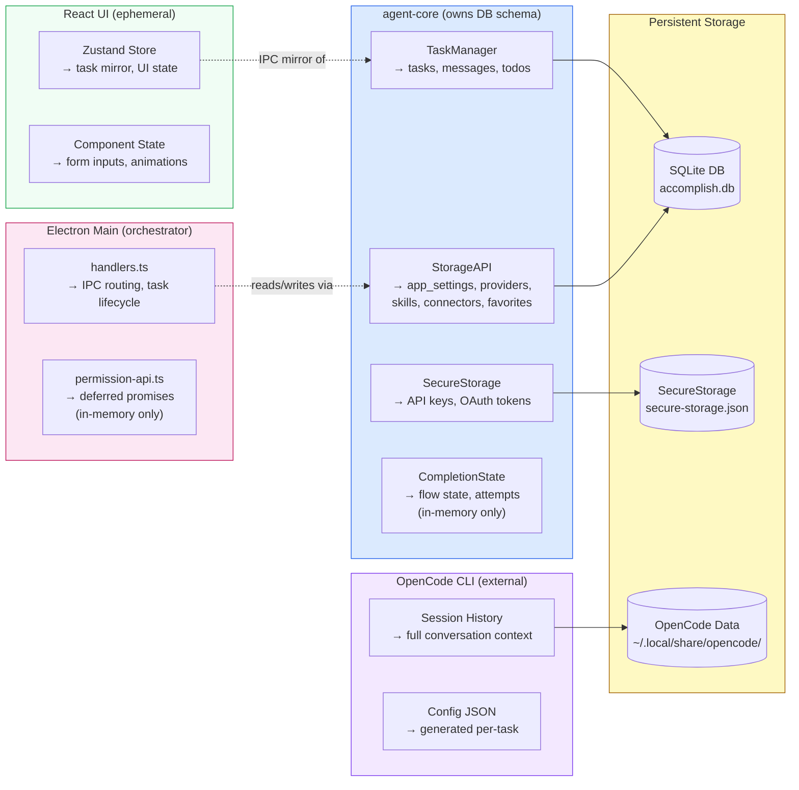

---

## 12. Task Data Lifecycle

End-to-end journey of a task's data from creation through persistence.

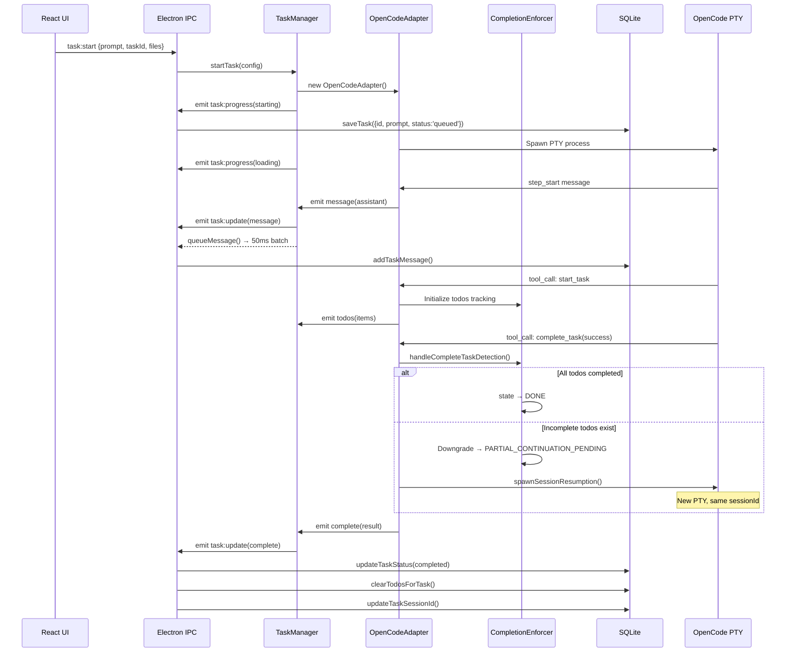

---

## 13. Startup Stage Progression

The stages emitted during task startup, before the AI agent begins work.

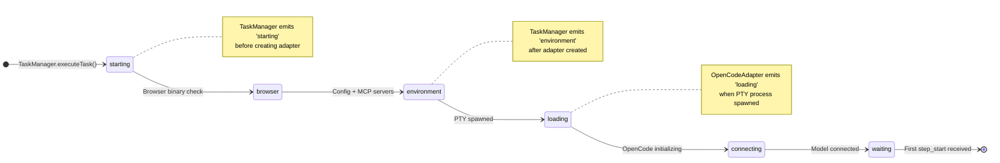

---

## 14. Task Update Event Types

The `TaskUpdateEvent` discriminated union flowing through IPC.

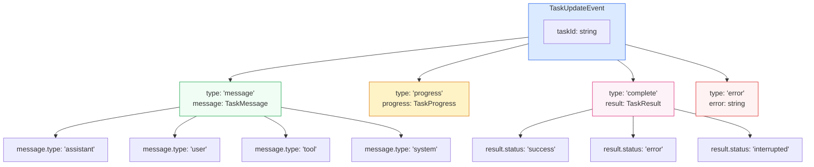

---

## 15. Thought Stream Data Model

Real-time subagent observation data flowing through port 9228.

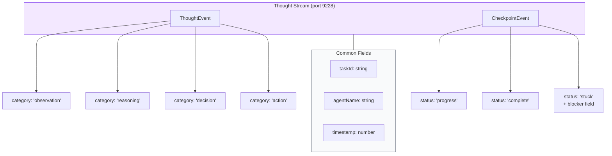

---

## 16. Complete Type Enum Reference

All enumerated types consolidated with their domain and cardinality.

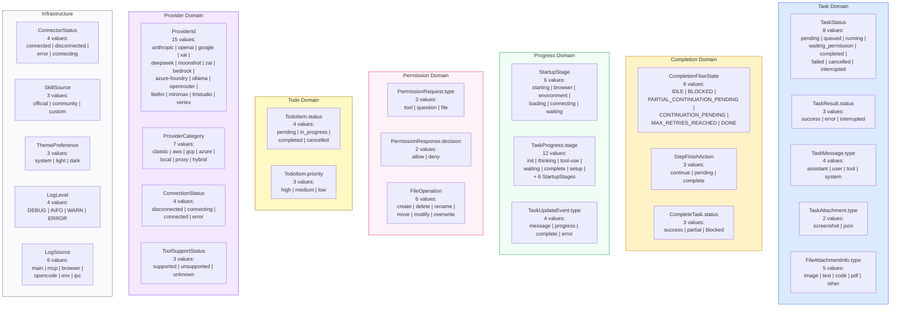

---

## 17. In-Memory vs. Persisted State Summary

| State                            | Owner                        | Persistence                  | Notes                                                   |
| -------------------------------- | ---------------------------- | ---------------------------- | ------------------------------------------------------- |
| `CompletionFlowState`            | CompletionState (agent-core) | **In-memory only**           | Reset per task execution; lost on crash                 |
| `continuationAttempts`           | CompletionState (agent-core) | **In-memory only**           | Counter up to 10                                        |
| `completeTaskArgs`               | CompletionState (agent-core) | **In-memory only**           | Last complete_task call arguments                       |
| Deferred permission promises     | permission-api.ts (Electron) | **In-memory only**           | Pending HTTP responses; timeout 5 min                   |
| Zustand store                    | React UI                     | **In-memory only**           | Rebuilt from IPC events on app restart                  |
| `hasCompleted`, `wasInterrupted` | OpenCodeAdapter (agent-core) | **In-memory only**           | Per-adapter instance flags                              |
| Task status, messages, todos     | TaskManager → SQLite         | **SQLite**                   | Survives restart                                        |
| Provider credentials             | SecureStorage                | **Encrypted file**           | AES-256-GCM                                             |
| OAuth tokens                     | SecureStorage                | **Encrypted file**           | Per-connector                                           |
| App settings, theme              | SQLite singleton row         | **SQLite**                   | Singleton (id=1)                                        |
| OpenCode conversation history    | OpenCode CLI                 | **~/.local/share/opencode/** | SQLite DB + session/message storage; enables resumption |
| Generated OpenCode config        | config-generator.ts          | **Temp file**                | Regenerated per task                                    |
| Skills (markdown files)          | Skills table + file system   | **SQLite + disk**            | Dual storage                                            |
| Theme preference                 | SQLite + localStorage        | **Both**                     | Synced across layers                                    |

---

## Key Architectural Decisions

1. **SQLite with WAL mode** — Enables concurrent reads during writes; critical for IPC-heavy architecture where UI reads while tasks write.
2. **Singleton settings rows** — `app_settings` and `provider_meta` use `CHECK id=1` constraint to prevent accidental multi-row configs.
3. **JSON-in-TEXT columns** — Provider credentials, model configs, and OAuth metadata stored as serialized JSON in TEXT columns. Trade-off: no SQL querying into JSON, but simpler schema evolution.
4. **Denormalized favorites** — `task_favorites` copies `prompt` and `summary` from `tasks` to allow independent display without JOIN. Trade-off: potential staleness vs. query simplicity.
5. **In-memory completion state** — `CompletionFlowState` deliberately not persisted. If the app crashes mid-task, the task is marked failed rather than attempting to reconstruct continuation state.
6. **Machine-derived encryption key** — SecureStorage uses PBKDF2 with machine-specific inputs (platform, homedir, username). Not as secure as OS keychain but avoids macOS permission prompts. Suitable for rotatable API keys.
7. **Ephemeral React state** — Zustand store is purely derived from IPC events. On restart, task history is reloaded from SQLite, but in-flight execution state (currentTool, startupStage, etc.) is lost.

---

## 18. userData Directory Reference

Location: `~/Library/Application Support/Accomplish/` (macOS)

All files and folders found in this directory at runtime:

### Accomplish Application Data

| Path                    | Owner               | Description                                                                                                                                                                         |
| ----------------------- | ------------------- | ----------------------------------------------------------------------------------------------------------------------------------------------------------------------------------- |
| `accomplish.db`         | agent-core (SQLite) | Main database — tasks, messages, todos, providers, settings, skills, connectors. All application state.                                                                             |
| `accomplish.db-wal`     | SQLite engine       | Write-Ahead Log — buffered writes not yet checkpointed to main DB. Auto-managed.                                                                                                    |
| `accomplish.db-shm`     | SQLite engine       | Shared memory index for WAL. Enables concurrent readers. Auto-managed.                                                                                                              |
| `accomplish-dev.db`     | agent-core (SQLite) | Development-mode database (used when running `pnpm dev`). Same schema as prod.                                                                                                      |
| `accomplish-dev.db-wal` | SQLite engine       | WAL for dev database.                                                                                                                                                               |
| `accomplish-dev.db-shm` | SQLite engine       | Shared memory for dev database.                                                                                                                                                     |
| `opencode/`             | config-generator.ts | Contains `opencode.json` — generated OpenCode CLI config (system prompt, MCP servers, provider settings). Regenerated before each task. Single file shared across concurrent tasks. |
| `skills/`               | SkillsManager       | Skill markdown files (official, community, custom). Each skill is a `.md` with frontmatter.                                                                                         |
| `logs/`                 | log-file-writer.ts  | Application log files written by Electron main process.                                                                                                                             |
| `dev-browser/`          | dev-browser-mcp     | Playwright browser profile data (cookies, localStorage) for the bundled Chromium used in browser automation tasks.                                                                  |

### Chromium / Electron Auto-Created

These are standard Chromium storage directories created automatically by Electron. Not managed by Accomplish code.

| Path                                                  | Owner           | Description                                                                                      |
| ----------------------------------------------------- | --------------- | ------------------------------------------------------------------------------------------------ |
| `Cache/`                                              | Chromium        | HTTP cache for the renderer process (the Accomplish UI webview).                                 |
| `Code Cache/`                                         | Chromium        | Compiled/cached JavaScript bytecode for faster UI startup.                                       |
| `Cookies`                                             | Chromium        | Cookie database for the Electron renderer (Accomplish UI, not the automation browser).           |
| `Cookies-journal`                                     | Chromium        | SQLite journal for Cookies DB.                                                                   |
| `GPUCache/`                                           | Chromium        | Cached GPU shader compilations.                                                                  |
| `DawnGraphiteCache/`                                  | Chromium (Dawn) | WebGPU shader cache (Dawn graphics backend).                                                     |
| `DawnWebGPUCache/`                                    | Chromium (Dawn) | WebGPU pipeline cache.                                                                           |
| `DIPS`, `DIPS-shm`, `DIPS-wal`                        | Chromium        | Bounce Tracking Mitigations database (Detection of Indirect Proxy for Stateful bounce tracking). |
| `IndexedDB/`                                          | Chromium        | Browser IndexedDB storage for the Accomplish UI renderer.                                        |
| `Local Storage/`                                      | Chromium        | `localStorage` for the Accomplish React app (theme preference synced here).                      |
| `Session Storage/`                                    | Chromium        | `sessionStorage` for the Accomplish React app.                                                   |
| `Network Persistent State`                            | Chromium        | Network stack state (HSTS, transport security policies).                                         |
| `Preferences`                                         | Chromium        | Electron/Chromium browser preferences JSON.                                                      |
| `Shared Dictionary/`                                  | Chromium        | Shared Brotli/Zstandard compression dictionaries.                                                |
| `SharedStorage/`                                      | Chromium        | Shared Storage API data.                                                                         |
| `WebStorage/`                                         | Chromium        | Additional web storage data.                                                                     |
| `Trust Tokens`, `Trust Tokens-journal`                | Chromium        | Privacy Pass / Trust Token storage.                                                              |
| `TransportSecurity`                                   | Chromium        | HSTS and certificate pin state.                                                                  |
| `blob_storage/`                                       | Chromium        | Binary large object storage for the renderer.                                                    |
| `Crashpad/`                                           | Chromium        | Crash dump reports (minidumps). Useful for debugging Electron crashes.                           |
| `SingletonCookie`, `SingletonLock`, `SingletonSocket` | Chromium        | Electron single-instance lock files. Prevent multiple app instances from running simultaneously. |

### What to inspect when debugging

| Scenario                           | Look at                                                                           |
| ---------------------------------- | --------------------------------------------------------------------------------- |
| Task not completing / wrong status | `accomplish.db` → `tasks` table (status, session_id)                              |
| Messages missing or corrupt        | `accomplish.db` → `task_messages` table (sort_order, content)                     |
| Provider connection issues         | `accomplish.db` → `providers` table (connection_status, credentials_type)         |
| API key not working                | `secure-storage.json` (encrypted — verify key exists, can't read value)           |
| OpenCode config wrong              | `opencode/opencode.json` (inspect generated system prompt, MCP servers)           |
| Browser automation state           | `dev-browser/` (Playwright profile with cookies/sessions from automated browsing) |
| App crashes                        | `Crashpad/` minidumps + `logs/` directory                                         |
| App won't start (locked)           | Delete `SingletonLock` file if stale from a crash                                 |
