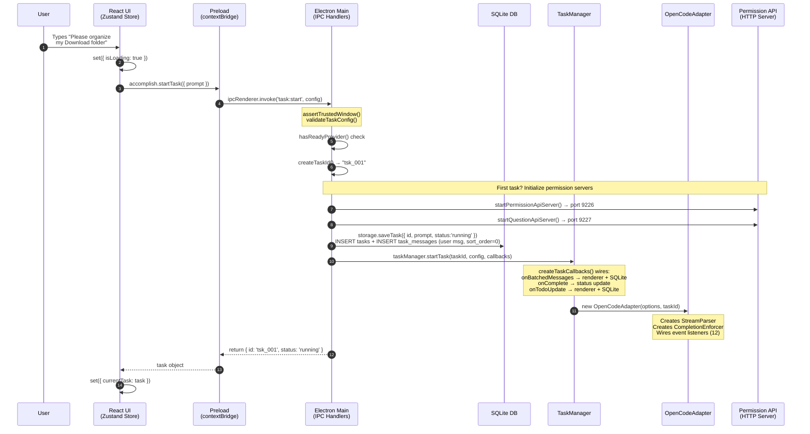
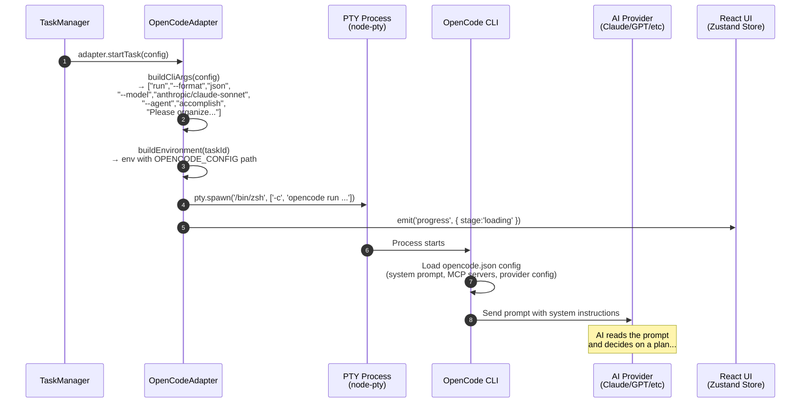
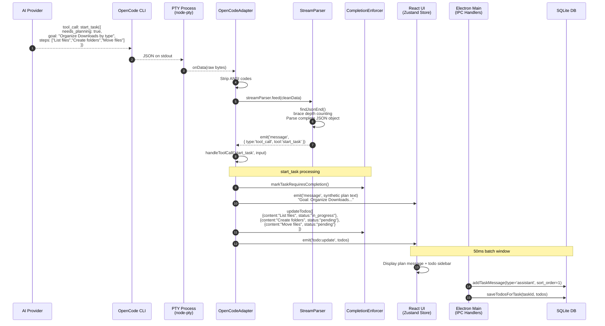
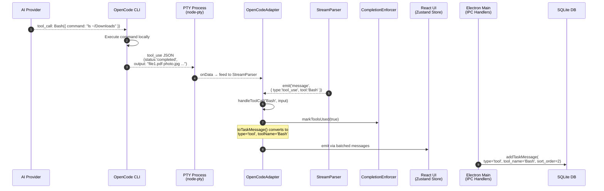
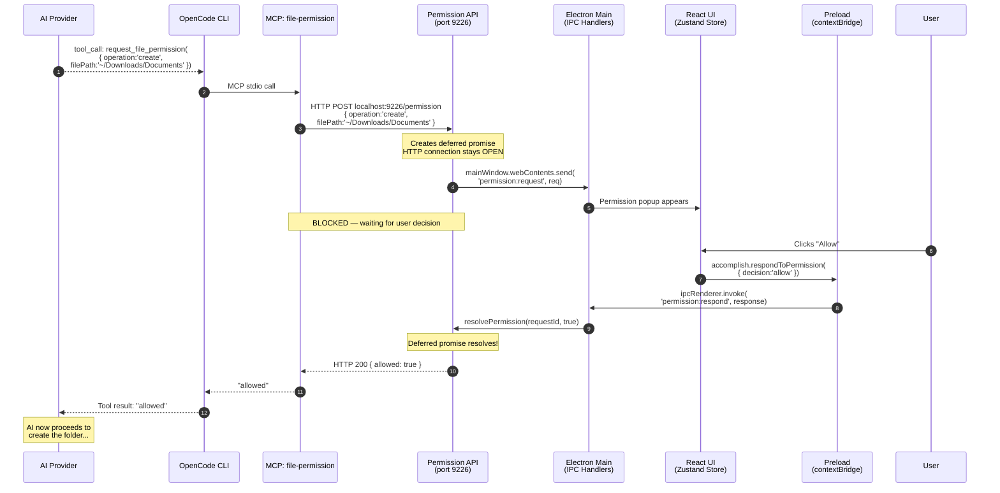
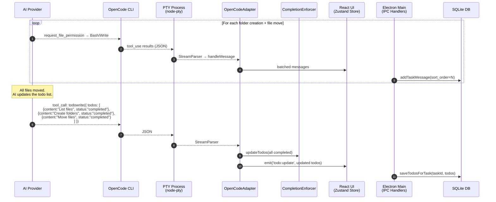
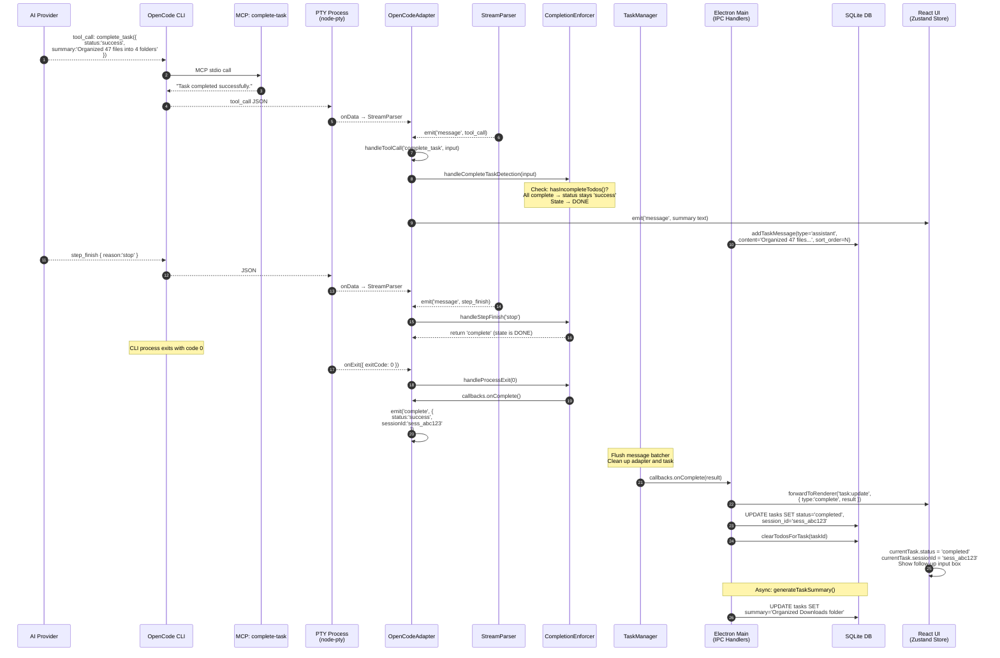
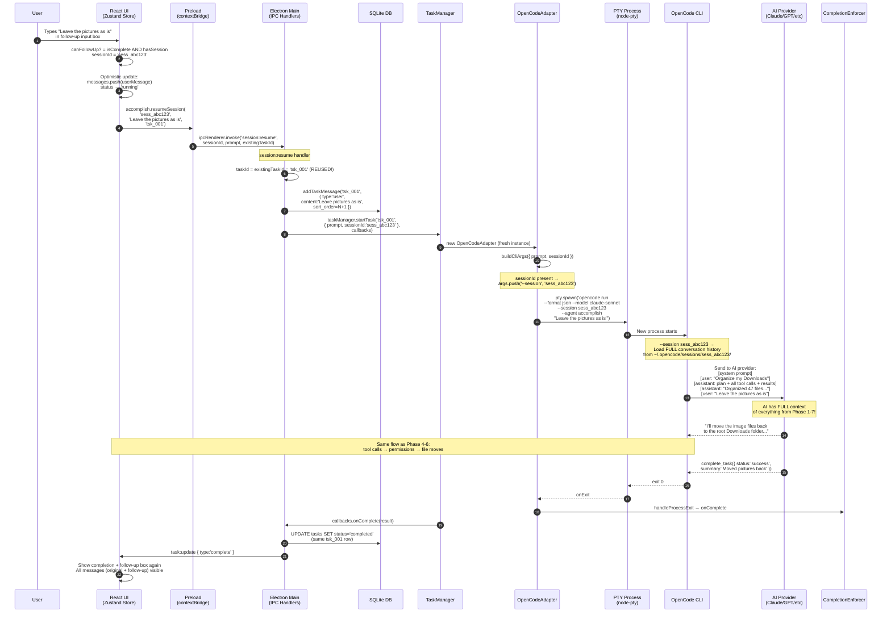

# Accomplish Task Flow — Phase-by-Phase Sequence Diagrams

> [!WARNING]
> **This document describes the pre-SDK-cutover PTY architecture.** The OpenCode SDK cutover port (commercial PR #720) replaced `node-pty` + `StreamParser` with `@opencode-ai/sdk` + `opencode serve`, so the `PTY Process` / `StreamParser` participants and byte-stream flows shown below no longer reflect runtime behaviour. The transport, participant names, and byte-stream fan-out are stale; the participants and data they exchange (adapter, TaskManager, daemon, UI) are still structurally accurate, as are the ordering and causality of events. Treat these diagrams as historical reference until they are rewritten in a follow-up docs PR. Current flow: `apps/daemon/src/opencode/server-manager.ts` spawns `opencode serve` per task; `packages/agent-core/src/internal/classes/OpenCodeAdapter.ts` subscribes to the SDK event stream; permissions/questions go through `client.permission.reply` / `client.question.reply` (not HTTP+MCP bridges).

> Example: User types **"Please organize my Download folder"**, then follows up with **"Leave the pictures as is"**

---

## Phase 1: User Submits Prompt

The user types a prompt in the React UI. It travels through the preload bridge to the Electron main process, which validates it, persists to SQLite, and initializes the TaskManager + OpenCodeAdapter.

---

## Phase 2: PTY Spawns OpenCode CLI

The OpenCodeAdapter builds CLI arguments and environment, then spawns a PTY child process running the OpenCode CLI. The CLI loads its config and sends the prompt to the AI provider.

---

## Phase 3: AI Responds — start_task (Planning)

The AI's first response is a `start_task` tool call declaring its plan. The StreamParser extracts JSON from the PTY byte stream, the adapter processes the tool call, and todo items appear in the UI.

---

## Phase 4: AI Executes Tools (e.g. Bash)

The AI calls tools like `Bash` to list files. Results flow back through the same StreamParser pipeline and are persisted incrementally.

---

## Phase 5: File Permission Request (User Blocked)

When the AI wants to create/modify files, the MCP `file-permission` tool sends an HTTP request to the Permission API. The request **blocks** until the user clicks Allow/Deny in the UI.

---

## Phase 6: AI Creates Folders & Moves Files (Loop)

The AI iterates: requesting permissions, creating folders, moving files. Each tool result is streamed back, parsed, and persisted. Todos are updated as steps complete.

---

## Phase 7: Task Completion

The AI calls `complete_task`, the CompletionEnforcer validates all todos are done, the CLI exits, and the main process persists the final status + session ID for future follow-ups.

---

## Phase 8: Follow-Up — "Leave the pictures as is"

The user sends a follow-up. The UI extracts the session ID from the completed task, a new PTY is spawned with `--session` flag, and the OpenCode CLI reloads the full conversation history so the AI has complete context.

