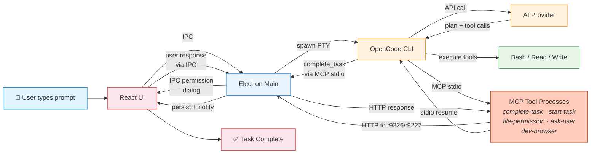
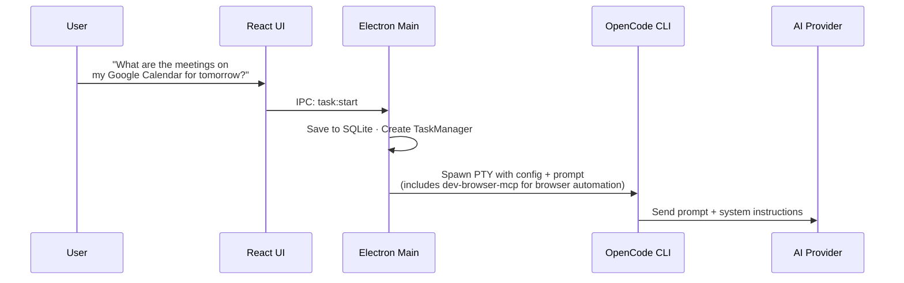
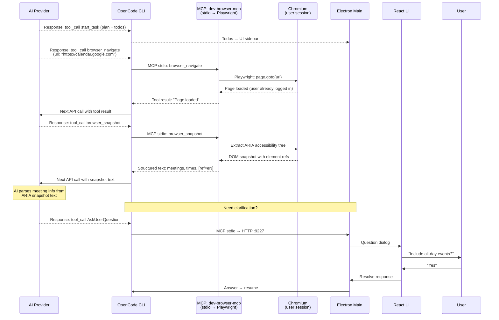
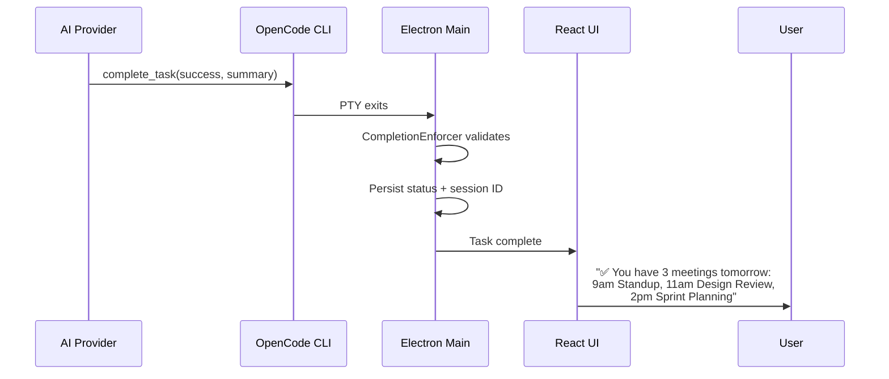
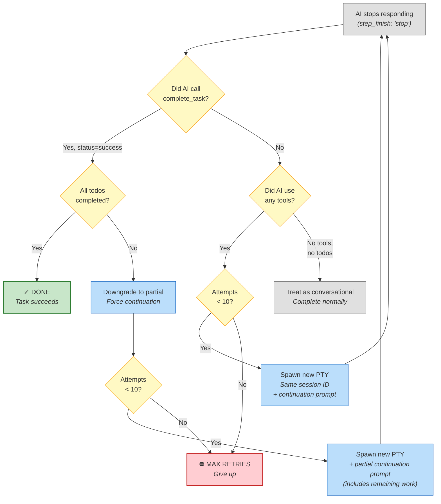
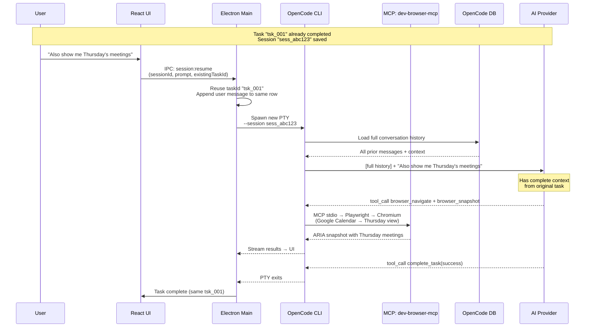
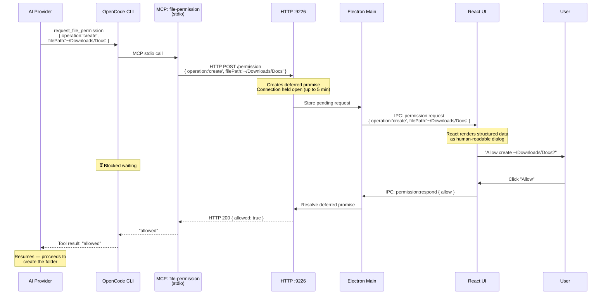

# Task Flow — Slide-Ready Diagrams

> Simplified versions of `task-flow-phases.md` for presentations. The detailed 8-phase diagrams remain in that file for deep reference.

Example tasks: **"Please organize my Download folder"** (diagrams 1, 3–5) · **"What are the meetings on my Google Calendar for tomorrow?"** (diagrams 2a–2c)

---

## 1. End-to-End Task Lifecycle (Single Slide)

The complete happy path in one diagram — from user prompt to completion.

---

## 2a. Phase 1 — Setup

Example: **"What are the meetings on my Google Calendar for tomorrow?"**

User prompt travels through IPC to Electron Main, which persists to SQLite and spawns a PTY with MCP tool configs (including dev-browser-mcp for browser automation).

---

## 2b. Phase 2 — Execution

The AI plans the task, then uses the dev-browser-mcp tool (stdio) to automate a Chromium browser — navigating to Google Calendar and reading the page via ARIA accessibility snapshots. If it needs clarification, it uses the `ask_user` MCP tool (stdio → HTTP :9227).

---

## 2c. Phase 3 — Completion

The AI calls `complete_task` via MCP, the CompletionEnforcer validates, and the result is persisted and shown to the user.

---

## 3. Completion Enforcement — What Happens When Things Go Wrong

Three paths after the AI stops: happy path, missing completion, and partial completion.

---

## 4. Follow-Up Message Flow

How a user continues an existing conversation — same task row, new PTY, full history loaded.

---

## 5. Permission Gate — The Blocking Pattern

The simplest view of how a human-in-the-loop permission works.

